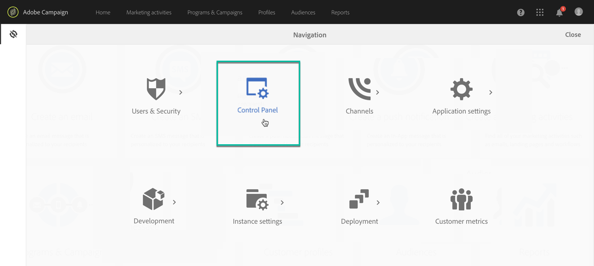

# Acceso al Panel de control {#accessing-control-panel}

El Panel de control está disponible directamente desde Experience Cloud o desde el propio producto.

## Requisitos previos {#prerequisites}

Para la versión 7/8 de Campaign, tenga en cuenta que la instancia debe estar alojada en Amazon Web Services (AWS) y actualizada a la última [versión estable de Campaign](https://experienceleague.adobe.com/docs/campaign-classic/using/release-notes/rn-overview.html?lang=es#rn-statuses) o a la versión 9032 o superior. Aprenda a comprobar su versión en [esta sección](https://experienceleague.adobe.com/docs/campaign-classic/using/getting-started/starting-with-adobe-campaign/launching-adobe-campaign.html?lang=es#getting-your-campaign-version). Para comprobar si la instancia está alojada en AWS, siga los pasos detallados en [esta página](../../faq.md#hosted-aws).

Las instancias de Campaign v8 alojadas en Microsoft Azure también tienen acceso a un subconjunto de funciones de Panel de control de Campaign: [lista de IP permitidas para acceso a instancias](../../instances-settings/using/ip-allow-listing-instance-access.md), [lista de IP permitidas para servidores SFTP](../../sftp/using/ip-range-allow-listing.md) y [administración de certificados SSL administrados por el cliente](../../subdomains-certificates/using/renewing-subdomain-certificate.md).

>[!IMPORTANT]
>
>De forma predeterminada, el Panel de control de Campaign es accesible para los usuarios administradores que pertenecen al Perfil de producto “Administradores”. Dependiendo de la configuración de la organización, el Perfil de producto puede tener distintos nombres (“administrador”, “administradores”, “administrador de aprobación”, etc.). **Cualquier perfil de producto que contenga la palabra &quot;admin&quot; en su nombre concederá automáticamente acceso al Panel de control de Campaign**. Revise cuidadosamente el nombre de su Perfil de producto para asegurarse de que solo los usuarios autorizados tengan acceso al Panel de control de Campaign. [Obtenga información sobre cómo administrar permisos para el Panel de control de Campaign](../../discover/using/managing-permissions.md).

## Acceso desde Experience Cloud Platform {#access-experience-cloud-platform}

Para acceder al Panel de control desde Adobe Experience Cloud Platform, siga los pasos que se indican a continuación.

1. Vaya a la [página de inicio de Experience Cloud](https://experiencecloud.adobe.com/){target="_blank"}.

1. Haga clic en el vínculo dedicado en la sección **Acceso rápido**.

   

También se puede acceder al Panel de control desde el **selector de soluciones** de Experience Cloud Platform:

1. En la [página de inicio de Adobe Experience Cloud](https://experiencecloud.adobe.com/){target="_blank"}, seleccione **Campaign** en la sección **Acceso rápido** o en el menú superior de la derecha.

   

1. Aparecerá la lista de las instancias de Campaign. Haga clic en la tarjeta **Panel de control** para iniciarlo.

   

## Acceso desde el producto {#access-product}

>[!NOTE]
>
>El acceso desde dentro del producto solo está disponible para [Campaign Standard](https://experienceleague.adobe.com/docs/campaign-standard/using/campaign-standard-home.html?lang=es){target="_blank"}.

1. Abra el producto Campaign Standard.

1. Seleccione el menú **[!UICONTROL Administración]** del panel **Navegación**.

   

1. Haga clic en el icono **[!UICONTROL Panel de control]**.

   
