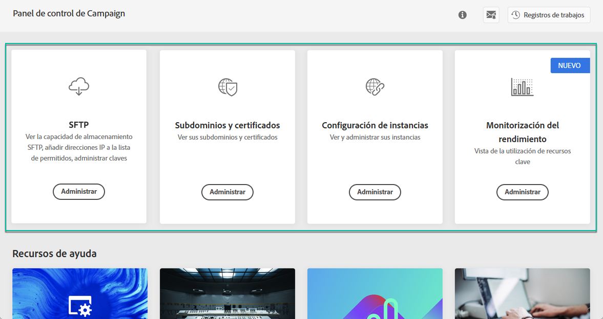
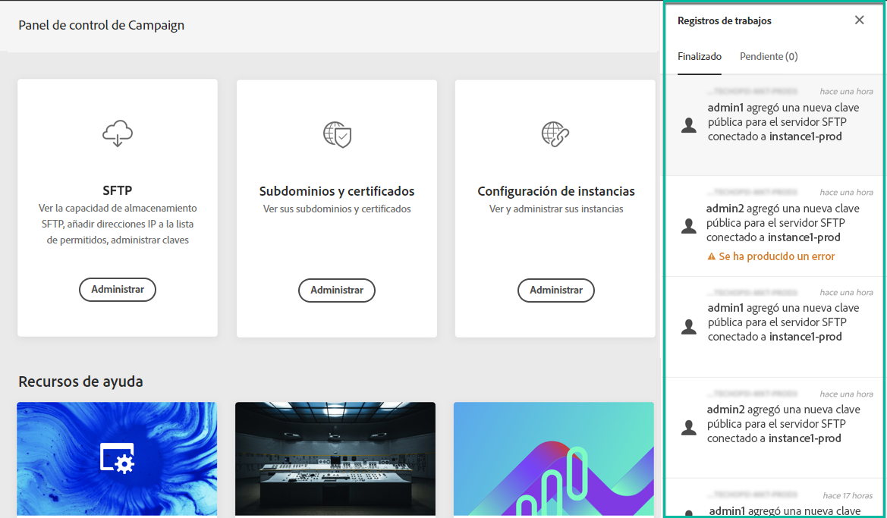
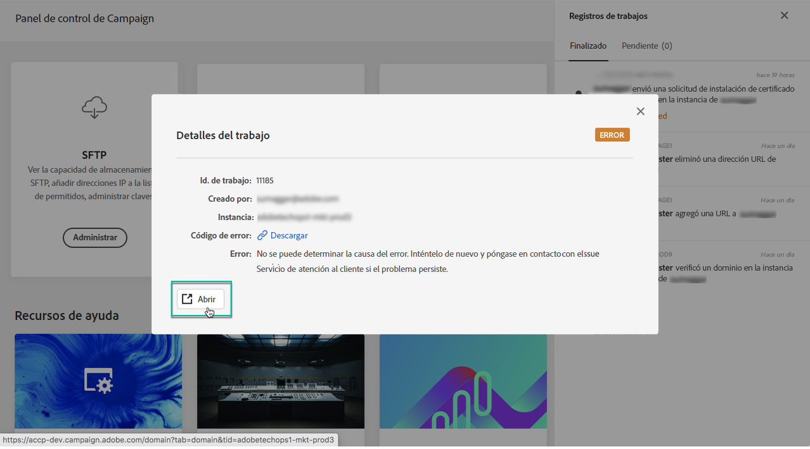
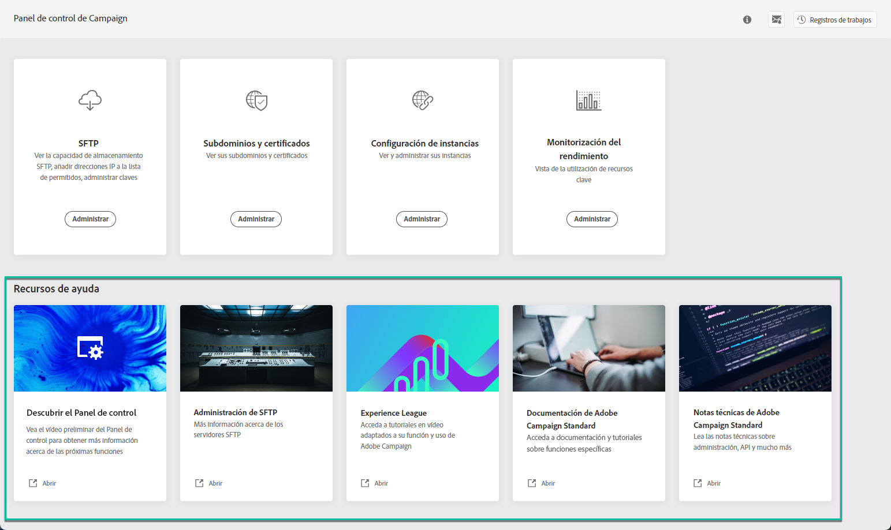

# Descubrimiento de la interfaz del Panel de control de Campaign {#discovering-interface}

La página de inicio del Panel de control le permite acceder a todas las acciones que se pueden realizar en las instancias de Campaign.

Están representados por tarjetas que están organizadas en temas, por ejemplo **Storage &amp; Database Management**.

Con las próximas versiones de Campaign, habrá más temas y tarjetas disponibles.

## Registros de trabajo {#job-logs}

El botón **[!UICONTROL Job Logs]** en la esquina superior derecha permite auditar todos los cambios realizados por los usuarios de la organización.

Haga clic en un elemento de la lista para obtener más detalles.

El botón **[!UICONTROL Open]** le permite acceder directamente a la pestaña Panel de control de Campaign donde se realizó el cambio.

## Recursos de ayuda {#help-resources}

La sección **[!UICONTROL Help Resources]** proporciona documentación útil para ayudarle a utilizar el Panel de control de Campaign y los productos de Campaign. No dudes en explorarlas.

