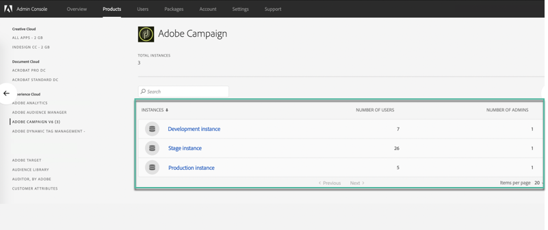

# Administración de permisos en Panel de control de Campaign {#managing-permissions-control-panel}

El Panel de control de Campaign está disponible para todos los usuarios administradores de una instancia de Campaign. Siga los pasos a continuación para asignar usuarios al grupo Administradores y otorgarles acceso al Panel de control de Campaign.

[ Descubra esta función en vídeo](#video)

1. Vaya a [Adobe Experience Cloud](https://experiencecloud.adobe.com/) y, a continuación, seleccione la pestaña **[!UICONTROL Administration]**.

   

   >[!NOTE]
   >
   >Si la pestaña <b>Administration</b> no está visible, significa que no tiene derechos de administrador para su organización. Póngase en contacto con los administradores de su organización para realizar los pasos con ellos.

1. Inicie el **Admin Console** haciendo clic en los vínculos disponibles.

   

1. Seleccione el producto de Campaign deseado.

   

   >[!NOTE]
   >
   >Si no ve el producto, póngase en contacto con los administradores de su organización para que le proporcionen acceso a él.

1. Se muestra la lista de instancias para el producto de Campaign. Seleccione la instancia a la que desea agregar un usuario administrador.

   

   >[!NOTE]
   >
   >Puede agregar diferentes usuarios administradores para cada instancia de Campaign. En ese caso, los usuarios administradores accederán al Panel de control de Campaign de la instancia a la que pertenecen únicamente.

1. Se muestra la lista de perfiles de producto de la instancia seleccionada. Haga clic en el perfil de producto **[!UICONTROL Administrators]** para acceder a la lista de usuarios administradores.

   

   >[!NOTE]
   >
   >De forma predeterminada, los usuarios administradores pertenecen al perfil de producto &quot;Administradores&quot;. Según la configuración de su organización, el perfil de producto puede tener nombres diferentes (&quot;administrador&quot;, &quot;administradores&quot;, etc.).

1. Se muestra la lista de usuarios administradores. Haga clic en el botón **[!UICONTROL Add User]** para agregar el usuario deseado.

   

>[!NOTE]
>
>Una vez configurado el acceso, el usuario tendrá que cerrar la sesión de Adobe Experience Cloud y volver a iniciarla, para acceder al Panel de control de Campaign.

## Vídeo tutorial {#video}

>[!VIDEO](https://video.tv.adobe.com/v/27147?quality=12)
