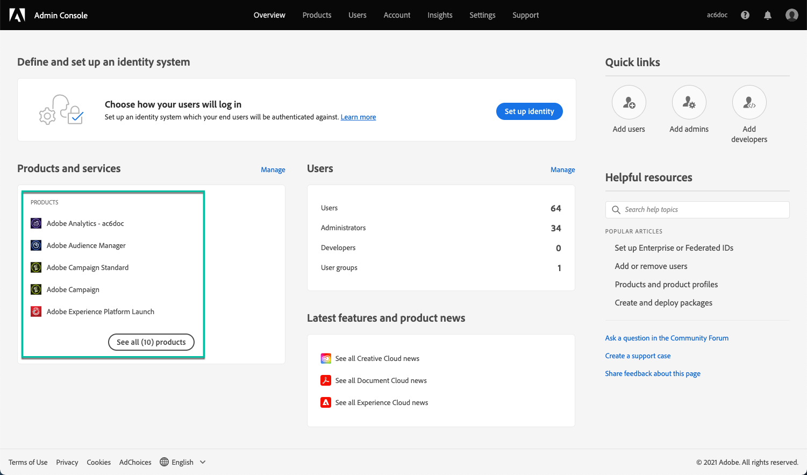

# Administración de permisos en Panel de control {#managing-permissions-control-panel}

El Panel de control está disponible para todos los usuarios administradores de una instancia de Campaign. Siga los siguientes pasos para asignar usuarios al grupo de Administradores y concederles acceso al Panel de control.

 Descubra esta funcionalidad en [vídeo](../../discover/using/managing-permissions.md#video)

1. Vaya a la [página principal de Adobe Experience Cloud](https://experiencecloud.adobe.com/){target="_blank"}.

1. Inicie el **Admin Console** haciendo clic en el enlace disponible en la sección **Acceso rápido** o en el menú superior derecho.

   

   >[!NOTE]
   >
   >Si el vínculo **Admin Console** no está visible, significa que no tiene derechos de Administrador para su organización. Póngase en contacto con los administradores de su organización para realizar los pasos.

1. En **Admin Console**, seleccione el producto de Campaign deseado de la lista **[!UICONTROL Productos y servicios]**.

   

   >[!NOTE]
   >
   >Si no puede ver el producto, póngase en contacto con los administradores de la organización para que le den acceso a él.

1. Aparecerá la lista de instancias del producto de Campaign. Seleccione la instancia a la que desea añadir un usuario administrador.

   

   >[!NOTE]
   >
   >Puede añadir diferentes usuarios administradores para cada instancia de Campaign. Los usuarios administradores accederán únicamente al Panel de control de la instancia a la que pertenezcan.

1. Aparecerá la lista de **[!UICONTROL Perfiles de producto]** de la instancia seleccionada. Haga clic en el perfil de producto **[!UICONTROL Administradores]** para acceder a la lista de usuarios administradores.

   

   >[!IMPORTANT]
   >
   >De forma predeterminada, el Panel de control de Campaign es accesible para los usuarios administradores que pertenecen al Perfil de producto &quot;Administradores&quot;. Según la configuración de la organización, el perfil de producto puede tener un nombre diferente (&quot;administrador&quot;, &quot;administradores&quot;, &quot;administrador de aprobación&quot;, etc.). **Cualquier perfil de producto que contenga la palabra &quot;admin&quot; en su nombre concederá automáticamente acceso al Panel de control de Campaign.**
   >
   >Revise cuidadosamente las convenciones de nomenclatura de Perfil de producto en Admin Console para asegurarse de que solo los usuarios autorizados tengan acceso al Panel de control de Campaign, ya que permite realizar cambios significativos en las instancias de Campaign.

1. Aparece la lista de usuarios administradores. Haga clic en el botón **[!UICONTROL Añadir usuario]** para añadir el usuario deseado.

   

>[!NOTE]
>
>Una vez configurado el acceso, el usuario tendrá que cerrar sesión en Adobe Experience Cloud y volver a iniciarla para acceder al Panel de control.

## Tutorial en vídeo {#video}

>[!VIDEO](https://video.tv.adobe.com/v/27147?quality=12)
