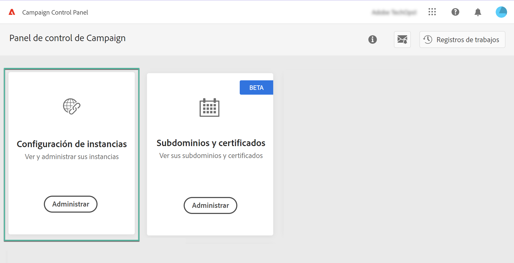
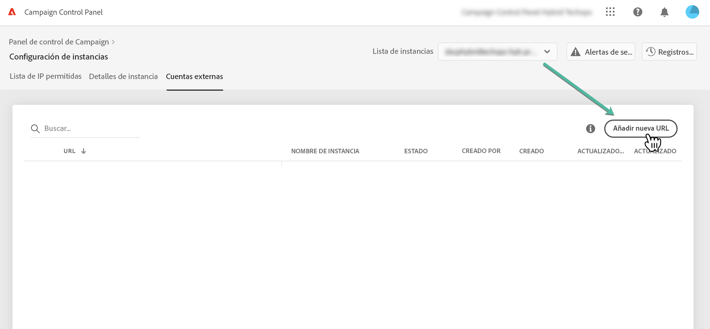
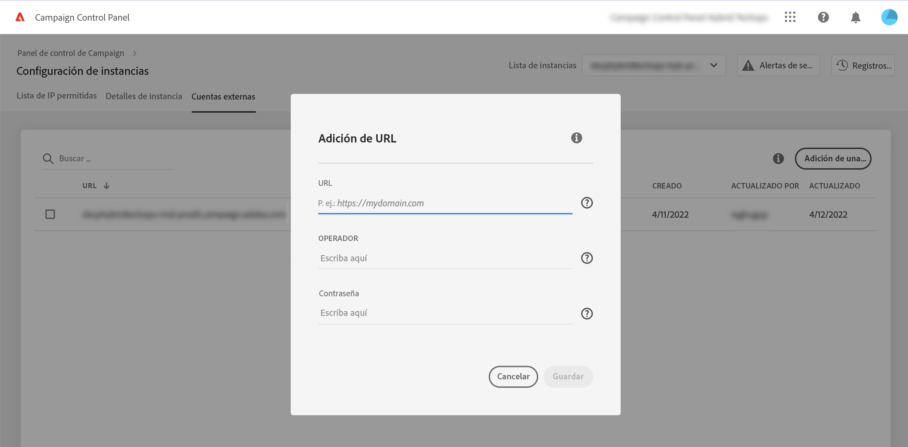
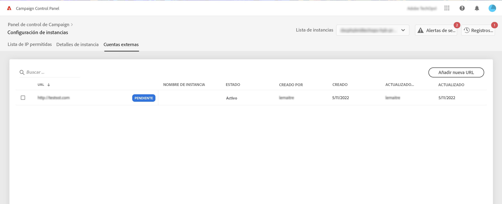
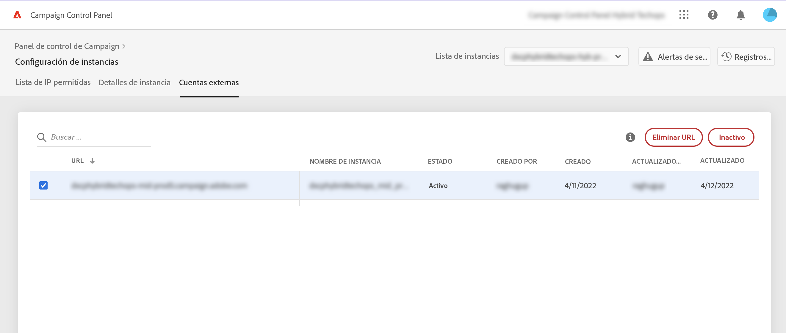
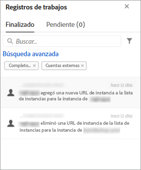

# Adición de instancias MID/RT (modelo híbrido){#add-mid-rt-instances-hybrid-model}

>[!CONTEXTUALHELP]
>id="cp_externalaccounts"
>title="Cuentas externas"
>abstract="En esta pantalla, los clientes con un modelo de alojamiento híbrido pueden proporcionar su URL de instancia MID/RT configurada en la instancia de marketing del Panel de control, para aprovechar las capacidades de este."

El Panel de control permite a los clientes con un modelo de alojamiento híbrido aprovechar las funcionalidades específicas del Panel de control. Para ello, debe:

* [Proporcione la URL de instancia de MID/RT](#add) configurado en la instancia de marketing en Panel de control de Campaign,
* [Añadir la dirección IP de la instancia MID/RT a la lista de permitidos](#ip) para permitir que la instancia de marketing se conecte a ella.

Para obtener más información sobre los modelos de alojamiento, consulte [Documentación de Campaign Classic](https://experienceleague.adobe.com/docs/campaign-classic/using/installing-campaign-classic/architecture-and-hosting-models/hosting-models-lp/hosting-models.html?lang=es).

## Adición de una instancia MID/RT {#add}

>[!CONTEXTUALHELP]
>id="cp_externalaccounts_url"
>title="Dirección URL"
>abstract="La dirección URL de la instancia se puede encontrar en la Consola del cliente de Campaign, en el menú Administración > Plataforma > Cuentas externas."

>[!CONTEXTUALHELP]
>id="cp_externalaccounts_operator"
>title="Operador"
>abstract="ID del operador proporcionado después del aprovisionamiento inicial por el administrador de Adobe."

>[!CONTEXTUALHELP]
>id="cp_externalaccounts_password"
>title="Contraseña"
>abstract="Contraseña del operador proporcionada después del aprovisionamiento inicial por el administrador de Adobe."

Los clientes híbridos deben conectarse al Panel de control a través de Experience Cloud. Al acceder al Panel de control por primera vez, solo se muestran dos tarjetas en la página principal.

>[!NOTE]
>
>En caso de que encuentre algún problema para acceder al Panel de control, lo más probable es que la instancia de marketing aún no esté asignada a su [ID de organización](https://experienceleague.adobe.com/docs/core-services/interface/administration/organizations.html?lang=es). Póngase en contacto con el Servicio de atención al cliente para completar esta configuración y continuar. Si la conexión se establece correctamente, verá la página de inicio del Panel de control.

Para poder acceder a las funcionalidades del Panel de control, debe proporcionar la información de la instancia MID/RT en la tarjeta **[!UICONTROL Instances Settings]**. Para realizar esto, siga los pasos a continuación.

1. En la tarjeta **[!UICONTROL Instances Settings]**, seleccione la pestaña **[!UICONTROL External Accounts]**. 

1. Seleccione la instancia de marketing que desee en la lista desplegable y haga clic en **[!UICONTROL Add new URL]**.

   

1. Proporcione información acerca de la instancia MID/RT que desea añadir.

   

   * **[!UICONTROL URL]**: URL de la instancia, que se puede encontrar en la Consola del cliente de Campaign, en el menú **[!UICONTROL Administration]** > **[!UICONTROL Platform]** > **[!UICONTROL External Accounts]**.

      

   * **[!UICONTROL Operator]** / **[!UICONTROL Password]**: credenciales del operador proporcionadas después del aprovisionamiento inicial por el administrador de Adobe.

      >[!NOTE]
      >
      >Si estos detalles no están disponibles, póngase en contacto con el Servicio de atención al cliente.

1. Haga clic en **[!UICONTROL Save]** para confirmar.

Al añadir la URL de MID/RT, se activa un proceso asincrónico para validar la corrección de las URL. Este proceso puede tardar unos minutos. Hasta que se valide la URL de instancia MID/RT, el trabajo estará pendiente. Solo una vez completada la validación, puede acceder a las funciones principales del Panel de control.

Puede quitar o desactivar una URL de instancia MID/RT en cualquier momento seleccionándola en la lista.

Tenga en cuenta que puede supervisar cualquier acción efectuada en la pestaña **[!UICONTROL External Accounts]** de una URL de instancia MID/RT desde **[!UICONTROL Job Logs]**:

## Añadir la dirección IP a la lista de permitidos {#ip}

Una vez añadida la instancia de MID/RT, debe añadir su dirección IP a la lista de permitidos para que la instancia de marketing pueda conectarse a ella.

Esto se puede realizar desde el **[!UICONTROL IP Allow Listing]** en la ficha **[!UICONTROL Instances Settings]** tarjeta. [Aprenda a añadir direcciones IP a la lista de permitidos](ip-allow-listing-instance-access.md)

Una vez finalizado, podrá utilizar las funcionalidades de Panel de control de Campaign con su instancia de MID/RT.

## Capacidades disponibles para clientes híbridos {#capabilities}

Una vez que se añade una instancia MID/RT al Panel de control, puede aprovechar las funciones que se enumeran a continuación:

* [Supervisión de los contactos y eventos clave](../../service-events/service-events.md)
* [Ver los detalles de la instancia](../../instances-settings/using/instance-details.md),
* [Adición de direcciones IP a la lista de permitidos](../../instances-settings/using/ip-allow-listing-instance-access.md),
* [Configuración de nuevos subdominios](../../subdomains-certificates/using/setting-up-new-subdomain.md),
* [Renovación de los certificados SSL de los subdominios](../../subdomains-certificates/using/renewing-subdomain-certificate.md).
