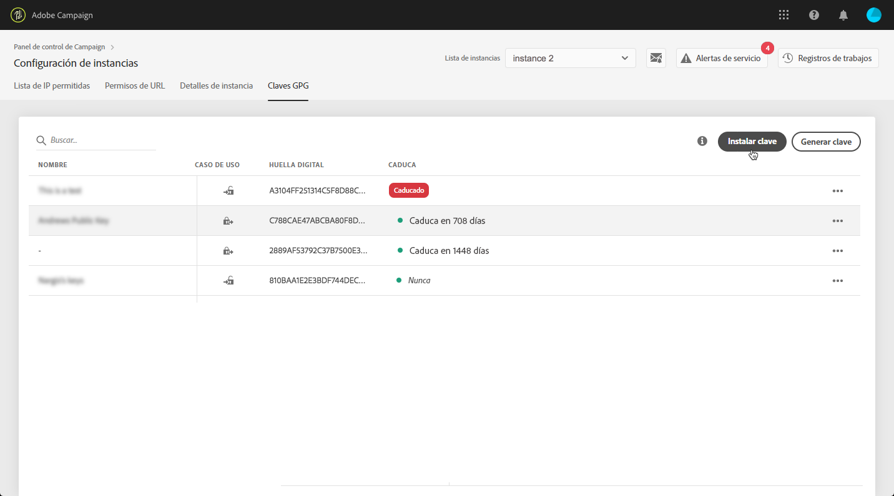
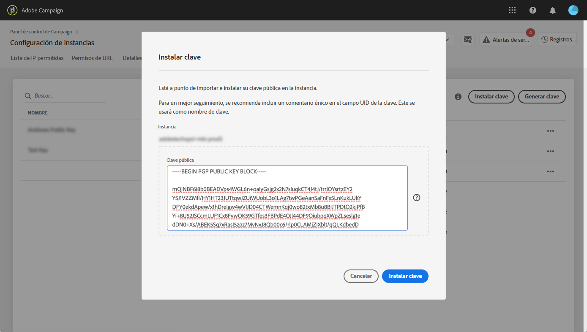
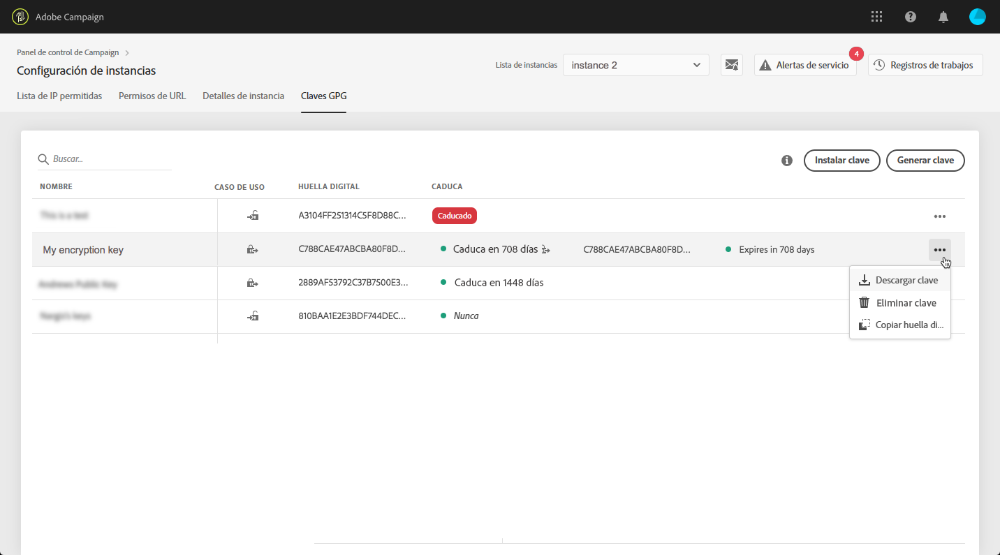
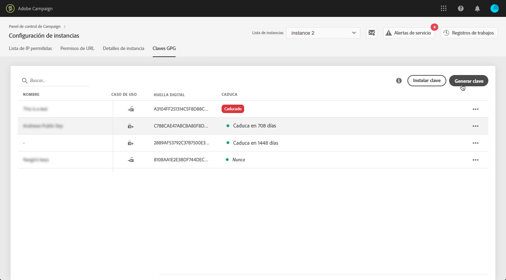
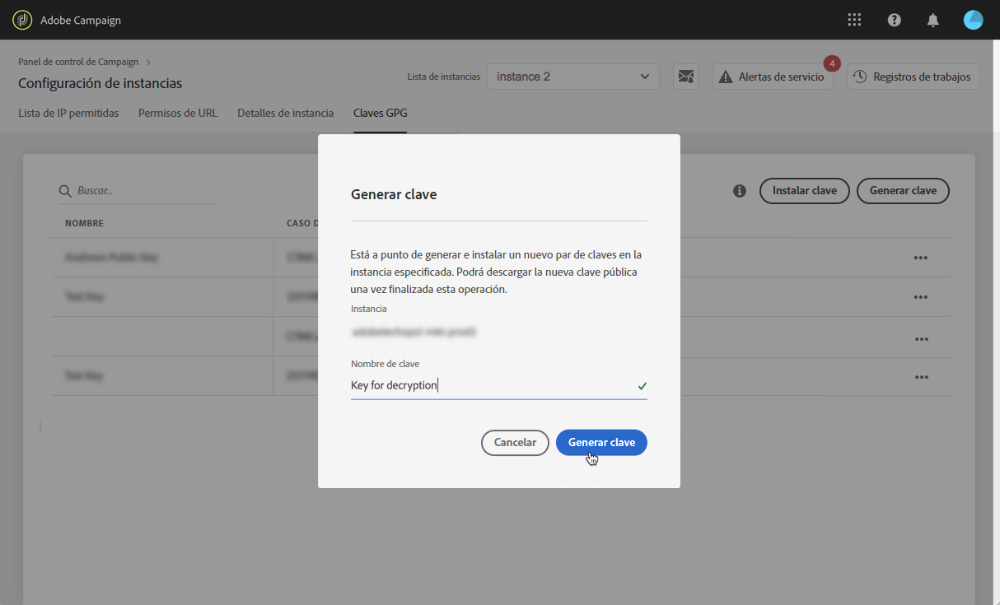
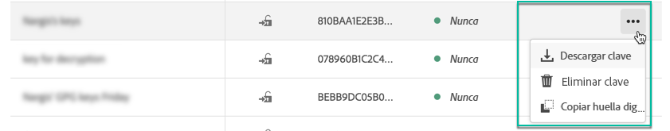
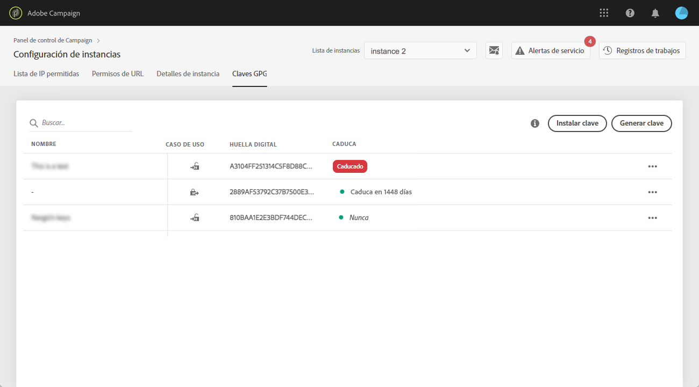
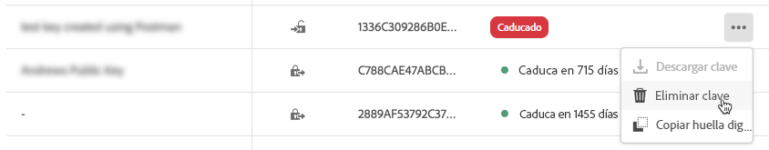

# Administración de claves GPG {#gpg-keys-management}

>[!CONTEXTUALHELP]
>id="cp_instancesettings_gpg_management"
>title="Acerca de las claves GPG"
>abstract="En esta pestaña, puede instalar y/o generar claves GPG en una instancia de marketing para cifrar los datos enviados desde Campaign y descifrar datos entrantes."
>additional-url="https://experienceleague.adobe.com/docs/control-panel/using/performance-monitoring/about-performance-monitoring.html?lang=es" text="Acerca de la monitorización del rendimiento"

## Acerca del cifrado GPG {#about-gpg-encryption}

El cifrado GPG le permite proteger los datos mediante un sistema de pares de claves públicas y privadas que siguen la especificación [OpenPGP](https://www.openpgp.org/about/standard/).

Una vez implementado, puede hacer que los datos entrantes se descifren y los salientes se cifren antes de que se realice la transferencia, para garantizar que nadie pueda acceder a ellos sin un par de claves coincidentes válido.

Para implementar el cifrado GPG con Campaign, un usuario administrador debe instalar y/o generar claves GPG en una instancia de marketing directamente desde el Panel de control.

Esto le permite:

* **Cifrar datos enviados**: Adobe Campaign envía los datos después de cifrarlos con la clave pública instalada.

* **Descifrar datos entrantes**: Adobe Campaign recibe datos que han sido cifrados desde un sistema externo utilizando una clave pública descargada del Panel de control. Adobe Campaign descifra los datos con una clave privada que se genera desde el Panel de control.

## Cifrar datos {#encrypting-data}

Panel de control le permite cifrar datos procedentes de la instancia de Adobe Campaign.

Para ello, tiene que generar un par de claves GPG a partir de una herramienta de cifrado PGP y, a continuación, instalar la clave pública en el Panel de control. De este modo, podrá cifrar los datos antes de enviarlos desde la instancia. Para realizar esto, siga los pasos a continuación.

>[!NOTE]
>
>Puede instalar hasta 60 claves GPG en el Panel de control.

[ Descubra esta funcionalidad en vídeo](#video)

1. Generar un par de claves pública/privada mediante una herramienta de cifrado PGP siguiendo la [especificación OpenPGP](https://www.openpgp.org/about/standard/). Para ello, instale una utilidad GPG o el software GNuGP.

   >[!NOTE]
   >
   >Existen programas gratuitos de código abierto para generar claves. Sin embargo, asegúrese de seguir las directrices de la organización y de utilizar la utilidad GPG recomendada por la organización de TI/seguridad.

1. Una vez instalada la utilidad, ejecute el siguiente comando, en el terminal de Mac o en el símbolo del sistema de Windows.

   `gpg --full-generate-key`

1. Cuando se le solicite, especifique los parámetros deseados para la clave. Los parámetros obligatorios son:

   * **tipo de clave**: RSA
   * **longitud de clave**: 3072 - 4096 bits
   * **nombre real** y **dirección de correo electrónico**: permite hacer un seguimiento de quién creó el par de claves. Escriba un nombre y una dirección de correo electrónico vinculados a la organización o departamento al que pertenece.
   * **comentario**: añadir una etiqueta al campo de comentarios le ayudará a identificar fácilmente la clave a utilizar para cifrar los datos.
     >[!IMPORTANT]
     >
     >Asegúrese de que este campo no quede vacío y de que se rellene con un comentario.

   * **caducidad**: fecha o “0” para no tener fecha de caducidad.
   * **frase de contraseña**

   

1. Una vez confirmado, el script generará una clave con la huella digital asociada, que podrá exportar a un archivo o pegar directamente en el Panel de control. Para exportar el archivo, ejecute el siguiente comando seguido de la huella digital de la clave que ha generado.

   `gpg -a --export <fingerprint>`

1. Para instalar la clave pública en el Panel de control, abra la tarjeta **[!UICONTROL Configuración de instancias]** y, a continuación, seleccione la pestaña **[!UICONTROL Claves GPG]** y la instancia deseada.

1. Haga clic en el botón **[!UICONTROL Instalar clave]**.

   

1. Pegue la clave pública que se ha generado con la herramienta de cifrado PGP. También puede arrastrar y soltar directamente el archivo de clave pública que ha exportado.

   >[!NOTE]
   >
   >La clave pública debe tener el formato OpenPGP.

   

1. Haga clic en el botón **[!UICONTROL Instalar clave]**.

Una vez instalada la clave pública, esta aparece en la lista. Puede utilizar el botón **...** para descargar o copiar su huella digital.

A continuación, la clave estará disponible para su uso en los flujos de trabajo de Adobe Campaign. Puede utilizarla para cifrar datos cuando utilice actividades de extracción de datos.

[ Descubra esta funcionalidad en vídeo](#video)

Para obtener más información sobre este tema, consulte la documentación de Adobe Campaign:

**Campaign v7/v8:**

* [Compresión o cifrado de un archivo](https://experienceleague.adobe.com/docs/campaign-classic/using/getting-started/importing-and-exporting-data/managing-data-encryption-compression/zip-encrypt.html?lang=es)
* [Caso de uso: codificación y exportación de datos con una clave instalada en el Panel de control](https://experienceleague.adobe.com/docs/campaign-standard/using/managing-processes-and-data/importing-and-exporting-data/managing-encrypted-data.html?lang=es#use-case-gpg-encrypt)

**Campaign Standard:**

* [Administración de datos cifrados](https://experienceleague.adobe.com/docs/campaign-standard/using/managing-processes-and-data/importing-and-exporting-data/managing-encrypted-data.html?lang=es)
* [Caso de uso: codificación y exportación de datos con una clave instalada en el Panel de control](https://experienceleague.adobe.com/docs/campaign-classic/using/getting-started/importing-and-exporting-data/managing-data-encryption-compression/zip-encrypt.html?lang=es#use-case-gpg-encrypt)

## Descifrado de datos {#decrypting-data}

El Panel de control le permite descifrar los datos externos que llegan a las instancias de Adobe Campaign.

Para ello, tiene que generar un par de claves GPG directamente desde el Panel de control.

* La **clave pública** se comparte con el sistema externo, que la utiliza para cifrar los datos que se envían a Campaign.
* Campaign utiliza la **clave privada** para descifrar los datos cifrados entrantes.

[ Descubra esta funcionalidad en vídeo](#video)

Para generar un par de claves en el Panel de control, siga los siguientes pasos:

1. Abra la tarjeta **[!UICONTROL Configuración de instancias]** y, a continuación, seleccione la pestaña **[!UICONTROL Claves GPG]** y la instancia de Adobe Campaign que desee.

1. Haga clic en el botón **[!UICONTROL Generar clave]**.

   

1. Especifique el nombre de la clave y, a continuación, haga clic en **[!UICONTROL Generar clave]**. Este nombre le ayudará a identificar la clave que se utilizará para descifrar en los flujos de trabajo de Campaign

   

Una vez generado el par de claves, la clave pública aparece en la lista. Tenga en cuenta que los pares de claves de descifrado se generan sin fecha de caducidad.

Puede utilizar el botón **...** para descargar la clave pública o copiar su huella digital.

La clave pública se puede compartir con cualquier sistema externo. Adobe Campaign podrá utilizar la clave privada en las actividades de carga de datos para descifrar datos que se hayan cifrado con la clave pública.

Para obtener más información, consulte la documentación de Adobe Campaign:

**Campaign 7 y 8:**

* [Descompresión o desencriptado de un archivo antes de procesarlo](https://experienceleague.adobe.com/docs/campaign-classic/using/getting-started/importing-and-exporting-data/managing-data-encryption-compression/unzip-decrypt.html?lang=es)
* [Caso de uso: importación de datos cifrados con una clave generada por el Panel de control](https://experienceleague.adobe.com/docs/campaign-classic/using/getting-started/importing-and-exporting-data/managing-data-encryption-compression/unzip-decrypt.html?lang=es#use-case-gpg-decrypt)

**Campaign Standard:**

* [Administración de datos cifrados](https://experienceleague.adobe.com/docs/campaign-standard/using/managing-processes-and-data/importing-and-exporting-data/managing-encrypted-data.html?lang=es)
* [Caso de uso: importación de datos cifrados con una clave generada por el Panel de control](https://experienceleague.adobe.com/docs/campaign-standard/using/managing-processes-and-data/importing-and-exporting-data/managing-encrypted-data.html?lang=es#use-case-gpg-decrypt)

## Monitorizar claves GPG

Para acceder a las claves GPG instaladas y generadas para las instancias, abra la tarjeta **[!UICONTROL Configuración de instancias]** y, a continuación, seleccione la pestaña **[!UICONTROL Claves GPG]**.

La lista muestra todas las claves GPG de cifrado y descifrado que se han instalado y generado para las instancias, con información detallada sobre cada clave:

* **[!UICONTROL Nombre]**: el nombre que se ha definido al instalar o generar la clave.
* **[!UICONTROL Caso de uso]**: esta columna especifica el caso de uso de la clave:

  : la clave se ha instalado para el cifrado de datos.

  : la clave se ha generado para permitir el descifrado de datos.

* **[!UICONTROL Huella digital]**: la huella digital de la clave.
* **[!UICONTROL Caduca]**: la fecha de caducidad de la clave. Tenga en cuenta que el Panel de control proporcionará indicaciones visuales a medida que la clave se aproxime a su fecha de caducidad:

   * Urgente (rojo) se muestra 30 días antes.
   * Advertencia (amarillo) se muestra 60 días antes.
   * Cuando una clave caduca, aparece un banner rojo de “Caducado”.

  >[!NOTE]
  >
  >Tenga en cuenta que el Panel de control no enviará ninguna notificación por correo electrónico.

Como práctica recomendada, le aconsejamos que quite cualquier clave que ya no necesite. Para ello, haga clic en el botón **...** y, a continuación, seleccione **[!UICONTROL Eliminar clave].**.

>[!IMPORTANT]
>
>Antes de eliminar una clave, asegúrese de que no se utiliza en ningún flujo de trabajo de Adobe Campaign para evitar posibles errores.

## Tutorial en vídeo {#video}

El siguiente vídeo muestra cómo generar e instalar claves GPG para el cifrado de datos.

Encontrará vídeos instructivos adicionales relacionados con la administración de claves GPG en las páginas de tutoriales de [Campaign v7/v8](https://experienceleague.adobe.com/docs/campaign-standard-learn/control-panel/instance-settings/gpg-key-management/gpg-key-management-overview.html?lang=es#instance-settings) y [Campaign Standard](https://experienceleague.adobe.com/docs/campaign-classic-learn/control-panel/instance-settings/gpg-key-management/gpg-key-management-overview.html?lang=es#instance-settings).

>[!VIDEO](https://video.tv.adobe.com/v/36386?quality=12)
