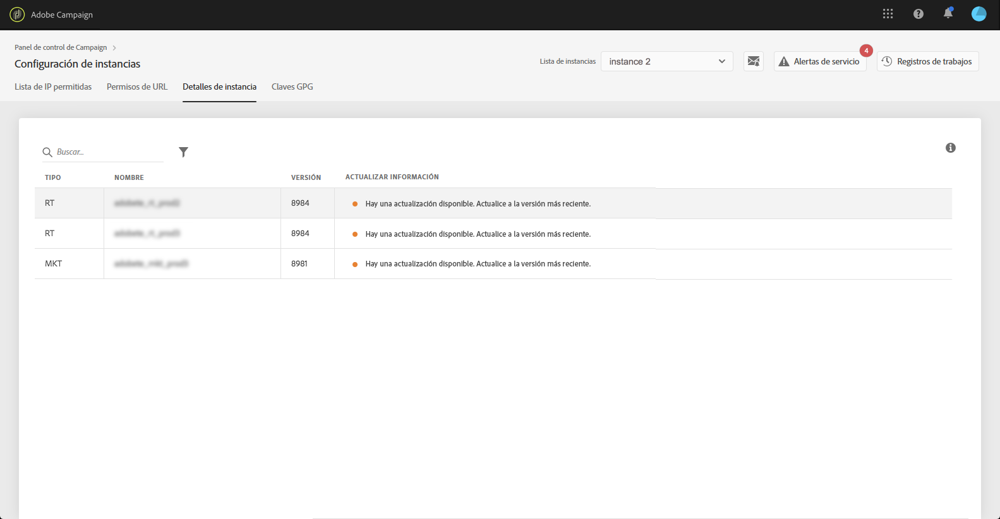

# Detalles de instancias {#instance-details}

>[!CONTEXTUALHELP]
>id="cp_instancesettings_instancedetails"
>title="Acerca de los detalles de instancias"
>abstract="Vea los detalles de las instancias de Adobe Campaign: tipos, nombres, información de compilación y posibles recomendaciones de actualización."

## Acerca de los detalles de instancias {#about-instance-details}

>[!IMPORTANT]
>
>Esta función solo está disponible para instancias de Campaign v7/v8.

La arquitectura de las instancias de Adobe Campaign puede contener varios servidores para permitir la flexibilidad de las actividades de marketing. Por ejemplo, puede tener servidores de fuentes de marketing, tiempo real (o centro de mensajes) y medios que admitan su instancia.

La funcionalidad Detalles de instancias permite ver la arquitectura plana de la instancia. Además de la información del servidor, también le permite saber si la versión de la instancia está actualizada o no, así como recomendar actualizaciones cuando sea necesario.

>[!NOTE]
>
>Recomendamos que las instancias se actualicen al menos una vez al año para evitar la degradación del rendimiento y poder aprovechar las nuevas funciones y correcciones que ofrece Adobe Campaign v7/v8.

**Temas relacionados:**

* [Realización de una actualización de versión](https://helpx.adobe.com/es/campaign/kb/acc-build-upgrade.html)
* [Actualización de Adobe Campaign](https://docs.campaign.adobe.com/doc/AC/en/PRO_Updating_Adobe_Campaign_Introduction.html)

## Recuperación de información sobre las instancias {#retrieving-information-about-instances}

Para obtener información sobre los servidores conectados a las instancias, siga estos pasos:

1. Abra la tarjeta **[!UICONTROL Instances Settings]** para acceder a la pestaña **[!UICONTROL Instance Details]**.

   >[!NOTE]
   >
   >Si la tarjeta Configuración de instancia no está visible en la página de inicio del Panel de control de Campaign, el ID de organización de IMS no está asociado a ninguna instancia de Adobe Campaign v7/v8

1. Seleccione en el panel izquierdo la instancia de Campaign que desee.

   >[!NOTE]
   >
   >Todas las instancias de Campaign se muestran en la lista del panel izquierdo. Como la función Detalles de instancia está dedicada únicamente a instancias de Campaign v7/v8, se muestra el mensaje Instancia no aplicable si selecciona una instancia de Campaign Standard.

1. Se muestran los servidores conectados a la instancia.

   

La información disponible es:

* **[!UICONTROL Type]**: tipo del servidor. Los valores posibles son MKT (Marketing), MID (fuentes intermedias) y RT (mensajes del centro de mensajes/mensajería en tiempo real).
* **[!UICONTROL Name]**: nombre del servidor.
* **[!UICONTROL Build:]**: versión instalada en el servidor.
* **[!UICONTROL Upgrade info]**: esta columna le informa si se requiere alguna actualización para el servidor.
   * Verde: su servidor está actualizado y no se requiere ninguna actualización.
   * Amarillo: debe considerar la posibilidad de actualizar. Le faltan las funciones y correcciones más recientes.
   * Rojo: actualice lo antes posible. Faltan nuevas funciones y es posible que el rendimiento del servidor no sea óptimo.

Si es necesario actualizar uno de los servidores, consulte [esta documentación](https://docs.campaign.adobe.com/doc/AC/getting_started/EN/buildUpgrade.html) para obtener más información sobre cómo proceder.

## Preguntas frecuentes {#common-questions}

**No veo el servidor MID en la arquitectura de mi instancia. ¿Significa que mis instancias no funcionan correctamente? ¿Necesito la instancia de RT para algo que no puedo hacer hoy?**

Su propia instancia puede tener un aspecto muy diferente y es posible que no tenga todos los tipos de servidores, o que tenga varios del mismo servidor. No tener un tipo de servidor u otro no significa que no pueda enviar un mensaje en tiempo real ni realizar otros tipos de actividades. Puede solicitar capacidad adicional para el servidor, pero se aplicarán tarifas adicionales.

Póngase en contacto con el Servicio de atención al cliente si cree que algunos servidores no se muestran en la página Detalles de instancia. Asegúrese de incluir la URL de instancia específica en el mensaje.
