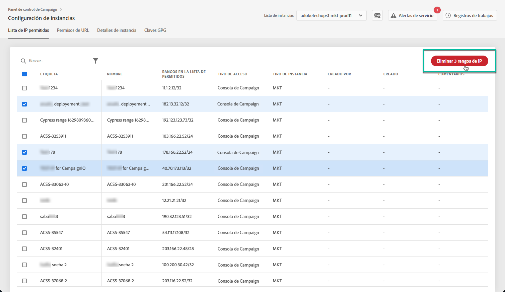

# Lista de IP permitidas {#ip-allow-listing}

>[!CONTEXTUALHELP]
>id="cp_instancesettings_iprange"
>title="Acerca de las listas de IP permitidas"
>abstract="Añada direcciones IP a la lista de permitidos para acceder a sus instancias."
>additional-url="https://images-tv.adobe.com/mpcv3/045cac99-f948-478e-ae04-f8c161dcb9e2_1568132508.1920x1080at3000_h264.mp4" text="Ver vídeo de demostración"

## Acerca de las listas de IP permitidas {#about-ip-allow-listing}

>[!IMPORTANT]
>
>Esta función solo está disponible para instancias de Campaign v7/v8.
>
>Si utiliza una instancia con un modelo de alojamiento híbrido, solo podrá añadir direcciones IP en &quot;Conexión de API externa&quot; para la instancia de RT.

De forma predeterminada, la instancia de Adobe Campaign no es accesible desde varias direcciones IP.

Si su dirección IP no se ha incluido en la lista de permitidos, no podrá iniciar sesión en la instancia desde esa dirección. Del mismo modo, es posible que no pueda conectar una API a su instancia de centro de mensajes o de marketing si la dirección IP no se ha incluido explícitamente en la lista de permitidos con la instancia.

El Panel de control de Campaign le permite configurar nuevas conexiones a las instancias añadiendo rangos de direcciones IP a la lista de permitidos. Para realizar esto, siga los pasos descritos a continuación.

Una vez que las direcciones IP estén en la lista de permitidos, puede crear y vincular operadores de Campaign a ellas para que los usuarios puedan acceder a la instancia.

 [Descubra esta función en vídeo](https://experienceleague.adobe.com/docs/campaign-classic-learn/control-panel/instance-settings/ip-allow-listing.html#instance-settings)

## Prácticas recomendadas {#best-practices}

Asegúrese de seguir las recomendaciones y limitaciones que se indican a continuación al incluir direcciones IP en la lista de permitidos en el Panel de control de Campaign-

* **No habilite el acceso IP a todos los tipos de acceso** si no desea que la dirección IP se conecte a los servidores RT o a la zona de seguridad de AEM.
* **Si ha habilitado temporalmente el acceso a su instancia para una dirección IP**, asegúrese de eliminar las direcciones IP de la lista de permitidos una vez que ya no necesite conectarse a su instancia.
* **No recomendamos añadir direcciones IP de lugares públicos a la lista de permitidos** (aeropuertos, hoteles, etc.). Utilice su dirección VPN de la compañía para mantener la seguridad de su instancia en todo momento.

## Adición de direcciones IP a la lista de permitidos para acceso a instancias {#adding-ip-addresses-allow-list}

>[!CONTEXTUALHELP]
>id="cp_instancesettings_iprange_add"
>title="Configuración de rango de IP"
>abstract="Defina el rango de IP que desea agregar a la lista de permitidos para conectarse a la instancia."

>[!NOTE]
>
>Si la variable **[!UICONTROL Instance Settings]** no está visible en la página principal del Panel de control de Campaign, lo que significa que su [ID de organización](https://experienceleague.adobe.com/docs/core-services/interface/administration/organizations.html?lang=es) no está asociado a ninguna instancia de Adobe Campaign v7/v8.

Para agregar direcciones IP a la lista de permitidos, siga estos pasos:

1. Abra la pestaña **[!UICONTROL Instances Settings card]** para acceder a la lista de direcciones IP permitidas y haga clic en **[!UICONTROL Add new IP Range]**.

   

1. Complete la información del rango de IP que desee incluir en la lista de permitidos como se describe a continuación.

   

   * **[!UICONTROL Instance(s)]**: instancias en las que las direcciones IP podrán conectarse. Se pueden manipular varias instancias al mismo tiempo. Por ejemplo, la adición de IP a lista de permitidos se puede realizar en las instancias Production y Stage siguiendo el mismo paso.
   * **[!UICONTROL IP Range]**: el rango de IP que desea agregar a la lista de permitidos, en formato CIDR. Tenga en cuenta que un rango de IP no puede superponerse a un intervalo existente en la lista de permitidos. En ese caso, primero elimine el rango que contiene la IP superpuesta.

   >[!NOTE]
   >
   >CIDR (enrutamiento entre dominios sin clase) es el formato admitido al agregar intervalos de IP con la interfaz del Panel de control de Campaign. La sintaxis consiste en una dirección IP, seguida de / y un número decimal. El formato y su sintaxis se detallan en [este artículo](https://whatismyipaddress.com/cidr).
   >
   >Puede buscar en Internet herramientas gratuitas en línea que le ayudarán a convertir la gama de IP al formato CIDR.

   * **[!UICONTROL Label]**: Etiqueta que se mostrará en la lista de permitidos.
   * **[!UICONTROL Name]**: el nombre debe ser único para el tipo de acceso, la instancia (en caso de conexión API externa) y la dirección IP.

1. Especifique el tipo de acceso que desea conceder a las direcciones IP:

   * **[!UICONTROL Campaign Console Access]**: Se permitirá que las direcciones IP se conecten a la consola del cliente de Campaign. Tenga en cuenta que el acceso a la consola solo está habilitado para instancias de Marketing. No se permite el acceso a las instancias de MID y RT y, por tanto, no se habilita.
   * **[!UICONTROL AEM connection]**: se permitirá que las direcciones IP de AEM especificadas se conecten a la instancia de Marketing.
   * **[!UICONTROL External API connection]**: se permitirá que las API externas con las direcciones IP especificadas se conecten a la instancia de Marketing y/o Centro de mensajes (RT). Tenga en cuenta que la conexión a la consola de instancias de RT no está habilitada.

      >[!NOTE]
      >
      >Si utiliza una instancia con un modelo de alojamiento híbrido, solo podrá añadir direcciones IP en &quot;Conexión de API externa&quot; para la instancia de RT.
   

1. Haga clic en el botón **[!UICONTROL Save]**. El rango de IP se agrega a la lista de permitidos.

   <!---->

De forma predeterminada, la instancia de Adobe Campaign no es accesible desde varias direcciones IP.

Para eliminar uno o varios rangos de IP de la lista de permitidos, selecciónelos y haga clic en el botón **[!UICONTROL Delete IP range]** botón.

**Temas relacionados:**

* [Vinculación de una zona de seguridad a un operador](https://docs.campaign.adobe.com/doc/AC/en/INS_Additional_configurations_Configuring_Campaign_server.html#Linking_a_security_zone_to_an_operator)
