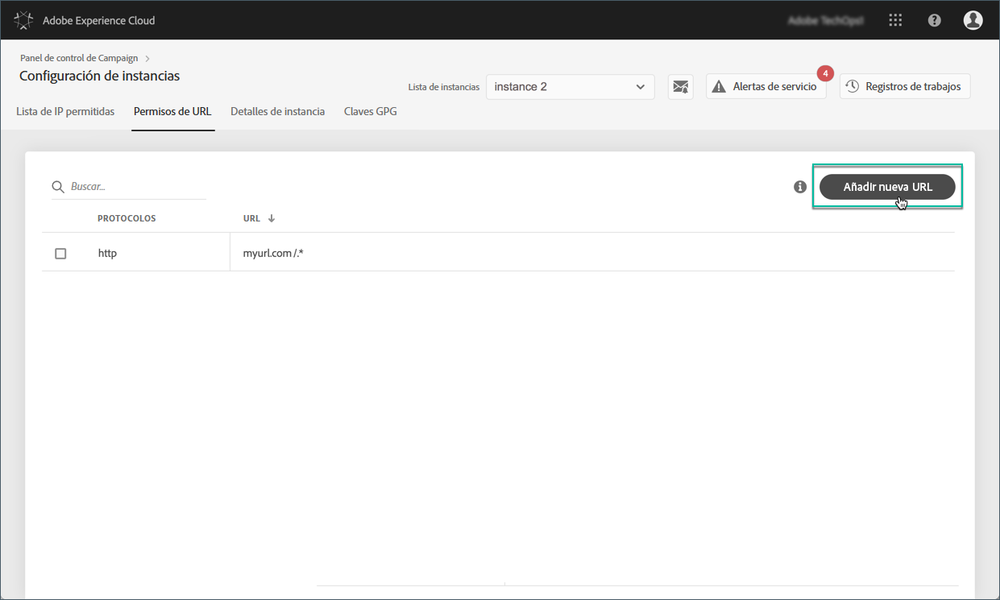
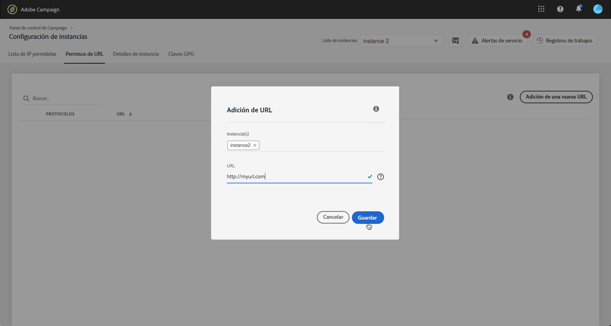
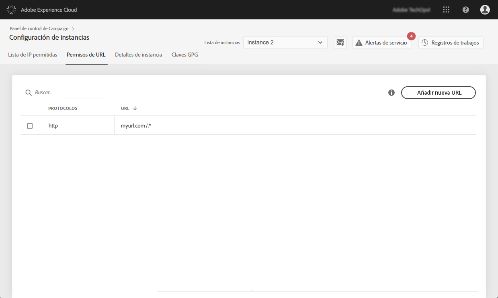

# Permisos de URL {#url-permissions}

>[!CONTEXTUALHELP]
>id="cp_instancesettings_urlpermissions"
>title="Acerca de los permisos de URL"
>abstract="Administre las direcciones URL con las que se pueden conectar las instancias de Adobe Campaign."
>additional-url="https://images-tv.adobe.com/mpcv3/91206a19-d9af-4b6a-8197-0d2810a78941_1563488165.1920x1080at3000_h264.mp4" text="Ver vídeo de demostración"

## Acerca de los permisos de URL {#about-url-permissions}

>[!IMPORTANT]
>
>Esta función solo está disponible para instancias de Campaign Classic desde la versión 8850. Si está utilizando una versión anterior, debe actualizarla para usar esta función.

La lista predeterminada de direcciones URL a las que pueden llamar los códigos JavaScript (flujos de trabajo, etc.) a través de instancias de Campaign Classic es limitada. Son direcciones URL que permiten que las instancias funcionen correctamente.

De forma predeterminada, las instancias no pueden conectarse a direcciones URL externas. El Panel de control de Campaign permite añadir algunas direcciones URL externas a la lista de direcciones URL autorizadas para que la instancia pueda conectarse a ellas. Esto le permite conectar las instancias de Campaign a sistemas externos como, por ejemplo, servidores SFTP o sitios web para habilitar la transferencia de datos o archivos.

Una vez añadida una URL, se hace referencia a ella en el archivo de configuración de la instancia (serverConf.xml).

 [Descubra esta función en vídeo](https://experienceleague.adobe.com/docs/campaign-classic-learn/control-panel/instance-settings/adding-url-permissions.html?lang=en#instance-settings)

**Temas relacionados:**

* [Configuración del servidor de Campaign](https://docs.campaign.adobe.com/doc/AC/en/INS_Additional_configurations_Configuring_Campaign_server.html)
* [Protección de conexión saliente](https://experienceleague.adobe.com/docs/campaign-classic/using/installing-campaign-classic/security-privacy/server-configuration.html#outgoing-connection-protection)

## Prácticas recomendadas {#best-practices}

* No conecte la instancia de Campaign a los sitios web o servidores a los que no tiene intención de conectarse.
* Elimine las direcciones URL con las que ya no esté trabajando. No obstante, tenga en cuenta que, si otra sección de la compañía sigue conectándose a la dirección URL que eliminó, nadie podrá volver a utilizarla.
* El Panel de control de Campaign admite los protocolos **http**, **https** y **sftp**. La introducción de direcciones URL o protocolos no válidos producirá errores.

## Administración de permisos de URL {#managing-url-permissions}

>[!CONTEXTUALHELP]
>id="cp_instancesettings_url_add"
>title="Adición de una dirección URL nueva"
>abstract="Añada las direcciones URL para permitir conexiones con la instancia de Campaign."

Para añadir una dirección URL a la que se pueda conectar su instancia, siga estos pasos:

1. Abra la tarjeta **[!UICONTROL Instances Settings]** para acceder a la pestaña **[!UICONTROL URL Permissions]**.

   >[!NOTE]
   >
   >Si la tarjeta Configuración de instancia no está visible en la página de inicio del Panel de control de Campaign, el ID de organización de IMS no está asociado a ninguna instancia de Adobe Campaign Classic
   >
   >La pestaña <b>Permisos de URL</b> lista todas las direcciones URL externas a las que se puede conectar la instancia. Esta lista no incluye las direcciones URL que son necesarias para que funcione Campaign (por ejemplo, conexiones entre elementos de infraestructura).

1. Seleccione en el panel izquierdo la instancia que desee y haga clic en el botón **[!UICONTROL Add new URL]**.

   

   >[!NOTE]
   >
   >Todas las instancias de Campaign se muestran en la lista del panel izquierdo.
   >
   >Como la administración de permisos de URL está dedicada únicamente a instancias de Campaign Classic, se muestra el mensaje Instancia no aplicable si selecciona una instancia de Campaign Standard.

1. Escriba la dirección URL para autorizar, con su protocolo asociado (http, https o sftp).

   >[!NOTE]
   >
   >Es posible autorizar varias instancias para conectarse a la dirección URL. Para ello, añádalas directamente desde el campo Instancia(s) escribiendo la primera letra.

   

1. La dirección URL se añade a la lista y ya puede conectarse a ella.

   >[!NOTE]
   >
   >Los caracteres /.* se añaden automáticamente al final de la dirección URL que introduzca después de validarla para cubrir todas las subpáginas de la página introducida.

   

Puede eliminar una dirección URL en cualquier momento seleccionándola y haciendo clic en el botón **[!UICONTROL Delete URL]**.

Tenga en cuenta que, si elimina una dirección URL, su instancia no podrá volver a llamarla.

## Preguntas frecuentes {#common-questions}

**He agregado una dirección URL nueva, pero mi instancia sigue sin poder conectarse a ella. ¿Por qué?**

En algunos casos, las direcciones URL que intenta conectar requieren una lista de permitidos, una entrada de contraseña u otra forma de autenticación. El Panel de control de Campaign no administra la autenticación adicional.
