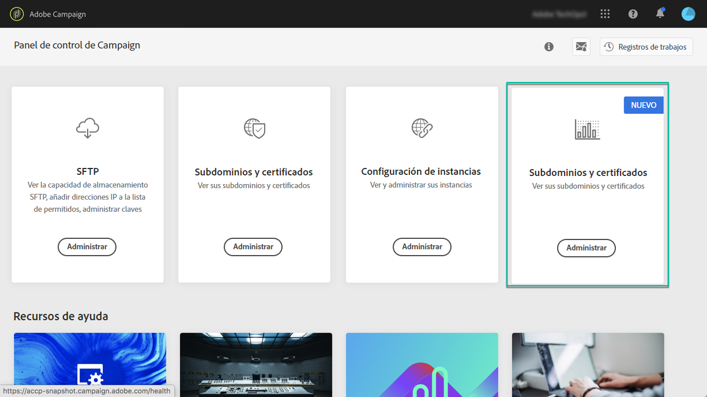

# Acerca de la monitorización del rendimiento {#about-performance-monitoring}

El Panel de control proporciona varias funcionalidades que le ayudan a monitorizar las instancias y garantizar un rendimiento óptimo.

El **[!UICONTROL Monitorización del rendimiento]** en la página de inicio de la Panel de control de Campaign le permite monitorizar el uso de las instancias de Campaign como, por ejemplo, la capacidad de la base de datos. Para obtener más información, consulte [esta sección](../../performance-monitoring/using/database-monitoring.md).

>[!NOTE]
>
>Con las próximas versiones de Paneles de control de Campaign, se pondrán a disposición funciones de monitorización adicionales en esta tarjeta.

