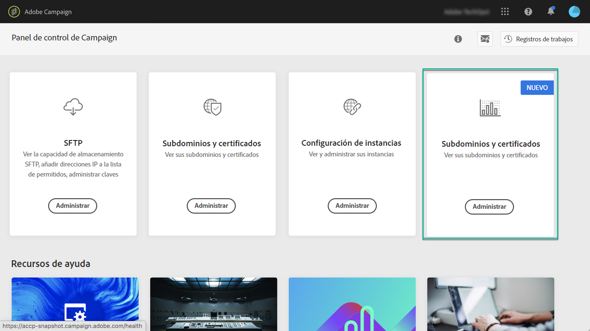

# Acerca de la monitorización del rendimiento {#about-performance-monitoring}

El Panel de control proporciona varias funcionalidades que le ayudan a monitorizar las instancias y garantizar un rendimiento óptimo.

La tarjeta **[!UICONTROL Monitorización del rendimiento]** de la página de inicio del Panel de control le permite monitorizar el uso de las instancias de Campaign como, por ejemplo, su capacidad de base de datos. Para obtener más información, consulte [esta sección](../../performance-monitoring/using/database-monitoring.md).

>[!NOTE]
>
>En futuras versiones del Panel de control, esta tarjeta dispondrá de funciones de monitorización adicionales.

