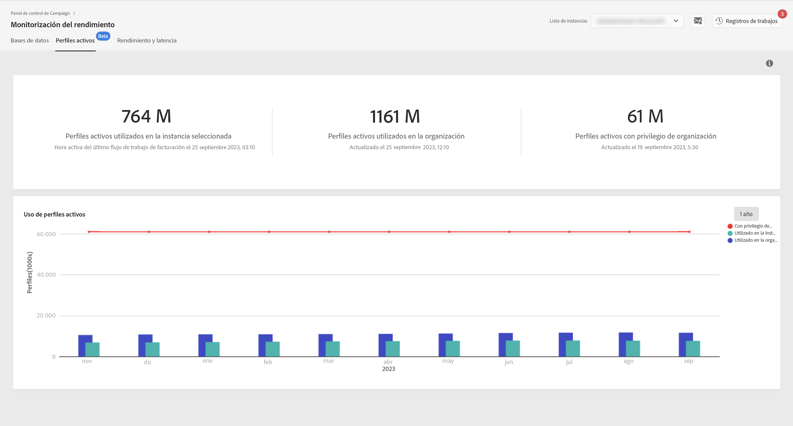

# Monitorización de perfiles activos {#active-profiles-monitoring}

## Acerca de los perfiles activos {#about-active-profiles}

>[!IMPORTANT]
>
>La monitorización de perfiles activos desde el Panel de control de Campaign está disponible en versión beta y sujeta a frecuentes actualizaciones y modificaciones sin previo aviso. Está disponible desde la versión de Campaign Standard 10368.

Según el contrato, cada una de las instancias de Campaign se aprovisiona con una cantidad específica de perfiles activos que se contabilizan a efectos de facturación. Consulte su contrato más reciente para obtener una referencia sobre la cantidad de perfiles activos adquiridos.

Un “perfil” es un registro de información (por ejemplo, un registro de la tabla nmsRecipient o una tabla externa que contiene una ID de cookie, ID de cliente, ID móvil u otra información relacionada con un canal determinado) que representa a un cliente final, a un cliente potencial o a un contacto.

Los perfiles se consideran activos si se han segmentado o si se ha comunicado con ellos en los últimos 12 meses.

>[!NOTE]
>
>Los canales de Facebook y Twitter no se tienen en cuenta.

Para obtener más información sobre los perfiles activos, consulte [Campaign Standard](https://experienceleague.adobe.com/docs/campaign-standard/using/profiles-and-audiences/managing-profiles/active-profiles.html) y [Campaign v7/v8](https://experienceleague.adobe.com/docs/campaign-classic/using/getting-started/profile-management/about-profiles.html#active-profiles) documentaciones.

## Supervisión de perfiles activos {#monitoring-active-profiles}

>[!CONTEXTUALHELP]
>id="cp_performancemonitoring_active_profile"
>title="Acerca de la monitorización de perfiles activos"
>abstract="En esta pestaña, puede obtener información en tiempo real sobre el uso y la evolución de los perfiles activos más recientes e históricos de cada una de las instancias de Campaign."
>additional-url="https://experienceleague.adobe.com/docs/control-panel/using/performance-monitoring/about-performance-monitoring.html?lang=es" text="Acerca de la monitorización del rendimiento"

El Panel de control de Campaign permite supervisar el uso de perfiles activos para cada una de las instancias de Campaign.

Para ello, siga estos pasos:

1. Abra la tarjeta **[!UICONTROL Performance Monitoring]** y seleccione la pestaña **[!UICONTROL Active Profiles]**.

1. Seleccione la instancia que desee en **[!UICONTROL Instance List]**.

1. Se muestra el número de perfiles activos que usa la instancia, así como la última vez que se ejecutó el flujo de trabajo de facturación en la instancia.

>[!NOTE]
>
>Los perfiles activos se cuentan en función de los flujos de trabajo técnicos dedicados que se ejecutan todos los días en las instancias:
>
>* Flujo de trabajo [&quot;Facturación&quot;](https://experienceleague.adobe.com/docs/campaign-standard/using/administrating/application-settings/technical-workflows.html?lang=es) para Campaign Standard.
>* La variable [&quot;Número de perfiles de facturación activos&quot;](https://experienceleague.adobe.com/docs/campaign-classic/using/automating-with-workflows/advanced-management/about-technical-workflows.html) flujo de trabajo para Campaign v7/v8.

El área inferior proporciona una representación gráfica del uso de perfiles activos durante los últimos 30 días. Puede cambiar el período de tiempo mostrado a 1 año utilizando los filtros disponibles en la esquina superior derecha.

Al pasar el ratón por encima de una de las barras de gráficos, podrá obtener la cantidad exacta de perfiles activos utilizados en el período seleccionado.
