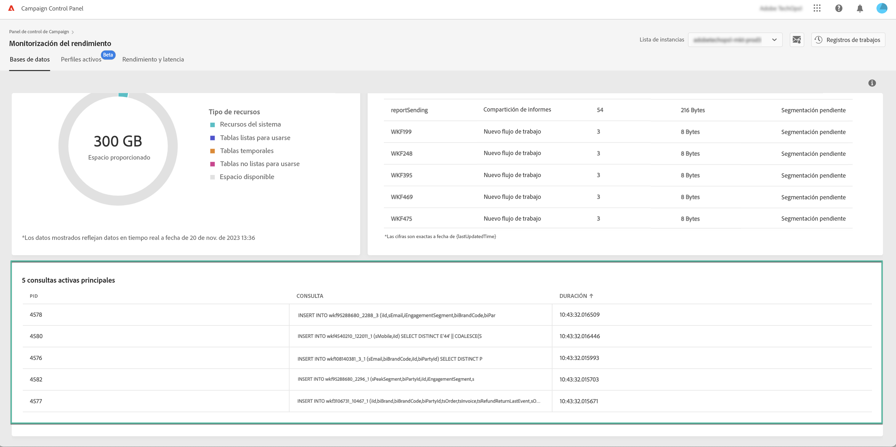

# Monitorización de consultas activas {#long-running-queries}

El área **[!UICONTROL Active queries]** de la pestaña **[!UICONTROL Databases]** lista las cinco consultas que se han estado ejecutando durante el mayor tiempo en la instancia seleccionada.

Las columnas **[!UICONTROL Duration]** especifican cuánto tiempo se ha estado ejecutando una consulta en la instancia. La duración se muestra en este formato: `hh:mm:ss.ms`.

>[!IMPORTANT]
>
>Si una de las consultas ha estado activa durante más de 24 horas, póngase en contacto con el Servicio de atención al cliente para que identifique y resuelva el problema. Deberá proporcionarles el valor de columna **[!UICONTROL PID]**, que es un identificador único para la consulta.
