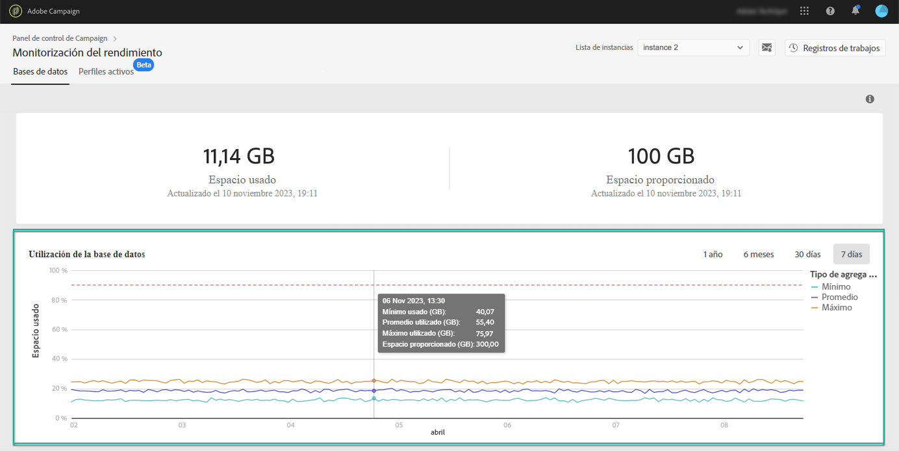

# Supervisión de bases de datos {#database-monitoring}

## Acerca de las bases de datos de instancias {#about-instances-databases}

Según el contrato, cada una de las instancias de Campaign se aprovisiona con una cantidad específica de espacio en la base de datos.

Las bases de datos incluyen todos los **activos**, **flujos de trabajo** y **datos** que se almacenan en Adobe Campaign.

Con el tiempo, las bases de datos pueden alcanzar su capacidad máxima, especialmente si los recursos almacenados nunca se eliminan de la instancia o si hay muchos flujos de trabajo en estado pausado.

El desbordamiento de una base de datos de instancias puede dar lugar a varios problemas (incapacidad para iniciar sesión, enviar correos electrónicos, etc.). Por lo tanto, la supervisión de las bases de datos de las instancias es esencial para garantizar un rendimiento óptimo.

>[!NOTE]
>
>Si la cantidad de espacio proporcionado en la base de datos, como se muestra en el Panel de control de Campaign, no refleja la cantidad especificada en el contrato, póngase en contacto con el Servicio de atención al cliente.

## Monitorización del uso de la base de datos {#monitoring-instances-database}

 Descubra esta función en vídeo usando  [Campaign ](https://experienceleague.adobe.com/docs/campaign-classic-learn/control-panel/performance-monitoring/monitoring-databases.html?lang=en#performance-monitoring) Classic  [Campaign Standard](https://experienceleague.adobe.com/docs/campaign-standard-learn/control-panel/performance-monitoring/monitoring-databases.html?lang=en#performance-monitoring)

Panel de control de Campaign le permite supervisar el uso de la base de datos para cada una de las instancias de Campaign. Para ello, abra la tarjeta **[!UICONTROL Performance Monitoring]** y seleccione la pestaña **[!UICONTROL Databases]** .

Seleccione la instancia que desee en **[!UICONTROL Instance List]** para mostrar información sobre la capacidad de la base de datos de la instancia y el espacio utilizado.

>[!NOTE]
>
>Tenga en cuenta que los datos de este tablero se actualizan en función de la **[!UICONTROL Database cleanup technical workflow]** que se ejecuta en la instancia de Campaign (consulte la documentación [Campaign Standard](https://docs.adobe.com/help/en/campaign-standard/using/administrating/application-settings/technical-workflows.html#list-of-technical-workflows) y [Campaign Classic](https://docs.adobe.com/help/en/campaign-classic/using/monitoring-campaign-classic/data-processing/database-cleanup-workflow.html) ).
>
>Puede comprobar la última vez que el flujo de trabajo se ejecutó por debajo de las métricas **[!UICONTROL Used Space]** y **[!UICONTROL Provided Space]** . Tenga en cuenta que, si el flujo de trabajo no se ha ejecutado desde hace más de 3 días, le recomendamos que se ponga en contacto con el Servicio de atención al cliente de Adobe para que investigue por qué el flujo de trabajo no se está ejecutando.

En este tablero encontrará métricas adicionales, que se describen a continuación, para ayudarle a analizar el uso de la base de datos de la instancia:

* [Utilización de la base de datos](../../performance-monitoring/using/database-monitoring.md#database-utilization)
* [Resumen del almacenamiento](../../performance-monitoring/using/database-monitoring.md#storage-overview)
* [Principales 10 recursos temporales](../../performance-monitoring/using/database-monitoring.md#top-10)

### Utilización de la base de datos {#database-utilization}

El área **[!UICONTROL Database utilization]** proporciona una representación gráfica de la utilización mínima, media y máxima de la base de datos durante los últimos 7 días, así como el umbral de utilización de la base de datos del 90% representado por una curva punteada roja.

Para cambiar el período de tiempo, utilice los filtros disponibles en la esquina superior derecha del gráfico.

Para mejorar la legibilidad, también puede resaltar una o varias curvas en el gráfico. Para ello, selecciónelos en la leyenda **[!UICONTROL Aggregation Type]**.

Para obtener más información sobre un período de tiempo específico, pase el ratón sobre el gráfico para mostrar información sobre el uso de la base de datos que se hizo en ese momento.

### Resumen de almacenamiento {#storage-overview}

El área **[!UICONTROL Storage overview]** proporciona una representación gráfica del espacio ocupado por:

* **[!UICONTROL System resources]**

   Tenga en cuenta que, si los recursos del sistema consumen una gran parte del espacio de la base de datos, le recomendamos que se ponga en contacto con el Servicio de atención al cliente.

* **[!UICONTROL Out-of-the-box tables]** proporcionado de forma predeterminada con las instancias de Campaign,
* **[!UICONTROL Temporary tables]** creados por flujos de trabajo y envíos,
* **[!UICONTROL Non-out of the box tables]** generado después de crear recursos personalizados.

Haga clic en el botón **[!UICONTROL View details]** para obtener más información sobre los distintos recursos que consumen espacio en la base de datos.

Utilice el filtro para restringir las tablas de búsqueda y visualización solo de un tipo de recurso específico.

### Los 10 recursos temporales principales {#top-10}

El área **[!UICONTROL Top 10 temporary resources]** enumera los 10 recursos temporales más grandes generados por flujos de trabajo y envíos.

La monitorización de flujos de trabajo y envíos que crean grandes recursos temporales es un paso clave para monitorizar la base de datos. Si algún recurso temporal consume demasiado espacio en la base de datos, asegúrese de que es necesario tener este flujo de trabajo o envío y, finalmente, vaya a la instancia para detenerlo.

>[!IMPORTANT]
>
>La recomendación general es evitar tener **más de 40 columnas** en recursos que no sean predeterminados.

>[!NOTE]
>
>Si se encuentra que un flujo de trabajo tiene un gran número de recuentos de tablas o tamaño de base de datos, se recomienda revisar el flujo de trabajo para investigar por qué está generando tantos datos.
>
>Los recursos de Campaign Standard y Classic también están disponibles al final de esta página para ayudarle a evitar la sobrecarga de la base de datos.

El botón **[!UICONTROL View all]** le permite acceder a información detallada sobre estos recursos temporales.

>[!NOTE]
>
>El valor de la columna **[!UICONTROL Keep interim results]** indica si la opción está activada (&quot;1&quot;) o desactivada (&quot;0&quot;) en Campaign. Se puede acceder a la opción **[!UICONTROL Keep interim results]** en las propiedades de los flujos de trabajo. Permite guardar los resultados de las transiciones entre las distintas actividades de un flujo de trabajo (consulte la documentación [Campaign Standard](https://docs.adobe.com/content/help/en/campaign-standard/using/managing-processes-and-data/executing-a-workflow/managing-execution-options.html) y [Campaign Classic](https://docs.adobe.com/content/help/en/campaign-classic/using/automating-with-workflows/general-operation/workflow-best-practices.html#logs)).
>
>Si la opción está habilitada para uno de los flujos de trabajo, el flujo de trabajo de limpieza de la base de datos no podrá recuperar el espacio consumido por los resultados provisionales. Por lo tanto, se recomienda revisar el flujo de trabajo para comprobar si la opción se puede desactivar.

## Prevención de la sobrecarga de la base de datos {#preventing-database-overload}

Campaign Standard y Classic ofrecen varias formas de evitar el consumo excesivo de espacio en disco de la base de datos.

La sección siguiente proporciona recursos útiles de la documentación de Campaign para ayudarle a optimizar el uso de las bases de datos:

**Monitorización de flujos de trabajo**

* [Prácticas recomendadas de flujos de trabajo](https://docs.adobe.com/content/help/en/campaign-standard/using/managing-processes-and-data/workflow-general-operation/best-practices-workflows.html)  (Campaign Standard)
* [Control de la ejecución del flujo de trabajo](https://docs.adobe.com/help/en/campaign-classic/using/automating-with-workflows/monitoring-workflows/monitoring-workflow-execution.html)  (Campaign Classic)

**Mantenimiento de la base de datos**

* Flujo de trabajo técnico para limpieza de bases de datos ([Campaign Standard](https://docs.adobe.com/help/en/campaign-standard/using/administrating/application-settings/technical-workflows.html#list-of-technical-workflows) / [Campaign Classic](https://docs.adobe.com/help/en/campaign-classic/using/monitoring-campaign-classic/data-processing/database-cleanup-workflow.html))
* [Guía de mantenimiento de la base de datos](https://docs.adobe.com/content/help/en/campaign-classic/using/monitoring-campaign-classic/database-maintenance/recommendations.html)  (Campaign Classic)
* [Solución de problemas del rendimiento de la base de datos](https://docs.adobe.com/content/help/en/campaign-classic/using/monitoring-campaign-classic/troubleshooting/database-performances.html)  (Campaign Classic)
* [Opciones relacionadas con la base de datos](https://docs.adobe.com/help/en/campaign-classic/using/installing-campaign-classic/appendices/configuring-campaign-options.html#database)  (Campaign Classic)
* Retención de datos ([Campaign Standard](https://docs.adobe.com/help/en/campaign-standard/using/administrating/application-settings/data-retention.html) / [Campaign Classic](https://docs.adobe.com/help/en/campaign-classic/using/configuring-campaign-classic/data-model/data-model-best-practices.html#data-retention))

>[!NOTE]
>
>Además, puede recibir notificaciones cuando una de sus bases de datos alcance su capacidad. Para ello, suscríbase a [alertas de correo electrónico](../../performance-monitoring/using/email-alerting.md).
