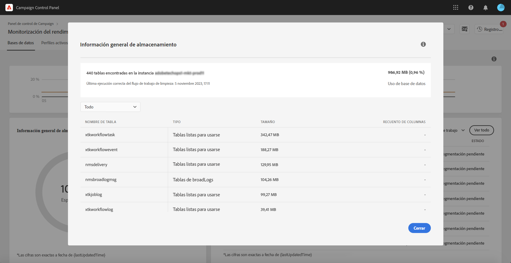

# Resumen de almacenamiento {#storage-overview}

>[!CONTEXTUALHELP]
>id="cp_dbdetails_storagedetails"
>title="Información general acerca del almacenamiento"
>abstract="En esta pestaña, puede obtener información detallada sobre los distintos recursos de Campaign que consumen espacio en la base de datos."

El área **[!UICONTROL Información general de almacenamiento]** proporciona una representación gráfica del espacio ocupado por:

* **[!UICONTROL Recursos del sistema]**

  Tenga en cuenta que, si los recursos del sistema consumen una gran parte del espacio de la base de datos, le recomendamos que se ponga en contacto con el Servicio de atención al cliente.

* **[!UICONTROL Tablas listas para usarse]** proporcionadas de forma predeterminada con las instancias de Campaign,
* **[!UICONTROL Tablas temporales]** creadas por flujos de trabajo y envíos,
* **[!UICONTROL Tablas no listas para usarse]** generadas después de crear recursos personalizados.

Haga clic en el botón **[!UICONTROL Ver detalles]** para obtener más detalles sobre los diferentes recursos que están consumiendo espacio de la base de datos.

Puede utilizar la lista desplegable para refinar la búsqueda y mostrar tablas de un tipo de recurso específico solamente (flujos de trabajo, envíos, destinatarios).

Tenga en cuenta que esta pantalla también le permite monitorizar los parámetros del flujo de trabajo que pueden requerir una atención específica para evitar cualquier problema en las instancias. Obtenga más información en [esta página](workflow-monitoring.md).
