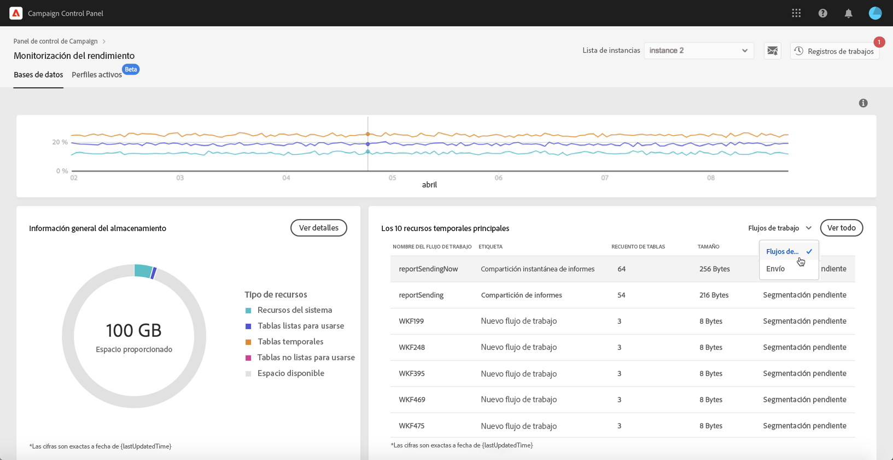

# Los 10 recursos temporales principales {#top-10}

El área **[!UICONTROL Los 10 recursos temporales principales]** enumera los 10 recursos temporales más grandes generados por los flujos de trabajo y los envíos.

La monitorización de flujos de trabajo y envíos que crean grandes recursos temporales es un paso clave para monitorizar la base de datos. Si algún recurso temporal consume demasiado espacio en la base de datos, asegúrese de que es necesario tener este flujo de trabajo o envío y, finalmente, vaya a la instancia para pararlo.

>[!IMPORTANT]
>
>La recomendación general es evitar tener **más de 40 columnas** en recursos que no sean predeterminados. Si se ve que un flujo de trabajo tiene un gran número de recuentos de tablas o tamaño de base de datos, se recomienda revisar el flujo de trabajo para investigar por qué está generando tantos datos.
>
>Las directrices de Campaign Standard y Classic también están disponibles en [esta página](database-preventing-overload.md) para ayudarle a evitar la sobrecarga de la base de datos.

El botón **[!UICONTROL Ver todo]** permite acceder a los detalles de **[!UICONTROL Información general de almacenamiento]** para obtener información detallada sobre estos recursos temporales. Para obtener más información, consulte [esta página](database-storage-overview.md).
