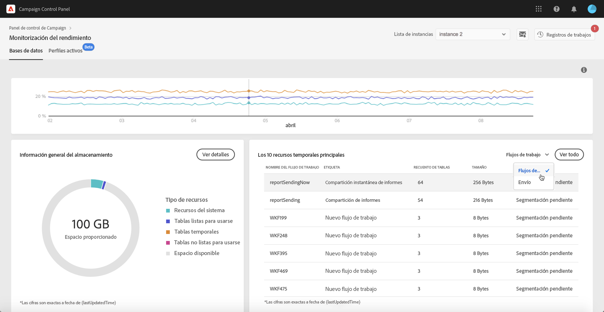

# Los 10 recursos temporales principales {#top-10}

El área **[!UICONTROL Top 10 temporary resources]** enumera los 10 recursos temporales más grandes generados por flujos de trabajo y envíos.

La monitorización de flujos de trabajo y envíos que crean grandes recursos temporales es un paso clave para monitorizar la base de datos. Si algún recurso temporal consume demasiado espacio en la base de datos, asegúrese de que es necesario tener este flujo de trabajo o envío y, finalmente, vaya a la instancia para pararlo.

>[!IMPORTANT]
>
>La recomendación general es evitar tener **más de 40 columnas** en recursos que no sean predeterminados.

>[!NOTE]
>
>Si se ve que un flujo de trabajo tiene un gran número de recuentos de tablas o tamaño de base de datos, se recomienda revisar el flujo de trabajo para investigar por qué está generando tantos datos.
>
>Los recursos de Campaign Standard y Classic también están disponibles al final de esta página para ayudarle a evitar la sobrecarga de la base de datos.

El botón **[!UICONTROL View all]** le permite acceder a información detallada sobre estos recursos temporales.

El valor de la columna **[!UICONTROL Keep interim results]** indica si la opción está activada (&quot;1&quot;) o desactivada (&quot;0&quot;) en Campaign. Permite guardar los resultados de las transiciones entre las distintas actividades de un flujo de trabajo (consulte la documentación de [Campaign Standard](https://experienceleague.adobe.com/docs/campaign-standard/using/managing-processes-and-data/executing-a-workflow/managing-execution-options.html?lang=es) y [Campaign Classic](https://experienceleague.adobe.com/docs/campaign-classic/using/automating-with-workflows/introduction/workflow-best-practices.html?lang=es#logs)).

>[!IMPORTANT]
>
>Esta opción nunca se debe marcar en un flujo de trabajo de producción. Se utiliza para analizar los resultados y está diseñada únicamente para fines de realización de pruebas; por lo tanto, solo debe usarse en entornos de ensayo o desarrollo.
>
>Si el valor en el Panel de control de Campaign indica que la opción está habilitada en uno de los flujos de trabajo, se recomienda desactivarla en Campaign.
