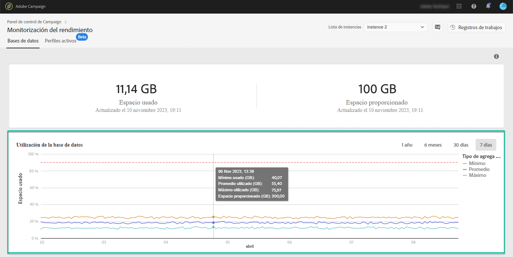

# Utilización de la base de datos {#database-utilization}

El área **[!UICONTROL Utilización de la base de datos]** proporciona una representación gráfica de la utilización mínima, media y máxima de la base de datos durante los últimos 7 días, así como el umbral de utilización de la base de datos del 90 %, representado por una curva punteada roja.

Para cambiar el período de tiempo, utilice los filtros disponibles en la esquina superior derecha del gráfico.

Para mejorar la legibilidad, también puede resaltar una o varias curvas en el gráfico. Para ello, selecciónelas en la leyenda  **[!UICONTROL Tipo de agregación]**.

Para obtener más información sobre un período de tiempo específico, pase el ratón sobre el gráfico para mostrar información sobre el uso de la base de datos que se hizo en ese momento.

