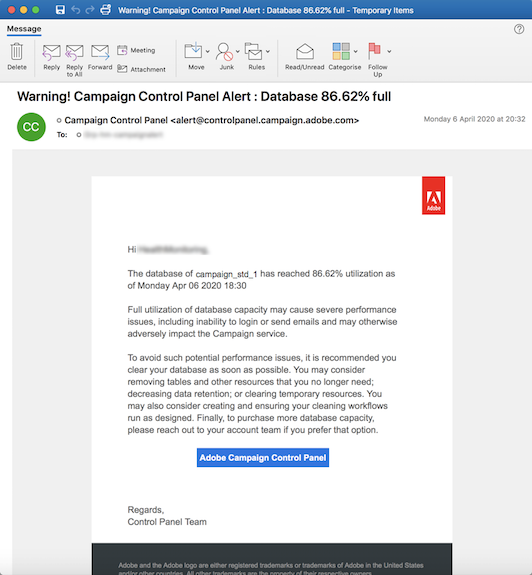

# Alertas por correo electrónico {#email-alerting}

Con el fin de proporcionar buena flexibilidad a su trabajo, Panel de control de Campaign está equipado con funciones de alerta por correo electrónico en tiempo real.

Para suscribirse a estas alertas, siga estos pasos:

1. Haga clic en el botón **[!UICONTROL Alerting notifications]** disponible en cualquier ubicación del Panel de control de Campaign y, a continuación, haga clic en **[!UICONTROL Subscribe]**.

   

1. Se envía un correo electrónico para confirmar la suscripción.

   

1. Tras la suscripción, el Panel de control de Campaign notificará los problemas del sistema y recomendará las acciones que deben realizarse. Las alertas de correo electrónico se envían a todos los usuarios que se hayan registrado en **todas las instancias** de las que sean administradores.

   

La lista de alertas es la siguiente:

* **Uso** de almacenamiento SFTP: Uno de los servidores SFTP ha alcanzado el 80 % o más de su capacidad. Consulte [Administración de almacenamiento SFTP](../../sftp/using/sftp-storage-management.md).

* **Uso** de la base de datos: Una de las bases de datos de instancias ha alcanzado el 80% o más de su capacidad. Consulte [Supervisión de bases de datos](../../performance-monitoring/using/database-monitoring.md).

* **Caducidad** del certificado SSL: Uno de los certificados SSL de los subdominios ha caducado o va a caducar en 60 días o menos. Consulte [Supervisión de los certificados SSL de los subdominios](../../subdomains-certificates/using/monitoring-ssl-certificates.md).

