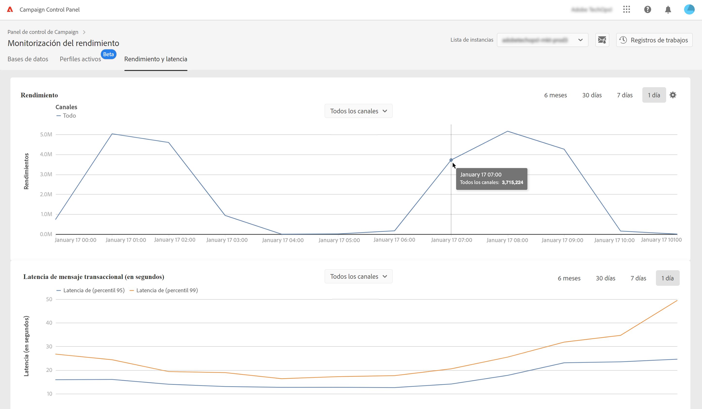
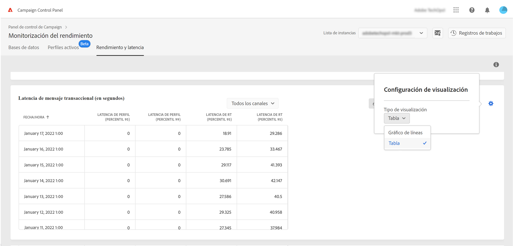
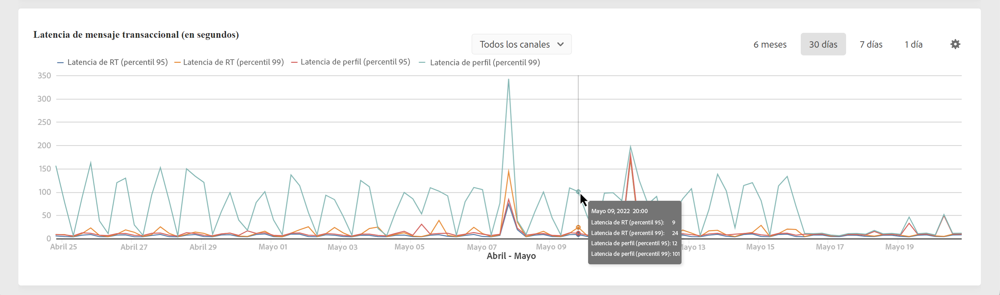

# Monitorización del rendimiento y la latencia {#throughputs-latency-monitoring}

>[!CONTEXTUALHELP]
>id="cp_performancemonitoring_throughputslatencies"
>title="Acerca de la monitorización del rendimiento y la latencia "
>abstract="En esta pestaña, puede monitorizar cómo el rendimiento y la latencia de la entrega son las tendencias a lo largo del tiempo en las instancias."

Monitorizar cómo el rendimiento y la latencia de la entrega son tendencias a lo largo de un período es esencial para comprender el uso de las instancias y garantizar que tengan un buen rendimiento.

Esta información está disponible en Panel de control de Campaign para cada una de las instancias de Campaign en la pestaña **[!UICONTROL Performance Monitoring]** tarjeta **[!UICONTROL Throughputs & Latencies]**.

>[!NOTE]
>
>Todas las cifras presentadas en esta área son aproximadas y solo con fines informativos.

De forma predeterminada, los datos se muestran para el día actual. Puede cambiar el período mostrado utilizando los botones **[!UICONTROL 6 months]**, **[!UICONTROL 30 days]** y **[!UICONTROL 7 days]**.

El área **[!UICONTROL Throughput]** proporciona información sobre el número de mensajes enviados por hora desde la instancia de Campaign seleccionada para todos los canales de comunicación a los que está autorizado.

También puede visualizar esta información en formato tabular con columnas que se pueden ordenar en lugar de un gráfico. Para ello, haga clic en el botón **[!UICONTROL Visualization settings]** y seleccione **[!UICONTROL Table]**.

El área **[!UICONTROL Latency]** proporciona información sobre la latencia encontrada en la instancia seleccionada al enviar comunicaciones transaccionales en tiempo real. Las latencias se capturan y visualizan con un percentil 95 y 99, lo que significa que el 95 % y el 99 % de las solicitudes deben ser más rápidas que la latencia dada.

