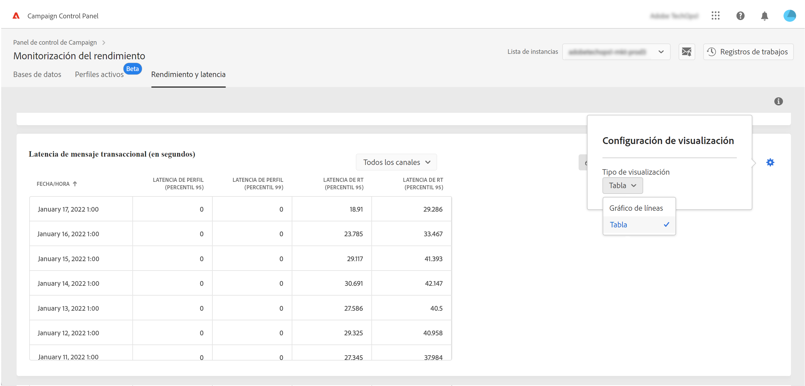
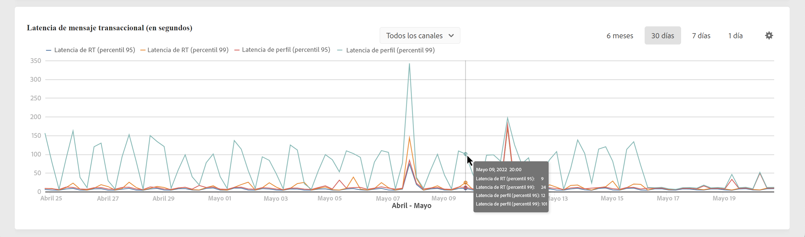

# Monitorización de rendimiento y latencia  {#throughputs-latency-monitoring}

>[!CONTEXTUALHELP]
>id="cp_performancemonitoring_throughputslatencies"
>title="Acerca de la monitorización del rendimiento y la latencia "
>abstract="En esta pestaña, puede monitorizar cómo el rendimiento y la latencia del envío son las tendencias a lo largo del tiempo en las instancias. Para obtener información acerca de los envíos que contribuyen al rendimiento, cambie a la vista tabular."

El Panel de control permite monitorizar el rendimiento de envío y la latencia de cada una de las instancias.

>[!IMPORTANT]
>
>Esta función está disponible para todos los clientes de las versiones 7 y 8 de Campaign Standard, con los números de compilación 9032 y más recientes, incluidas las [implementaciones independientes](https://experienceleague.adobe.com/docs/campaign-classic/using/installing-campaign-classic/deployment-types-/standalone-deployment.html?lang=es) (sin ninguna instancia intermediaria).

Monitorizar las tendencias del rendimiento y la latencia de envío a lo largo de un período es esencial para comprender el uso de las instancias y garantizar que tengan un buen rendimiento.

Esta información está disponible en el Panel de control para cada una de las instancias de Campaign en la tarjeta **[!UICONTROL Monitorización del rendimiento]**, pestaña **[!UICONTROL Rendimiento y latencia]** (tenga en cuenta que el Panel de control puede tardar hasta 1 hora en mostrar los valores).

>[!NOTE]
>
>Todas las cifras presentadas en esta área son aproximadas y solo con fines informativos.

De forma predeterminada, los datos se muestran para el día actual. Puede cambiar el periodo de tiempo mostrado utilizando los botones **[!UICONTROL 6 meses]**, **[!UICONTROL 30 días]** y **[!UICONTROL 7 días]**. Se presentarán los siguientes datos:
* de cada hora para la vista de uno día y siete días,
* de cada seis horas para la vista de 30 días,
* diarios para la vista de seis meses.

También puede visualizar la información en formato tabular con columnas que se pueden ordenar en lugar de un gráfico. Para ello, haga clic en el botón **[!UICONTROL Configuración de visualización]** y, a continuación, seleccione **[!UICONTROL Tabla]**.

## Monitorización del rendimiento {#throughput}

El área **[!UICONTROL Rendimiento]** proporciona información sobre el número de mensajes enviados por hora desde la instancia de Campaign seleccionada para todos los canales de comunicación a los que está autorizado.

>[!NOTE]
>
>Para las versiones 7 y 8 de Campaign, el número de rendimiento mostrado es el logrado desde instancias de MID (fuentes intermediarias). Para implementaciones de marketing (MKT) independientes (sin ninguna instancia de MID), se muestra el rendimiento de la instancia de MKT en su lugar.

Además, el Panel de control permite identificar los ID de los cinco envíos principales que contribuyen al rendimiento durante el período de tiempo seleccionado. Esta información solo está disponible en la vista tabular:

## Monitorización de la latencia {#latency}

El área **[!UICONTROL Latencia]** proporciona información sobre la latencia encontrada en la instancia seleccionada al enviar comunicaciones transaccionales en tiempo real.

>[!NOTE]
>
>Tenga en cuenta que la información relacionada con la **Latencia del perfil** también está disponible solo para instancias de [!DNL Campaign Standard].

Las latencias se capturan y visualizan con un percentil 95 y 99, lo que significa que el 95 % y el 99 % de las solicitudes deben ser más rápidas que la latencia dada.

De forma predeterminada, la latencia se muestra en todos los canales. Puede visualizar la latencia de un canal específico mediante la lista desplegable.

>[!NOTE]
>
>El filtrado de canales solo está disponible para instancias de las versiones 7 y 8 de Campaign Classic.
