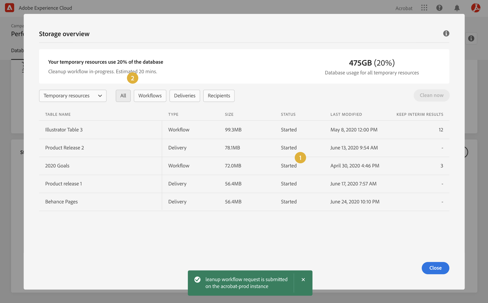
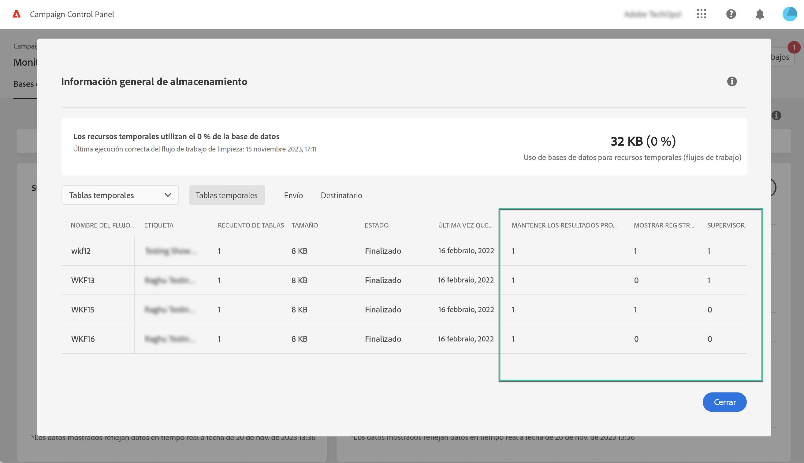

# Monitorización de flujos de trabajo {#monitor-workflows}

<!-- Clean paused and completed workflows

When [!DNL Adobe Campaign] workflows are paused or completed, they leave temporary tables on your instances database that consume space and can lead to performance issues.

Control Panel allows you to identify those workflows and clean the temporary resources generated on your instances.

>[!NOTE]
>
>Technically, this operation executes the **[!UICONTROL Database cleanup technical workflow]** that runs on your Campaign instance everyday (see [Campaign Standard](https://experienceleague.adobe.com/docs/campaign-standard/using/administrating/application-settings/technical-workflows.html#list-of-technical-workflows) and [Campaign Classic](https://experienceleague.adobe.com/docs/campaign-classic/using/monitoring-campaign-classic/data-processing/database-cleanup-workflow.html) documentation). 

To clean paused and completed workflows, follow these steps:

1. Navigate to the **[!UICONTROL Performance monitoring]** card.

1. In the **[!UICONTROL Databases]** tab, select the instance where you want to perform the operation.

1. Access the **[!UICONTROL Storage overview]** details, then filter the list on **[!UICONTROL Temporary tables]**. Learn more on **[!UICONTROL Storage overview]** in [this page](database-storage-overview.md).

    

1. All temporary tables generated on your instances by workflows and deliveries display. Click the **[!UICONTROL Clean now]** button to delete the resources generated by paused and completed workflows.

    

1. Once the operation is confirmed, you can track the estimated remaining time in the **[!UICONTROL Storage overview]** list.

    

Monitor workflow parameters -->

En Adobe Campaign, algunos parámetros de flujo de trabajo pueden requerir una atención específica para evitar problemas en las instancias. Los detalles del Panel de control de Campaign **[!UICONTROL Storage overview]** le permiten comprobar si alguna de estas opciones está habilitada para sus flujos de trabajo.

## **[!UICONTROL Keep interim results]** {#keep-results}

Cuando está activada (valor &quot;1&quot;), esta opción guarda los resultados de las transiciones entre las distintas actividades de un flujo de trabajo. Obtenga más información en la documentación de [Campaign Standard](https://experienceleague.adobe.com/docs/campaign-standard/using/managing-processes-and-data/executing-a-workflow/managing-execution-options.html?lang=es) y [Campaign Classic](https://experienceleague.adobe.com/docs/campaign-classic/using/automating-with-workflows/introduction/workflow-best-practices.html?lang=es#logs).

>[!IMPORTANT]
>
>Esta opción nunca se debe marcar en un flujo de trabajo de producción. Se utiliza con fines de análisis y prueba y, por lo tanto, solo debe utilizarse en entornos de desarrollo o ensayo. Recomendamos encarecidamente desactivarlo en Campaign.

## **[!UICONTROL Show SQL log]** {#sql}

Cuando esta opción está habilitada, las consultas SQL enviadas a la base de datos durante la ejecución del flujo de trabajo se muestran en Adobe Campaign. Obtenga más información en la documentación de [Campaign Standard](https://experienceleague.adobe.com/docs/campaign-standard/using/managing-processes-and-data/executing-a-workflow/managing-execution-options.html?lang=es) y [Campaign Classic](https://experienceleague.adobe.com/docs/campaign-classic/using/automating-with-workflows/advanced-management/workflow-properties.html?lang=es#execution).

El valor 1 indica que el flujo de trabajo tiene el campo **Gravedad** definido como Producción, y que la opción registro de consulta de SQL está habilitada.

>[!IMPORTANT]
>
>La activación de esta opción puede afectar al rendimiento y rellenar los archivos de registro en el servidor. Debe utilizarse únicamente con fines de análisis y diagnóstico.

## **[!UICONTROL Supervisors]** {#supervisors}

Este campo permite asignar un operador a un flujo de trabajo. Si el flujo de trabajo falla, se alerta al operador asociado. Obtenga más información en la documentación de [Campaign Standard](https://experienceleague.adobe.com/docs/campaign-standard/using/managing-processes-and-data/executing-a-workflow/monitoring-workflow-execution.html?lang=es#error-management) y [Campaign Classic](https://experienceleague.adobe.com/docs/campaign-classic/using/automating-with-workflows/advanced-management/workflow-properties.html?lang=es#error-management).

El valor 1 indica que el flujo de trabajo tiene el campo **Gravedad** definido como Producción y que no se ha asignado ningún grupo de supervisor al flujo de trabajo.

