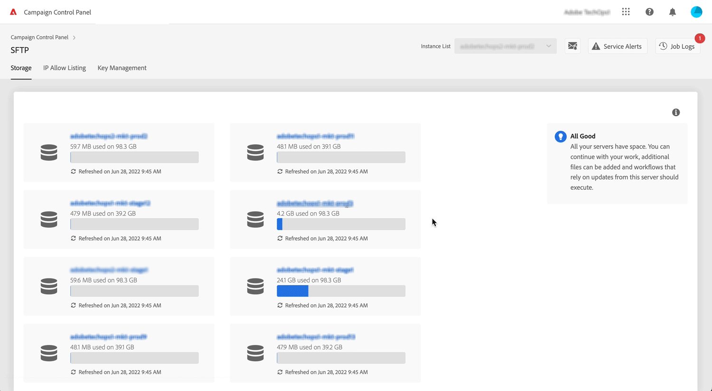

# Última versión {#control-panel-releases}

Esta página enumera todas las nuevas funciones y mejoras de Panel de control de Campaign.

## Junio de 2022 {#june-2022}

### Novedades?

<table>
<thead>
<tr>
<th><strong>Los 10 archivos principales que consumen espacio en los servidores SFTP</strong> </th>
</tr>
</thead>
<tbody>
<tr>
<td>

Ahora puede identificar los 10 archivos principales que consumen más espacio en un servidor SFTP. <a href="../sftp/using/sftp-storage-management.md">Más información</a>

</td>
</tr>
</tbody>
</table>

<table>
<thead>
<tr>
<th><strong>Avisos del calendario de servicios</strong> </th>
</tr>
</thead>
<tbody>
<tr>
<td>

El calendario de servicios ahora le permite configurar recordatorios para recibir notificaciones por correo electrónico antes de que se produzca un evento en las instancias. <a href="../service-events/service-events.md">Más información</a>

</td>
</tr>
</tbody>
</table>

<table>
<thead>
<tr>
<th><strong>Mejoras en la generación de CSR de los subdominios</strong> </th>
</tr>
</thead>
<tbody>
<tr>
<td>

Se han realizado varias mejoras en el proceso de generación de CSR. <a href="../subdomains-certificates/using/renewing-subdomain-certificate.md">Más información</a>
<ul><li>Al generar una CSR, ahora puede seleccionar uno de los subdominios incluidos como Nombre común.</li><li>Ahora puede copiar el resumen de la CSR antes de generar la CSR.</li><li>Una vez que se ha generado una CSR, puede descargarla de nuevo desde los registros de trabajos. Esta capacidad no se aplica a los certificados generados antes de esta versión.</li></ul>

</td>
</tr>
</tbody>
</table>

### Mejoras

**Configuración de instancias**

* El número máximo de claves GPG en Panel de control de Campaign se ha aumentado a 60 claves. [Más información](../instances-settings/using/gpg-keys-management.md)

## Mayo de 2022 {#may-2022}

<table>
<thead>
<tr>
<th><strong>Disponibilidad del Panel de control de Campaign para el modelo de alojamiento híbrido</strong> </th>
</tr>
</thead>
<tbody>
<tr>
<td>

El Panel de control de Campaign ya está disponible para los clientes con un modelo de alojamiento híbrido. Estos clientes pueden aprovechar las funciones del Panel de control de Campaign al proporcionar su URL de instancia MID/RT configurada en su instancia de marketing en Panel de control de Campaign.

Para obtener más información, consulte la <a href="../instances-settings/using/external-accounts.md">documentación detallada.</a>

</td>
</tr>
</tbody>
</table>

<table>
<thead>
<tr>
<th><strong>Actualizaciones de supervisión de las latencias y los procesos</strong> </th>
</tr>
</thead>
<tbody>
<tr>
<td>

Se han mejorado las capacidades de supervisión de los resultados y las latencias:<ul><li>Ahora puede identificar los ID de los cinco envíos principales que contribuyen al rendimiento de su instancia.</li><li>Los clientes de las versiones 7 y 8 de Campaign Classic ahora pueden visualizar la latencia de un canal específico.
</li>
Para obtener más información, consulte la <a href="../performance-monitoring/using/thoughputs-latencies.md">documentación detallada.</a>

</td>
</tr>
</tbody>
</table>

## Abril de 2022 {#april-2022}

<table>
<thead>
<tr>
<th><strong>Supervisión de contactos y eventos clave en las instancias</strong> </th>
</tr>
</thead>
<tbody>
<tr>
<td>

Ahora puede monitorizar las versiones anteriores y futuras, así como las revisiones de servicio que se producen en las instancias, y acceder a una lista de contactos clave en Adobe para cualquier solicitud o problema.

Para obtener más información, consulte la <a href="../service-events/service-events.md">documentación detallada.</a>

</td>
</tr>
</tbody>
</table>

## Marzo de 2022 {#march-2022}

<table>
<thead>
<tr>
<th><strong>Disponibilidad de monitorización de latencia y de rendimiento</strong> </th>
</tr>
</thead>
<tbody>
<tr>
<td>

La monitorización de latencia y de rendimiento ya está disponible para todos los clientes Campaign Standards y v8, y para los clientes de Campaign V7 con los números de compilación 9032, 9330, 9346 o 9349 que tienen implementaciones independientes (sin ninguna instancia media).

Para obtener más información, consulte la <a href="../performance-monitoring/using/thoughputs-latencies.md">documentación detallada.</a>

</td>
</tr>
</tbody>
</table>

## Febrero de 2022 {#february-2022}

<table>
<thead>
<tr>
<th><strong>Monitorización de parámetros de flujo de trabajo</strong> </th>
</tr>
</thead>
<tbody>
<tr>
<td>

Ahora puede monitorizar los parámetros de flujo de trabajo que puedan requerir una atención específica para evitar problemas en las instancias. 

Para obtener más información, consulte la <a href="../performance-monitoring/using/workflow-monitoring.md">documentación detallada</a>.

</td>
</tr>
</tbody>
</table>

## Enero de 2022 {#january-2022}

<table>
<thead>
<tr>
<th><strong>Monitorización de consultas activas</strong> </th>
</tr>
</thead>
<tbody>
<tr>
<td>

Ahora, el Panel de control de Campaign le permite supervisar las consultas que se han estado ejecutando durante más tiempo en las instancias.

Para obtener más información, consulte la <a href="../performance-monitoring/using/database-active-queries.md">documentación detallada</a>.

</td>
</tr>
</tbody>
</table>

<table>
<thead>
<tr>
<th><strong>Monitorización de rendimiento y latencia </strong> </th>
</tr>
</thead>
<tbody>
<tr>
<td>

Ahora puede monitorizar cómo el rendimiento y la latencia de la entrega son tendencias a lo largo del tiempo en las instancias.

Para obtener más información, consulte la <a href="../performance-monitoring/using/thoughputs-latencies.md">documentación detallada</a>.

</td>
</tr>
</tbody>
</table>

<table>
<thead>
<tr>
<th><strong>Operaciones de certificados SSL en nuevos subdominios</strong> </th>
</tr>
</thead>
<tbody>
<tr>
<td>

Ahora, las operaciones de certificados SSL se pueden realizar en un subdominio recién configurado, incluso si la auditoría de la entrega sigue en curso.

Para obtener más información, consulte la <a href="../subdomains-certificates/using/renewing-subdomain-certificate.md">documentación detallada</a>.

</td>
</tr>
</tbody>
</table>
