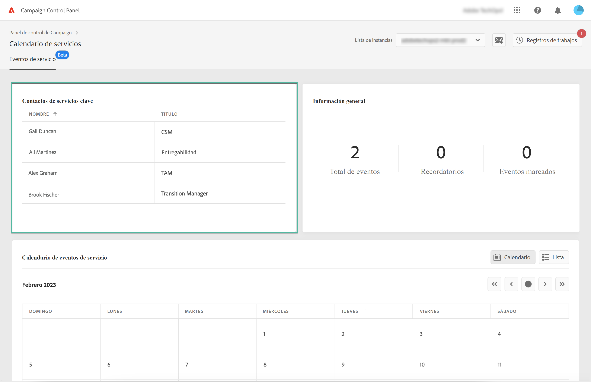
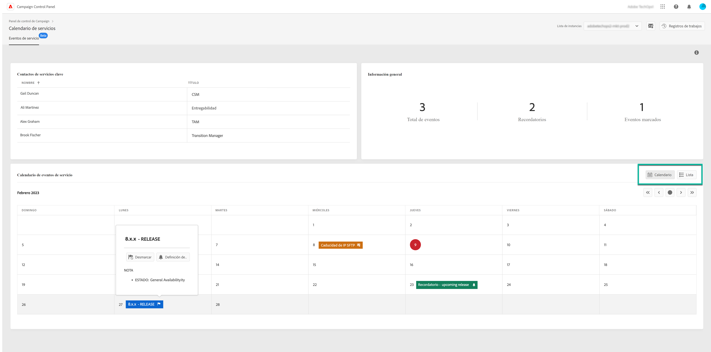
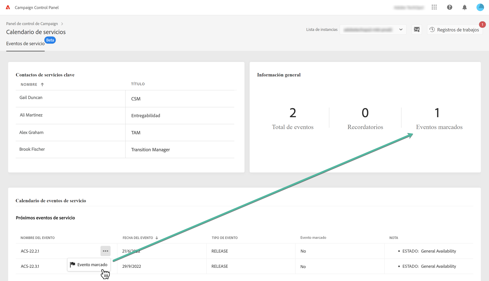
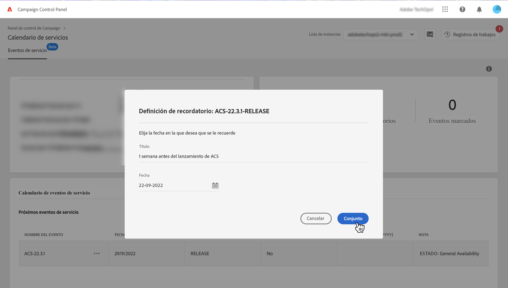
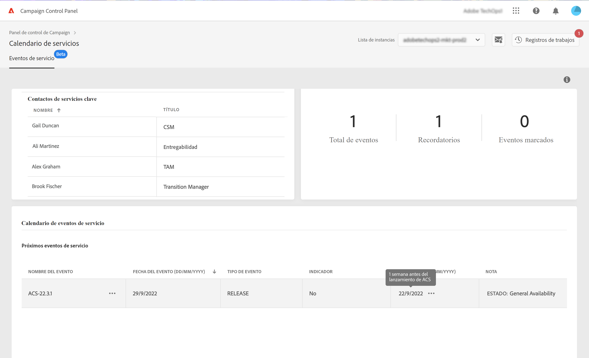

# Supervisión de los contactos y eventos clave {#keycontacts-events}

>[!CONTEXTUALHELP]
>id="cp_servicecalendar_serviceevents"
>title="Calendario de servicios"
>abstract="La sección Contactos clave enumera las personas en Adobe con las que ponerse en contacto para cualquier solicitud o problema de las instancias. En la sección Calendario de eventos de servicio , puede identificar las versiones y revisiones de servicio de la instancia seleccionada y configurar recordatorios para eventos próximos."

>[!IMPORTANT]
>
>El Calendario de servicios estará disponible en la versión beta y sujeta a frecuentes actualizaciones y modificaciones sin previo aviso.

La identificación de eventos planificados en las instancias es esencial para monitorizar las instancias de Campaign.

Con el Panel de control de Campaign, puede supervisar las versiones y revisiones de servicio que se producen en las instancias y acceder a una lista de contactos clave en Adobe para cualquier solicitud o problema.

Se puede acceder a esta información desde la tarjeta **[!UICONTROL Service Calendar]** en la página de inicio del Panel de control de Campaign.

## Contactos clave {#key-contacts}

La sección **[!UICONTROL Key contacts]** lista las personas en Adobe con las que puede ponerse en contacto para cualquier solicitud o problema de las instancias.

>[!NOTE]
>
>Esta sección muestra información solo para cuentas de servicio administradas.

Los contactos clave incluyen las siguientes funciones:

* **[!UICONTROL TAM]**: administrador de cuentas técnico,
* **[!UICONTROL CSM]**: Customer Success Manager,
* **[!UICONTROL Deliverability]**: punto de contacto para operaciones de capacidad de entrega,
* **[!UICONTROL Transition Manager]**: gestor de transición de Managed Services (solo para la cuenta de Managed Services),
* **[!UICONTROL On-boarding Specialist]**: especialista asignado a la cuenta para ayudarle en la incorporación a Campaign Classic (solo para la cuenta de Managed Services).

## Eventos {#events}

### Monitorización de eventos {#monitor-events}

La sección **[!UICONTROL Service Event Calendar]** muestra todas las versiones anteriores y futuras, así como las revisiones de servicio de la instancia seleccionada.

La columna **[!UICONTROL Note]** proporciona información sobre el estado de cada versión:

* **[!UICONTROL General availability]**: última compilación estable disponible.
* **[!UICONTROL Limited availability]**: solo implementación bajo demanda.
* **[!UICONTROL Release candidate]**: validado por ingeniería. Esperando pruebas de producción.
* **[!UICONTROL Pre release]**: disponibilidad anticipada para necesidades específicas del cliente.
* **[!UICONTROL No longer available]**: la versión no presenta ningún problema importante, pero hay una nueva disponible con correcciones de errores adicionales. Se requiere una actualización.
* **[!UICONTROL Deprecated]**: regresiones conocidas de la incrustación de la versión.
La versión ya no es compatible. Es obligatorio actualizar.

Puede asignar un indicador a uno o varios eventos próximos para realizar un seguimiento de ellos. Para ello, haga clic en el botón de los tres puntos situado junto al nombre del evento.

### Definir recordatorios {#reminders}

Con el Calendario de servicios, puede configurar recordatorios para que se le notifique por correo electrónico antes de que se produzca un evento.

>[!NOTE]
>
>Para recibir notificaciones sobre próximos eventos, asegúrese de haberse suscrito a las alertas de correo electrónico en el Panel de control de Campaign. [Más información](../performance-monitoring/using/email-alerting.md)

Para establecer una alerta para un evento, siga estos pasos:

1. Haga clic en el botón de elipse junto al evento del que desee que se le recuerde y, a continuación, seleccione **[!UICONTROL Set Reminder]**.

1. Asigne un título al recordatorio y seleccione la fecha en la que desea que se le notifique antes de que se produzca el evento.

   

   >[!NOTE]
   >
   >Si no se ha suscrito a las alertas de Panel de control de Campaign, se mostrará un mensaje que le permitirá inscribirse para recibir notificaciones por correo electrónico.

1. El recordatorio ahora se establece para el evento seleccionado. Puede pasar el ratón sobre ella en cualquier momento para mostrar su título.

   

   >[!NOTE]
   >
   >Se pueden configurar hasta dos recordatorios para el mismo evento.

1. En la fecha especificada en el recordatorio, se enviará un correo electrónico para notificarle el evento siguiente y el recordatorio se eliminará automáticamente del **[!UICONTROL Reminders]** en el menú Calendario de servicios .
