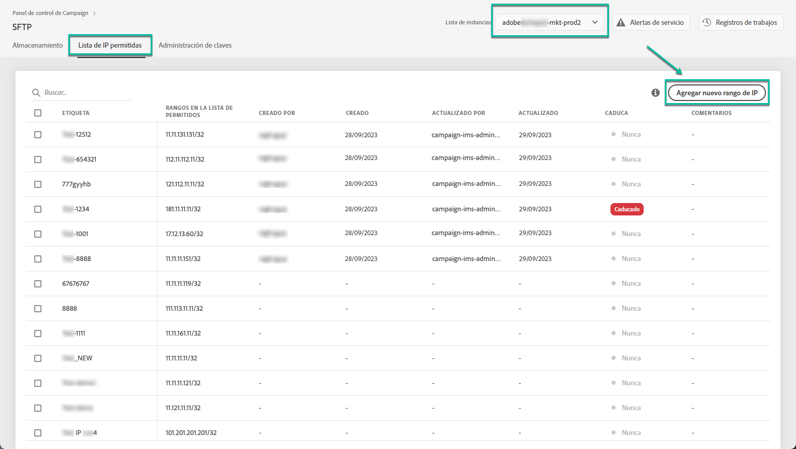
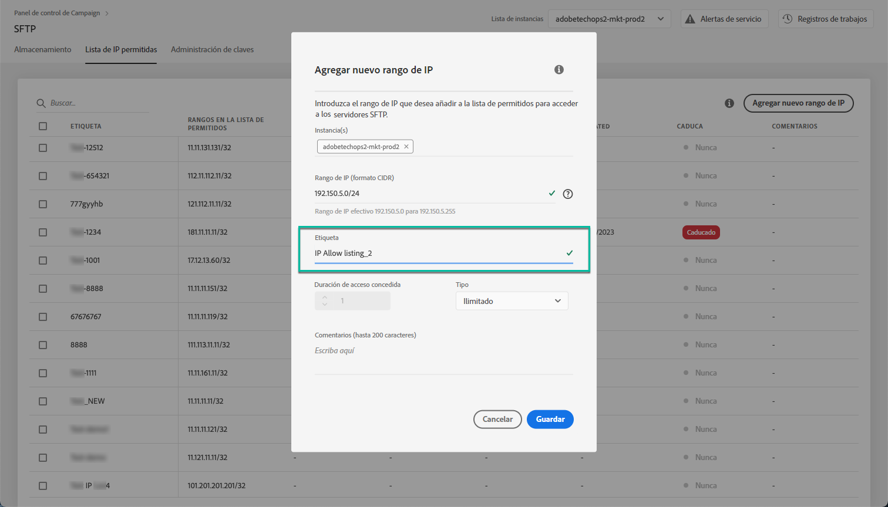
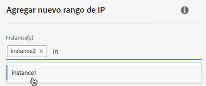
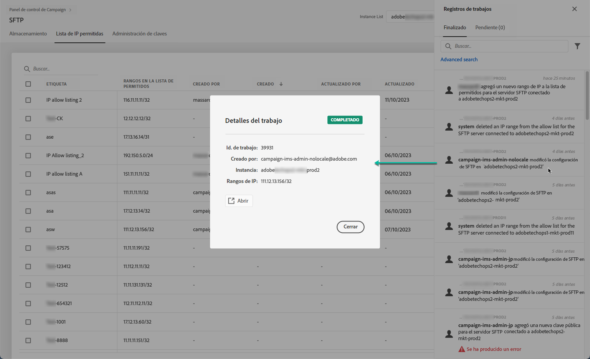

# Adición de rangos de IP a la lista de permitidos {#ip-range-allow-listing}

>[!CONTEXTUALHELP]
>id="cp_ip_whitelist"
>title="Acerca de las listas de IP permitidas"
>abstract="En esta pestaña, puede agregar rangos de IP a la lista de permitidos para establecer una conexión con los servidores SFTP. Aquí solo se muestran los servidores SFTP a los que tiene acceso. Póngase en contacto con el administrador para solicitar acceso a otros servidores SFTP."
>additional-url="https://images-tv.adobe.com/mpcv3/8a977e03-d76c-44d3-853c-95d0b799c870_1560205338.1920x1080at3000_h264.mp4#t=98" text="Ver vídeo de demostración"

Los servidores SFTP están protegidos. Para poder acceder a ellos con el fin de ver archivos o escribir nuevos archivos, debe incluir en la lista de permitidos la dirección IP pública del sistema o cliente que accede a los servidores.

 Descubra esta función en vídeo usando  [Campaign ](https://experienceleague.adobe.com/docs/campaign-classic-learn/control-panel/sftp-management/adding-ip-range-to-allow-list.html?lang=en#sftp-management) Classic  [Campaign Standard](https://experienceleague.adobe.com/docs/campaign-standard-learn/control-panel/sftp-management/adding-ip-range-to-allow-list.html?lang=en#sftp-management)

## Acerca del formato CIDR {#about-cidr-format}

CIDR (enrutamiento entre dominios sin clase) es el formato admitido al agregar intervalos de IP con la interfaz del Panel de control de Campaign.

La sintaxis consiste en una dirección IP, seguida de / y un número decimal. El formato y su sintaxis se detallan en [este artículo](https://whatismyipaddress.com/cidr).

Puede buscar en Internet herramientas gratuitas en línea que le ayudarán a convertir la gama de IP al formato CIDR.

## Prácticas recomendadas {#best-practices}

Asegúrese de seguir las recomendaciones y limitaciones que se indican a continuación al incluir direcciones IP en la lista de permitidos en el Panel de control de Campaign-

* **Añada rangos de IP a la lista de permitidos** en lugar de a direcciones IP únicas. Para incluir una sola dirección IP en la lista de permitidos, añada /32 para indicar que el rango solo incluye una sola dirección IP.
* **No agregue rangos muy anchos a la lista de permitidos**, por ejemplo, incluyendo >265 direcciones IP. El Panel de control de Campaign rechazará cualquier rango de formato CIDR que esté entre /0 y /23.
* Solo se pueden agregar **direcciones IP públicas** a la lista de permitidos.
* Asegúrese de **eliminar con cierta regularidad las direcciones IP** que ya no necesite de la lista de permitidos.

## Adición de direcciones IP a la lista de permitidos {#adding-ip-addresses-allow-list}

>[!CONTEXTUALHELP]
>id="cp_sftp_iprange_add"
>title="Adición de un nuevo rango de IP"
>abstract="Defina los rangos de IP que desea agregar a la lista de permitidos para conectarse a los servidores SFTP."

Para agregar un rango de IP a la lista de permitidos, siga estos pasos:

1. Abra la tarjeta **[!UICONTROL SFTP]** y seleccione la pestaña **[!UICONTROL IP Allow Listing]**.
1. La lista de las direcciones IP en la lista de permitidos se muestra para cada instancia. Seleccione la instancia que desee en la lista del lado izquierdo y haga clic en el botón **[!UICONTROL Add new IP range]**.

   

1. Defina el rango de IP que desea incluir en la lista de permitidos, en formato CIDR, y luego defina la etiqueta que se mostrará en la lista.

   >[!NOTE]
   >
   >Estos caracteres especiales se permiten en el campo Etiqueta:
   > `. _ - : / ( ) # , @ [ ] + = & ; { } ! $`

   

   >[!IMPORTANT]
   >
   >Un rango de IP no puede superponerse a un intervalo existente en la lista de permitidos. En ese caso, primero elimine el rango que contiene la IP superpuesta.
   >
   >Es posible agregar un rango en la lista de permitidos para varias instancias. Para ello, pulse la tecla de la flecha hacia abajo o escriba las primeras letras de la instancia deseada y selecciónela en la lista de sugerencias.

   

1. Haga clic en el botón **[!UICONTROL Save]**. La adición de IP a la lista de permitidos se mostrará como PENDIENTE hasta que la solicitud se procese por completo. Esto solo debería tardar unos segundos.

Para eliminar rangos de IP de la lista de permitidos, selecciónelos y haga clic en el botón **[!UICONTROL Delete IP range]**.

>[!NOTE]
>
>Actualmente no es posible editar rangos en la lista de permitidos. Para modificar un rango de IP, elimínelo y luego cree uno que se ajuste a sus necesidades.

## Control de cambios {#monitoring-changes}

**[!UICONTROL Job Logs]**, en la página de inicio del Panel de control de Campaign, permite supervisar todos los cambios realizados en las direcciones IP permitidas.

Para obtener más información sobre la interfaz del Panel de control de Campaign, consulte [esta sección](../../discover/using/discovering-the-interface.md).

