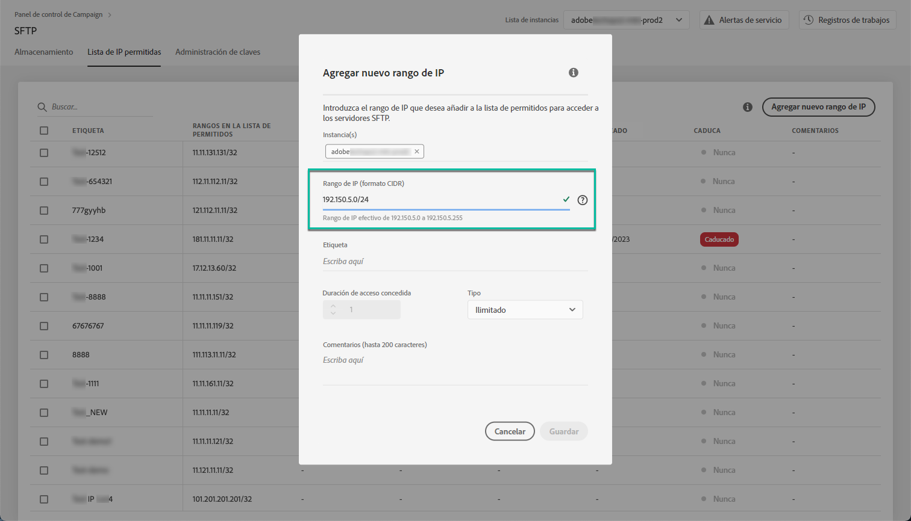
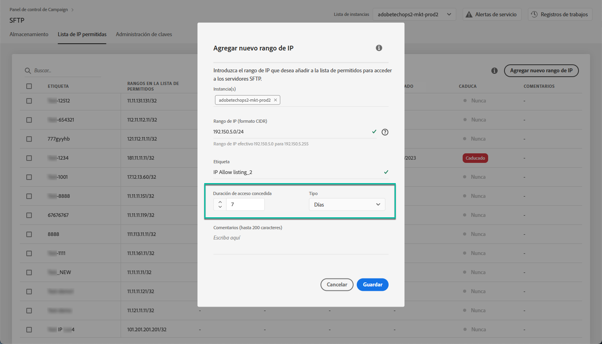
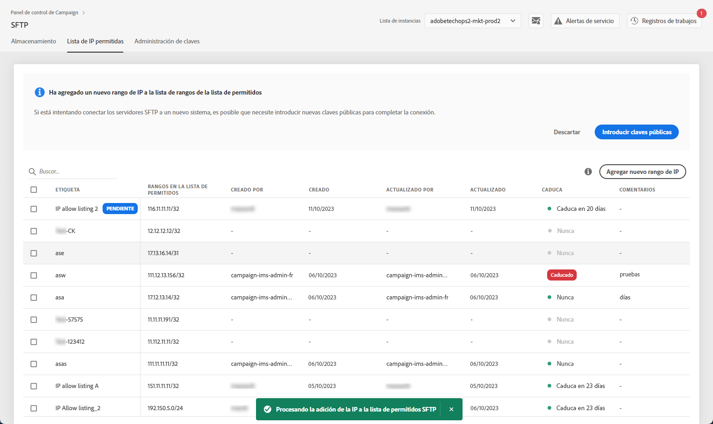
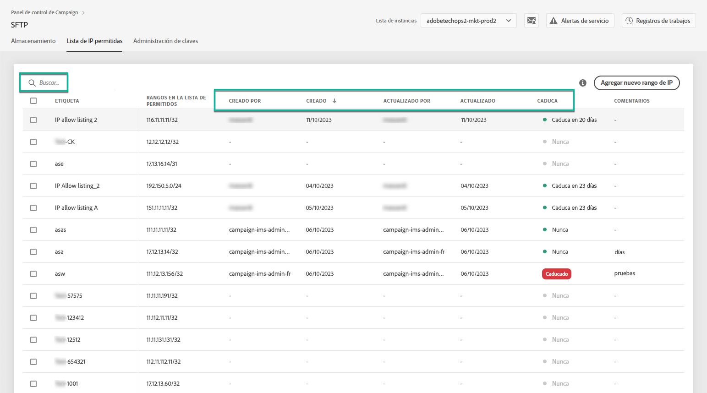
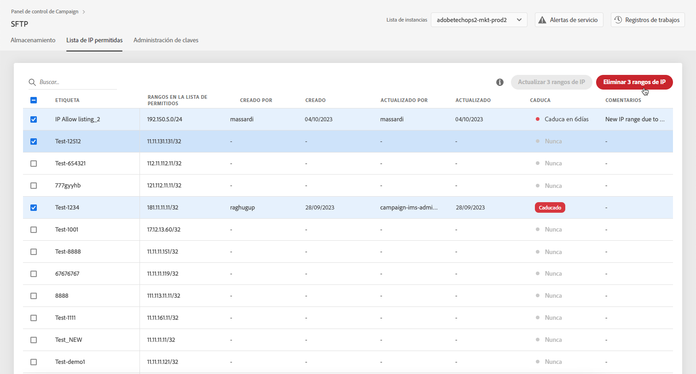
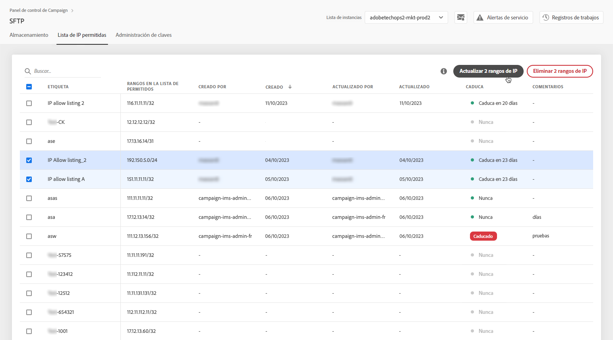
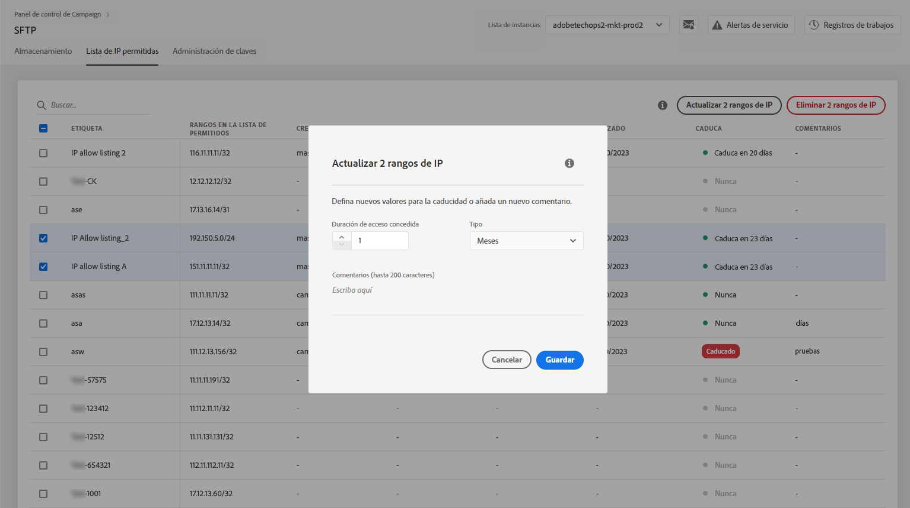

# Adición de rangos de IP a la lista de permitidos {#ip-range-allow-listing}

>[!CONTEXTUALHELP]
>id="cp_ip_whitelist"
>title="Acerca de las listas de IP permitidas"
>abstract="En esta pestaña, puede agregar rangos de IP a la lista de permitidos para establecer una conexión con los servidores SFTP. Aquí solo se muestran los servidores SFTP a los que tiene acceso. Póngase en contacto con el administrador para solicitar acceso a otros servidores SFTP."
>additional-url="https://images-tv.adobe.com/mpcv3/8a977e03-d76c-44d3-853c-95d0b799c870_1560205338.1920x1080at3000_h264.mp4#t=98" text="Ver vídeo de demostración"

Los servidores SFTP están protegidos. Para poder acceder a ellos para ver archivos o escribir nuevos archivos, debe añadir a la lista de permitidos la dirección IP pública del sistema o cliente que accede a los servidores.

 Descubra esta función en vídeo usando [Campaign v7/v8](https://experienceleague.adobe.com/docs/campaign-classic-learn/control-panel/sftp-management/adding-ip-range-to-allow-list.html#sftp-management) o [Campaign Standard](https://experienceleague.adobe.com/docs/campaign-standard-learn/control-panel/sftp-management/adding-ip-range-to-allow-list.html#sftp-management)

## Acerca del formato CIDR {#about-cidr-format}

CIDR (enrutamiento entre dominios sin clase) es el formato admitido al agregar intervalos de IP con la interfaz del Panel de control.

La sintaxis consiste en una dirección IP, seguida de / y un número decimal. El formato y su sintaxis se detallan en [este artículo](https://whatismyipaddress.com/cidr){target="_blank"}.

Puede buscar en Internet herramientas gratuitas en línea que le ayudarán a convertir la gama de IP al formato CIDR.

## Prácticas recomendadas {#best-practices}

Asegúrese de seguir las recomendaciones y limitaciones que se indican a continuación al incluir direcciones IP en la lista de permitidos en el Panel de control-

* **Añada rangos de IP a la lista de permitidos** en lugar de a direcciones IP únicas. Para incluir una sola dirección IP en la lista de permitidos, añada /32 para indicar que el rango solo incluye una sola dirección IP.
* **No agregue rangos muy anchos a la lista de permitidos**, por ejemplo, incluyendo >265 direcciones IP. El Panel de control rechazará cualquier rango de formato CIDR que esté entre /0 y /23.
* Solo se pueden agregar **direcciones IP públicas** a la lista de permitidos.
* Asegúrese de lo siguiente **eliminar direcciones IP con regularidad** que ya no necesita de la lista de permitidos.

## Adición de direcciones IP a la lista de permitidos {#adding-ip-addresses-allow-list}

>[!CONTEXTUALHELP]
>id="cp_sftp_iprange_add"
>title="Configuración de rango de IP"
>abstract="Defina los rangos de IP que desea agregar a la lista de permitidos para conectarse a los servidores SFTP."

Para agregar un rango de IP a la lista de permitidos, siga estos pasos:

1. Abra el **[!UICONTROL SFTP]** , luego seleccione la **[!UICONTROL Listado de IP permitidas]** pestaña.
1. La lista de las direcciones IP en la lista de permitidos se muestra para cada instancia. Seleccione la instancia que desee en la lista del lado izquierdo y haga clic en **[!UICONTROL Agregar nuevo intervalo de IP]** botón.

   

1. Defina el rango de IP que desea agregar a la lista de permitidos. Este campo solo acepta rangos de IP en formato CIDR, como *192.150.5.0/24*.

   

   >[!IMPORTANT]
   >
   >Un rango de IP no puede superponerse a un intervalo existente en la lista de permitidos. En ese caso, primero elimine el rango que contiene la IP superpuesta.

1. Es posible añadir un rango a la lista de permitidos para varias instancias. Para ello, pulse la tecla de la flecha hacia abajo o escriba las primeras letras de la instancia deseada y selecciónela en la lista de sugerencias.

   

1. Defina la etiqueta que se mostrará para este rango de IP en la lista.

   

   >[!NOTE]
   >
   >Se permiten los siguientes caracteres especiales en la variable **[!UICONTROL Etiqueta]** campo:
   > `. _ - : / ( ) # , @ [ ] + = & ; { } ! $`

1. Para administrar mejor la lista de permitidos de IP, puede establecer una duración para la disponibilidad de cada intervalo de IP. Para ello, seleccione una unidad en la **[!UICONTROL Tipo]** y defina una duración en el campo correspondiente. Para obtener más información sobre la caducidad del intervalo IP, consulte [esta sección](#expiry).

   

   >[!NOTE]
   >
   >De forma predeterminada, la variable **[!UICONTROL Tipo]** el campo está configurado como **[!UICONTROL Ilimitado]**, lo que significa que el rango de IP nunca caduca.

1. En el **[!UICONTROL Comentario]** , puede indicar un motivo para permitir este intervalo de IP (por qué, para quién, etc.).

1. Haga clic en el botón **[!UICONTROL Save.]** El intervalo IP que se suma a la lista de permitidos se mostrará como **[!UICONTROL Pendiente]** hasta que la solicitud se procese por completo, lo que solo debería tardar unos segundos.

   

>[!IMPORTANT]
>
>Si intenta conectar los servidores SFTP a un sistema nuevo y, por lo tanto, agrega nuevos intervalos de IP a la lista de permitidos, es posible que tenga que introducir nuevas claves públicas para completar la conexión. Para obtener más información, consulte [esta sección](key-management.md).

## Administración de intervalos de IP {#managing-ip-ranges}

Los rangos de IP que cree se mostrarán en **[!UICONTROL Listado de IP permitidas]** pestaña.

Puede ordenar los elementos en función de la fecha de creación o de edición, del usuario que lo creó o editó y de la caducidad del intervalo de IP.

También puede buscar un rango de IP empezando a escribir una etiqueta, un intervalo, un nombre o un comentario.

Para editar uno o más rangos de IP, consulte [esta sección](#editing-ip-ranges).

Para eliminar uno o más rangos de IP de la lista de permitidos, selecciónelos y haga clic en **[!UICONTROL Eliminar intervalo de IP]** botón.

### Vencimiento {#expiry}

El **[!UICONTROL Caduca]** Esta columna muestra cuántos días quedan hasta que caduque el rango de IP.

Si se ha suscrito a [alertas por correo electrónico](../../performance-monitoring/using/email-alerting.md), recibirá notificaciones por correo electrónico 10 días y 5 días antes de que caduque un intervalo de IP y el día en que caduque. Una vez recibida la alerta, puede [editar el rango de IP](#editing-ip-ranges) para ampliar su periodo de validez si es necesario.

Un intervalo de IP caducado se eliminará automáticamente pasados 7 días. Se muestra como **[!UICONTROL Caducado]** en el **[!UICONTROL Caduca]** columna. Dentro de este periodo de 7 días:

* Ya no se puede utilizar un intervalo IP caducado para acceder a los servidores SFTP.

* No puede crear otro rango de IP que se superponga a un intervalo caducado. Primero debe eliminar el rango de IP caducado antes de crear el nuevo.

* Puede [editar](#editing-ip-ranges) un intervalo de IP caducado y actualice su duración para que vuelva a estar disponible.

* Puede eliminarlo de la lista de permitidos.

## Edición de rangos de IP {#editing-ip-ranges}

>[!CONTEXTUALHELP]
>id="cp_sftp_iprange_update"
>title="Actualización de rangos de IP"
>abstract="Actualice los rangos de IP seleccionados que pueden conectarse al servidor SFTP."

Para editar rangos de IP, siga los pasos a continuación.

>[!NOTE]
>
>Solo puede editar intervalos de IP creados desde la versión de Panel de control de Campaign de octubre de 2021.

<!--Edition is not available for IP ranges that have been created before the Control Panel October 2021 release.-->

1. Seleccione uno o varios rangos de IP en la lista **[!UICONTROL Listado de IP permitidas]** lista.

1. Haga clic en **[!UICONTROL Actualizar intervalo de IP]** botón.

   

1. Solo puede editar la caducidad del intervalo IP o agregar un comentario nuevo.

   >[!NOTE]
   >
   >Para modificar el formato CIDR, su etiqueta o editar las instancias relacionadas, primero debe eliminar el rango de IP y crear uno nuevo que se ajuste a sus necesidades.

   

1. Guarde los cambios.

## Control de cambios {#monitoring-changes}

El **[!UICONTROL Registros de trabajo]** en la página de inicio de Panel de control de Campaign, puede realizar un seguimiento y monitorizar todos los cambios realizados en las direcciones IP de la lista de permitidos.

Para obtener más información sobre la interfaz del Panel de control, consulte [esta sección](../../discover/using/discovering-the-interface.md).

