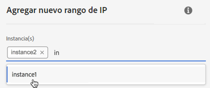

# Lista blanca de rangos de IP {#ip-range-whitelisting}

>[!CONTEXTUALHELP]
>id="cp_ip_whitelist"
>title="Acerca de las listas blancas de IP"
>abstract="En esta pestaña, puede incluir rangos de IP en la lista blanca para establecer una conexión con los servidores SFTP. Aquí solo se muestran los servidores SFTP a los que tiene acceso. Póngase en contacto con el administrador para solicitar acceso a otros servidores SFTP."
>additional-url="https://images-tv.adobe.com/mpcv3/8a977e03-d76c-44d3-853c-95d0b799c870_1560205338.1920x1080at3000_h264.mp4#t=98" text="Ver vídeo de demostración"

Los servidores SFTP están protegidos. Para poder acceder a ellos con el fin de ver archivos o escribir nuevos archivos, debe incluir en la lista blanca la dirección IP pública del sistema o cliente que accede a los servidores.

## Acerca del formato CIDR {#about-cidr-format}

CIDR (enrutamiento entre dominios sin clase) es el formato admitido al agregar intervalos de IP con la interfaz del Panel de control de Campaign.

La sintaxis consiste en una dirección IP, seguida de / y un número decimal. El formato y su sintaxis se detallan en [este artículo](https://whatismyipaddress.com/cidr).

Puede buscar en Internet herramientas gratuitas en línea que le ayudarán a convertir la gama de IP al formato CIDR.

## Prácticas recomendadas {#best-practices}

Asegúrese de seguir las recomendaciones y limitaciones que se indican a continuación al incluir direcciones IP en la lista blanca en el Panel de control de Campaign.

* **Lista blanca de rangos de IP**, en lugar de direcciones IP únicas. Para incluir una sola dirección IP en la lista blanca, añada /32 para indicar que el rango solo incluye una sola dirección IP.
* **No incluya rangos muy anchos en la lista blanca** como, por ejemplo, > 265 direcciones IP. El Panel de control de Campaign rechazará cualquier rango de formato CIDR que esté entre /0 y /23.
* Solo se pueden incluir en la lista blanca las **direcciones IP públicas**.
* Asegúrese de **eliminar frecuentemente las direcciones IP de la lista blanca** que ya no necesite.

## Lista blanca de direcciones IP {#whitelisting-ip-addresses}

>[!CONTEXTUALHELP]
>id="cp_sftp_iprange_add"
>title="Adición de un nuevo rango de IP"
>abstract="Defina los rangos IP que desea incluir en la lista blanca para conectarse a los servidores SFTP."

Para incluir un rango IP en la lista blanca, siga estos pasos:

1. Abra la tarjeta **[!UICONTROL SFTP]** y seleccione la pestaña **[!UICONTROL IP Whistelisting]**.
1. Se muestra la lista de direcciones IP en la lista blanca para cada instancia. Seleccione la instancia que desee en la lista del lado izquierdo y haga clic en el botón **[!UICONTROL Add new IP range]**.

   

1. Defina el rango IP que desea incluir en la lista blanca, en formato CIDR, y luego defina la etiqueta que se mostrará en la lista.

   >[!NOTE]
   >
   >Estos caracteres especiales se permiten en el campo Etiqueta:
   > `. _ - : / ( ) # , @ [ ] + = & ; { } ! $`

   

   >[!IMPORTANT]
   >
   >un rango IP no puede superponerse a un intervalo de la lista blanca existente. En ese caso, primero elimine el rango que contiene la IP superpuesta.
   >
   >Es posible incluir un rango en la lista blanca para varias instancias. Para ello, pulse la tecla de la flecha hacia abajo o escriba las primeras letras de la instancia deseada y selecciónela en la lista de sugerencias.

   

1. Haga clic en el botón **[!UICONTROL Save]**. La incorporación a la lista blanca de IP se mostrará como PENDIENTE hasta que la solicitud se procese por completo. Esto solo debería tardar unos segundos.

Para eliminar los rangos de IP en la lista blanca, selecciónelos y haga clic en el botón **[!UICONTROL Delete IP range]**.

>[!NOTE]
>
>Actualmente no es posible editar un rango de la lista blanca. Para modificar un rango de IP, elimínelo y luego cree uno que se ajuste a sus necesidades.

## Control de cambios {#monitoring-changes}

**[!UICONTROL Job Logs]**, en la página de inicio del Panel de control de Campaign, permite supervisar todos los cambios realizados en las direcciones IP permitidas.

Para obtener más información sobre la interfaz del Panel de control de Campaign, consulte [esta sección](../../discover/using/discovering-the-interface.md).

