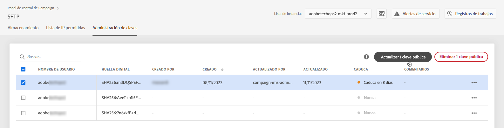

# Administración de claves {#key-management}

>[!CONTEXTUALHELP]
>id="cp_key_management"
>title="Acerca de la administración de claves públicas"
>abstract="En esta pestaña, cree, administre y edite las claves públicas."
>additional-url="https://images-tv.adobe.com/mpcv3/8a977e03-d76c-44d3-853c-95d0b799c870_1560205338.1920x1080at3000_h264.mp4#t=166" text="Ver vídeo de demostración"

Adobe recomienda que todos los clientes establezcan una conexión con sus servidores SFTP **con un par de claves públicas y privadas**.

A continuación, se describen los pasos para generar una clave SSH pública y añadirla para acceder al servidor SFTP, así como las recomendaciones relativas a la autenticación.

Una vez configurado el acceso al servidor, recuerde **añadir las direcciones IP que requerirán acceso al servidor a la lista de permitidos** para poder conectarse a él. Para obtener más información, consulte [esta sección](../../instances-settings/using/ip-allow-listing-instance-access.md).

 Descubra esta función en vídeo usando [Campaign v7/v8](https://experienceleague.adobe.com/docs/campaign-classic-learn/control-panel/sftp-management/generate-ssh-key.html#sftp-management) o [Campaign Standard](https://experienceleague.adobe.com/docs/campaign-standard-learn/control-panel/sftp-management/generate-ssh-key.html#sftp-management)

## Prácticas recomendadas {#best-practices}

**Acerca de la clave SSH pública**

Asegúrese de utilizar siempre la misma autenticación para conectarse al servidor y de utilizar un formato admitido para la clave.

**Integración de API con nombre de usuario y contraseña**

En casos muy excepcionales, la autenticación basada en contraseña está habilitada en algunos servidores SFTP. El Adobe recomienda utilizar la autenticación basada en claves, ya que este método es más eficaz y seguro. Puede solicitar cambiar a la autenticación basada en claves poniéndose en contacto con el Servicio de atención al cliente.

>[!IMPORTANT]
>
>Si la contraseña caduca, incluso si hay claves instaladas en el sistema, no podrá iniciar sesión en sus cuentas de SFTP.

## Instalación de la clave SSH {#installing-ssh-key}

>[!CONTEXTUALHELP]
>id="cp_sftp_publickey_add"
>title="Adición de clave pública"
>abstract="Genere una clave SSH pública para una instancia y añádala al panel de control de Campaign para acceder al servidor SFTP."

>[!IMPORTANT]
>
>Siempre debe seguir las directrices de su organización con respecto a las claves SSH. Los pasos siguientes son solo un ejemplo de cómo se puede crear claves SSH y pueden servir como punto de referencia útil para comunicar los requisitos a su equipo o grupo de red interno.

1. Vaya a la pestaña **[!UICONTROL Key Management]** y, a continuación, haga clic en el botón **[!UICONTROL Add new public key]**.

   

1. En el cuadro de diálogo que aparece, seleccione el nombre de usuario para el que desea crear la clave pública y el servidor para el que desea activar la clave.

   

   >[!NOTE]
   >
   >El Panel de control de Campaign comprobará si un determinado nombre de usuario está activo en una instancia determinada y le permitirá activar la clave en una o varias instancias.
   >
   >Se pueden añadir una o más claves SSH públicas por cada usuario.

1. Para administrar mejor las claves públicas, puede establecer una duración para la disponibilidad de cada clave. Para ello, seleccione una unidad en la **[!UICONTROL Type]** y defina una duración en el campo correspondiente. Para obtener más información sobre la caducidad de la clave pública, consulte [esta sección](#expiry).

   

   >[!NOTE]
   >
   >De forma predeterminada, la variable **[!UICONTROL Type]** el campo está configurado como **[!UICONTROL Unlimited]**, lo que significa que la clave pública nunca caduca.

1. En el **[!UICONTROL Comment]** , puede indicar un motivo para añadir esta clave pública (por qué, para quién, etc.).

1. Para poder rellenar el **[!UICONTROL Public Key]** , debe generar una clave SSH pública. Siga los pasos a continuación según su sistema operativo.

   **Linux y Mac:**

   Utilice el terminal para generar un par de claves pública y privada:
   1. Introduzca este comando: `ssh-keygen -m pem -t rsa -b 2048 -C "your_email@example.com"`.
   1. Proporcione un nombre a la clave cuando se le solicite. Si el directorio .ssh no existe, el sistema creará uno.
   1. Introduzca y vuelva a introducir una contraseña cuando se le solicite. No obstante, lo puede dejar en blanco.
   1. El sistema crea un par de claves &quot;name&quot; y &quot;name.pub&quot;. Busque el archivo &quot;name.pub&quot; y ábralo. Debe tener una cadena alfanumérica que termina con la dirección de correo electrónico especificada.

   **Windows:**

   Es posible que deba instalar una herramienta de terceros que le ayude a generar pares de claves públicas/privadas con el mismo formato &quot;name.pub&quot;.

1. Abra el archivo .pub y, a continuación, copie y pegue toda la cadena empezando por &quot;ssh...&quot; en el Panel de control.

   

   >[!NOTE]
   >
   >El **[!UICONTROL Public Key]** Este campo solo acepta el formato OpenSSH. El tamaño de la clave SSH pública debe ser de **2048 bits**.

1. Haga clic en el botón **[!UICONTROL Save]** para crear la clave. El Panel de control de Campaign guarda la clave pública y su huella digital asociada cifrada con el formato SHA256.

>[!IMPORTANT]
>
>Si la clave que ha creado se utiliza para establecer una conexión con un sistema que nunca antes se había conectado al servidor SFTP seleccionado, deberá agregar una IP pública de ese sistema a la lista de permitidos antes de poder utilizar este sistema con el servidor SFTP. Consulte [esta sección](ip-range-allow-listing.md).

Puede utilizar las huellas digitales para que coincidan con las claves privadas guardadas en el equipo con las claves públicas correspondientes guardadas en la Panel de control de Campaign.

El botón **...** permite eliminar una clave existente o copiar su huella digital asociada en el portapapeles.

## Administración de claves públicas {#managing-public-keys}

Las claves públicas que cree se mostrarán en **[!UICONTROL Key Management]** pestaña.

Puede ordenar los elementos en función de la fecha de creación o de edición, del usuario que lo creó o editó y de la caducidad del intervalo de IP.

También puede buscar una clave pública empezando a escribir un nombre o un comentario.

Para editar uno o más rangos de IP, consulte [esta sección](#editing-public-keys).

Para eliminar una o más claves públicas de la lista, selecciónelas y, a continuación, haga clic en **[!UICONTROL Delete public key]** botón.

### Vencimiento {#expiry}

El **[!UICONTROL Expires]** Esta columna muestra cuántos días quedan hasta que la clave pública caduque.

Si se ha suscrito a [alertas por correo electrónico](../../performance-monitoring/using/email-alerting.md)Además, recibirá notificaciones por correo electrónico 10 días y 5 días antes de que la clave pública caduque y el día en que caduque. Una vez recibida la alerta, puede [editar la clave pública](#editing-public-keys) para ampliar su periodo de validez si es necesario.

Una clave pública caducada se eliminará automáticamente pasados 7 días. Se muestra como **[!UICONTROL Expired]** en el **[!UICONTROL Expires]** columna. Dentro de este periodo de 7 días:

* Ya no se puede utilizar una clave pública caducada para conectarse al servidor SFTP.

* Puede [editar](#editing-public-keys) una clave pública caducada y actualice su duración para que vuelva a estar disponible.

* Puede eliminarlo de la lista.

## Edición de claves públicas {#editing-public-keys}

>[!CONTEXTUALHELP]
>id="cp_sftp_publickey_update"
>title="Edición de claves públicas"
>abstract="Actualice las claves públicas seleccionadas para acceder al servidor SFTP."

Para editar las claves públicas, siga los pasos a continuación.

>[!NOTE]
>
>Solo puede editar las claves públicas que se hayan creado desde la versión de Panel de control de Campaign de octubre de 2021.

1. Seleccione uno o varios elementos de la **[!UICONTROL Key Management]** lista.
1. Haga clic en el botón **[!UICONTROL Update public key]**.

   

1. Solo puede editar la caducidad de la clave pública o agregar un comentario nuevo.

   >[!NOTE]
   >
   >Para modificar el nombre de usuario, la instancia y la clave pública en formato OpenSSH, elimine la clave pública y cree una nueva que se ajuste a sus necesidades.

1. Guarde los cambios.
