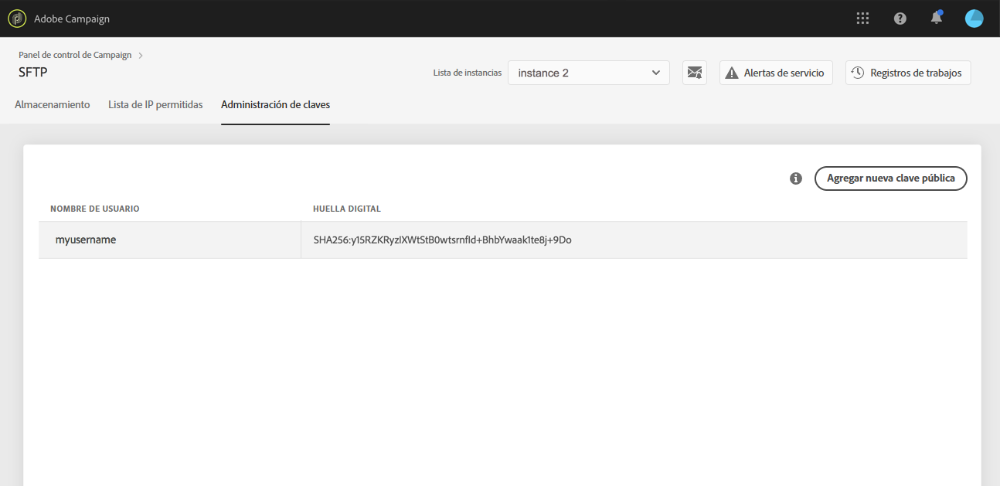
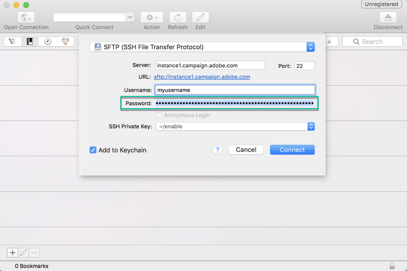
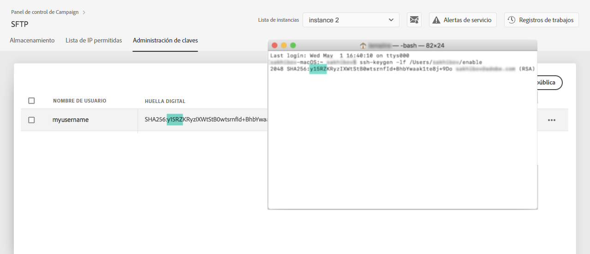

# Inicio de sesión en el servidor SFTP {#logging-into-sft-server}

Los siguientes pasos explican cómo conectar el servidor SFTP mediante la aplicación cliente SFTP.

 Descubra esta funcionalidad en [vídeo](https://video.tv.adobe.com/v/27263?quality=12)

Antes de iniciar sesión en el servidor, compruebe que:

* El servidor SFTP está **alojado por Adobe**.
* Se ha configurado el **nombre de usuario** para el servidor. Puede consultar esta información directamente en el Panel de control, en la pestaña **Administración de claves**, en la tarjeta SFTP.
* Dispone de un **par de claves pública y privada** para iniciar sesión en el servidor SFTP. Consulte [esta sección](../../sftp/using/key-management.md) para más información sobre cómo añadir la clave SSH.
* Su **dirección IP pública ha sido añadida a la lista de permitidos** en el servidor SFTP. Si no es así, consulte [esta sección](../../sftp/using/ip-range-allow-listing.md) para obtener más información sobre cómo añadir el intervalo de IP a la lista de permitidos.
* Tiene acceso a un **software cliente SFTP**. Puede consultar a su departamento de TI qué aplicación cliente SFTP recomiendan utilizar, o buscar una en Internet si las políticas de su empresa lo permiten.

Para conectarse a su servidor SFTP, siga estos pasos:

1. Inicie el Panel de control y, a continuación, seleccione la pestaña **[!UICONTROL Administración de claves]** desde la tarjeta **[!UICONTROL SFTP]**.

   

1. Inicie la aplicación cliente SFTP, copie y pegue la dirección del servidor desde el Panel de control, seguida de &quot;campaign.adobe.com&quot; y, a continuación, introduzca el nombre de usuario.

   

1. En el campo **[!UICONTROL Clave privada SSH]**, seleccione el archivo de clave privada almacenado en el equipo. Se corresponde con un archivo de texto que tiene el mismo nombre que su clave pública, sin la extensión “.pub” (por ejemplo, “enable”).

   

   El campo **[!UICONTROL Contraseña]** se rellena automáticamente con la clave privada del archivo.

   

   Puede comprobar que la clave que intenta utilizar está guardada en el Panel de control comparando la huella de la clave privada o pública con la huella de las claves que aparecen en la pestaña Administración de claves de la tarjeta SFTP.

   

   >[!NOTE]
   >
   >Si está utilizando un equipo Mac, puede ver la huella de la clave privada almacenada en el equipo ejecutando este comando:
   >
   >`ssh-keygen -lf <path of the privatekey>`

1. Una vez rellenada toda la información, pulse **[!UICONTROL Connect]** para iniciar sesión en el servidor SFTP.

   
