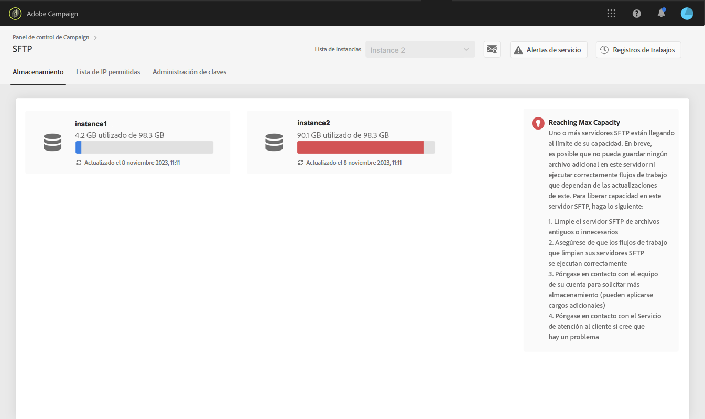
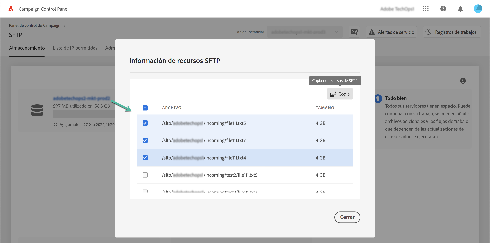

# Administración de almacenamiento SFTP {#sftp-storage-management}

>[!CONTEXTUALHELP]
>id="cp_storage"
>title="Acerca de la capacidad de almacenamiento"
>abstract="En esta pestaña, puede ver la información de capacidad y utilización de almacenamiento de sus servidores SFTP. También puede enumerar los 10 archivos que más espacio consumen en un servidor SFTP haciendo clic en su nombre. Aquí solo se muestran los servidores SFTP a los que tiene acceso. Póngase en contacto con el administrador para solicitar acceso a otros servidores SFTP."
>additional-url="https://images-tv.adobe.com/mpcv3/8a977e03-d76c-44d3-853c-95d0b799c870_1560205338.1920x1080at3000_h264.mp4" text="Ver vídeo de demostración"

Es posible que tenga una capacidad de almacenamiento diferente en su servidor SFTP según las condiciones contractuales.

Es vital que supervise regularmente el espacio disponible para cada uno de los servidores SFTP. De lo contrario, es posible que ya no pueda guardar ningún archivo adicional en el servidor o ejecutar correctamente flujos de trabajo que dependan de las actualizaciones de este servidor.

Si se ha suscrito a las [alertas por correo electrónico](../../performance-monitoring/using/email-alerting.md), recibirá notificaciones por correo electrónico cuando uno de sus servidores SFTP haya alcanzado el 80 % o más de su capacidad. Consulte la[Administración del almacenamiento SFTP](../../sftp/using/sftp-storage-management.md).

 Descubra esta función en vídeo usando [Campaign v7/v8](https://experienceleague.adobe.com/docs/campaign-classic-learn/control-panel/sftp-management/monitoring-server-capacity.html?lang=es#sftp-management) o [Campaign Standard](https://experienceleague.adobe.com/docs/campaign-standard-learn/control-panel/sftp-management/monitoring-server-capacity.html?lang=es#sftp-management)

## Acceso a la información de la capacidad de almacenamiento {#accessing-storage-capacity-information}

La información sobre el espacio utilizado por todas las instancias a las que tiene acceso está disponible en la pestaña **[!UICONTROL Storage]** de la tarjeta SFTP. Se actualiza en cada actualización de página.

En cada caso, una alerta visual le permite saber cuándo su almacenamiento supera su capacidad:

* **Naranja**: la instancia superó el 80 % de su capacidad,
* **Rojo**: la instancia supera el 90% de su capacidad.

También puede identificar los 10 archivos que más espacio consumen en un servidor SFTP haciendo clic en su nombre.

También hay disponibles sugerencias adicionales para ayudarle a saber cómo proceder con el servidor a medida que se acerca al límite de su capacidad.

## Prácticas recomendadas cuando se agota la capacidad de almacenamiento {#best-practices-when-capacity-runs-out}

1. **Limpie el servidor SFTP de archivos antiguos o innecesarios**. Para obtener más información sobre cómo acceder a la carpeta del servidor SFTP, consulte [esta sección](../../sftp/using/logging-into-sftp-server.md).
1. Asegúrese de que los **flujos de trabajo** que limpian los servidores SFTP se ejecutan correctamente. Para obtener más información sobre flujos de trabajo técnicos en Adobe Campaign, consulte la documentación específica de [Campaign v7/v8](https://experienceleague.adobe.com/docs/campaign-classic/using/automating-with-workflows/advanced-management/about-technical-workflows.html?lang=es) y [Campaign Standard](https://experienceleague.adobe.com/docs/campaign-standard/using/administrating/application-settings/technical-workflows.html?lang=es).
1. Póngase en contacto con el equipo de su cuenta para **solicitar más almacenamiento** (pueden aplicarse cargos adicionales).
1. Póngase en contacto con el **Servicio de atención al cliente** si cree que hay algún problema.
