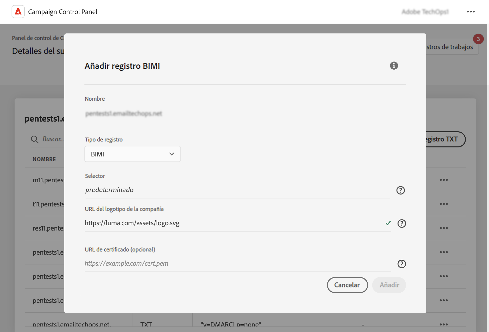

# Adición de registros BIMI {#dmarc}

## Acerca de los registros BIMI {#about}

Los indicadores de marca para la identificación de mensajes (BIMI-Brand Indicators for Message Identification) son un estándar en la industria que permite que aparezca un logotipo aprobado junto al correo electrónico de un remitente en las bandejas de entrada de los proveedores de buzones de correo para mejorar el reconocimiento y la confianza de la marca. BIMI ayuda a evitar la suplantación de identidad (phishing) y la suplantación electrónica (spoofing) de correo electrónico mediante la verificación de la identidad del remitente con autenticación DMARC, lo que dificulta a los actores malintencionados la suplantación de marcas legítimas en los correos electrónicos.

Puede tener varios logotipos para un subdominio determinado. Para ello, es necesario configurar un registro BIMI para cada logotipo y asignar un selector BIMI a cada registro. [Aprenda a añadir un registro BIMI](#add)

Encontrará información detallada sobre la implementación de BIMI en [Guía de prácticas recomendadas de envío de Adobe](https://experienceleague.adobe.com/docs/deliverability-learn/deliverability-best-practice-guide/additional-resources/technotes/implement-bimi.html?lang=es)

{width="70%" align="center"}

## Limitaciones y requisitos previos {#limitations}

* Los registros SPF, DKIM y DMARC son un requisito previo para crear un registro BIMI.
* Los registros BIMI solo se pueden añadir para subdominios utilizando la delegación de subdominios completa. [Obtenga más información sobre los métodos de configuración de subdominios](subdomains-branding.md#subdomain-delegation-methods)
* Requisitos previos del registro DMARC:

   * El tipo de directiva de registro del subdominio debe establecerse en &quot;Cuarentena&quot; o &quot;Rechazar&quot;. La creación de registros BIMI no está disponible con un tipo de directiva DMARC establecido en &quot;Ninguno&quot;.
   * El porcentaje de correos electrónicos a los que se aplica la directiva DMARC debe ser del 100 %. BIMI no es compatible con las directivas DMARC con este porcentaje establecido en menos del 100 %.

[Obtenga información sobre cómo configurar registros DMARC](dmarc.md)

## Adición de un registro BIMI para un subdominio {#add}

Para añadir un registro BIMI para un subdominio, siga estos pasos:

1. En la lista de subdominios, haga clic en el botón de los tres puntos situado junto al subdominio deseado y seleccione **[!UICONTROL Detalles del subdominio]**.

1. Haga clic en el botón **[!UICONTROL Añadir registro TXT]** y, a continuación, seleccione **[!UICONTROL BIMI]** en la lista desplegable **[!UICONTROL Tipo de registro]**.

   

1. El **[!UICONTROL Selector]** permite especificar un selector BIMI para el registro. Un selector BIMI es un identificador único que se puede asignar a un registro BIMI. Esto le permite definir varios logotipos para un subdominio determinado.

1. En **[!UICONTROL URL del logotipo de la compañía]**, especifique la URL del archivo SVG que contiene el logotipo.

1. Aunque **[!UICONTROL URL del certificado]** es opcional, es necesario para algunos proveedores de buzones de correo como Gmail y Apple, que cubren el 80 % del mercado de buzones de correo. Por lo tanto, recomendamos obtener un Certificado de marca verificada (VMC) para aprovechar realmente BIMI.

   +++¿Cómo obtengo un VMC?

   Los pasos principales para obtener un MVC son los siguientes:

   1. Registre su logotipo de marca como una marca comercial con una oficina de propiedad intelectual reconocida por los emisores de VMC. Si tiene un equipo legal, le recomendamos que trabaje con ellos para obtener su logotipo de marca comercial o para verificar que ya esté registrado.

   1. Después de verificar que su logotipo es de marca comercial, póngase en contacto con DigiCert o con la entidad emisora de certificados (CA) de Entrust para solicitar un VMC.

   1. Cuando se apruebe su VMC, recibirá un archivo de correo mejorado de privacidad (PEM) de certificado de entidad. Anexe cualquier otro certificado intermedio que obtenga de la CA a este archivo PEM. Cargue el archivo PEM (junto con los archivos adjuntos) en su servidor web público y tome nota de la URL del archivo PEM. Utilizará la dirección URL en su registro TXT BIMI.

   1. Una vez que el registro BIMI esté visible en la página de detalles del subdominio para un subdominio en particular, puede utilizar el Inspector BIMI disponible [aquí](https://bimigroup.org/bimi-generator/) para comprobar si el registro BIMI funciona correctamente.

   Encontrará información detallada sobre la implementación de BIMI en la [documentación estándar de BIMI](https://bimigroup.org/implementation-guide/)
+++

1. Haga clic en **[!UICONTROL Añadir]** para confirmar la creación del registro BIMI.

Una vez procesada la creación del registro BIMI (aproximadamente 5 minutos), aparece en la pantalla de detalles de los subdominios. [Obtenga información sobre cómo supervisar registros TXT para los subdominios](gs-txt-records.md#monitor)
