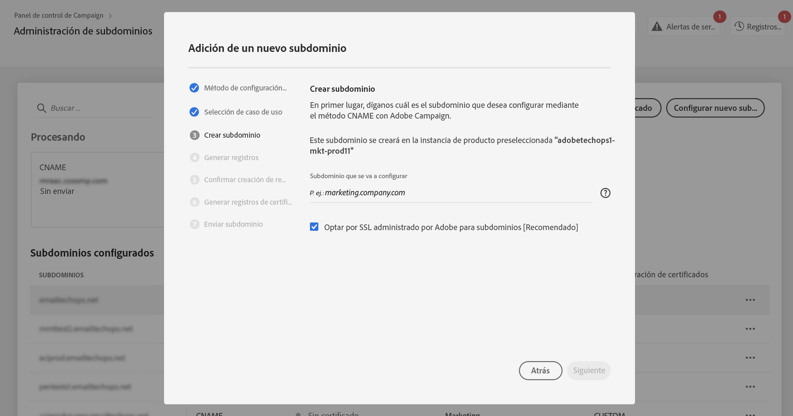
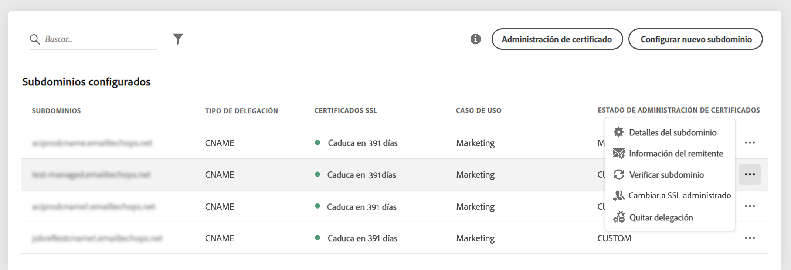
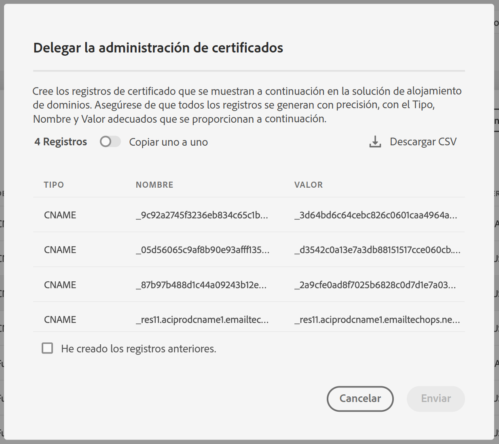

# Delegación de certificados SSL de los subdominios en el Adobe {#delegate-ssl-certificates}

>[!CONTEXTUALHELP]
>id="cp_managed_ssl"
>title="Delegación de certificados SSL de los subdominios en el Adobe"
>abstract="El Panel de control de Campaign de permite administrar por Adobe los certificados SSL de los subdominios. Si utiliza CNAME para configurar el subdominio, los registros de certificados se generarán y proporcionarán automáticamente para generar un certificado en la solución de alojamiento de dominios."

Se recomienda delegar los certificados SSL de los subdominios al Adobe, ya que el Adobe creará automáticamente el certificado y lo renovará cada año antes de que caduque el certificado.

Si utiliza CNAME para configurar una delegación de subdominios, Adobe proporcionará registros de certificado para utilizarlos en la solución de alojamiento de dominios a fin de generar el certificado.

La delegación de certificados SSL al Adobe se puede realizar al configurar un nuevo subdominio o para subdominios ya delegados.

>[!NOTE]
>
>SSL administrado por Adobe es una funcionalidad gratuita a disposición de los usuarios sin cargo alguno.

## Delegación de nuevos certificados SSL de subdominios {#new}

Para delegar certificados SSL al configurar un nuevo subdominio, habilite la variable **[!UICONTROL Opt for Adobe managed SSL for sub-domains]** del asistente de configuración de subdominios. Los registros de certificados que se copiarán en la solución de alojamiento se proporcionarán más adelante en el asistente de configuración. Los pasos detallados se documentan en [esta sección](setting-up-new-subdomain.md).

{width="70%" align="left"}

## Delegación de certificados SSL para subdominios ya delegados {#delegated}

Para delegar certificados SSL para un subdominio ya delegado, haga clic en el botón de puntos suspensivos situado junto al subdominio deseado y seleccione **[!UICONTROL Switch to Managed SSL]**.

{width="70%" align="left"}

Aparece un cuadro de diálogo con los registros de certificado que el Adobe ha generado automáticamente. Copie estos registros, uno por uno o descargando un archivo CSV, y luego vaya a la solución de alojamiento de dominios para generar el certificado coincidente.

Asegúrese de que todos los registros de certificados se hayan generado en la solución de alojamiento de dominios. Si todo está configurado correctamente, confirme la creación de los registros y haga clic en **[!UICONTROL Submit]**.

{width="70%" align="left"}
