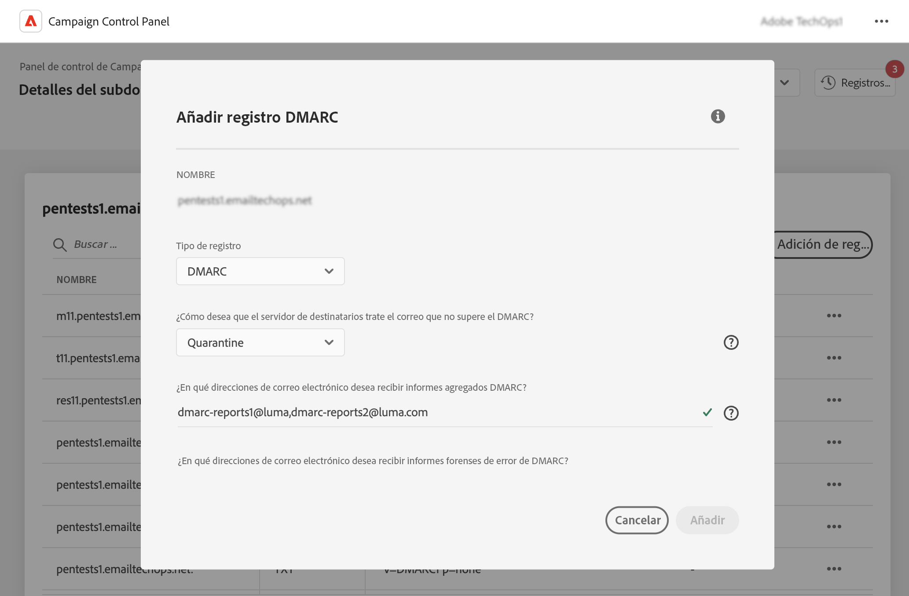
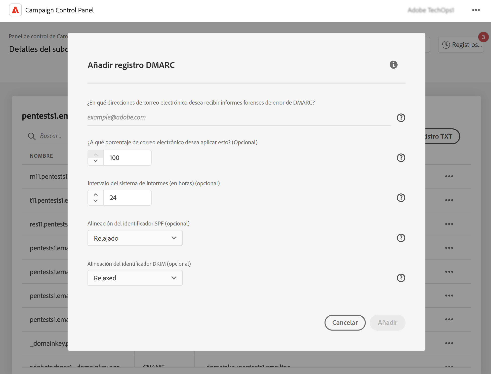

# Adición de registros DMARC {#dmarc}

## Acerca de los registros DMARC {#about}

Domain based Message Authentication, Reporting and Conformance (DMARC) es un estándar de protocolo de autenticación de correo electrónico que ayuda a las organizaciones a proteger sus dominios de correo electrónico frente a ataques de suplantación de identidad (phishing) y suplantación electrónica (spoofing). Permite decidir cómo debe gestionar un proveedor de buzones los correos electrónicos que no superan las comprobaciones SPF y DKIM, lo que proporciona una forma de autenticar el dominio del remitente y evitar el uso no autorizado del dominio con fines malintencionados.

Encontrará información detallada sobre la implementación de DMARC en la [Guía de prácticas recomendadas de envío de Adobe](https://experienceleague.adobe.com/docs/deliverability-learn/deliverability-best-practice-guide/additional-resources/technotes/implement-dmarc.html?lang=es)

## Limitaciones y requisitos previos {#limitations}

* Los registros SPF y DKIM son un requisito previo para crear un registro DMARC.
* Los registros DMARC solo se pueden añadir para subdominios utilizando la delegación de subdominios completa. [Obtenga más información sobre los métodos de configuración de subdominios](subdomains-branding.md#subdomain-delegation-methods)

  Para establecer un registro DMARC en un subdominio basado en CNAME, puede configurar el registro DMARC en su dominio principal. Esto garantiza que todos los subdominios asociados hereden los parámetros de registro DMARC, incluso cuando se deleguen a través de los CNAME.

* Si existen registros DMARC y BIMI para un subdominio:
   * Los registros DMARC no se pueden eliminar. Si desea eliminar un registro DMARC, elimine primero el registro BIMI.
   * Los registros DMARC se pueden editar, pero no se permite bajar de categoría la directiva DMARC a &quot;Ninguno&quot; y el valor porcentual debe establecerse en &quot;100&quot;.

## Adición de un registro DMARC para un subdominio {#add}

Para añadir un registro DMARC para un subdominio, siga estos pasos:

1. En la lista de subdominios, haga clic en el botón de los tres puntos situado junto al subdominio deseado y seleccione **[!UICONTROL Detalles del subdominio]**.

1. Haga clic en el botón **[!UICONTROL Añadir registro TXT]** y, a continuación, seleccione **[!UICONTROL DMARC]** en la lista desplegable **[!UICONTROL Tipo de registro]**.

   

1. Seleccione el **[!UICONTROL Tipo de directiva]** que debe seguir el servidor del destinatario cuando falla uno de los correos electrónicos. Los tipos de directivas disponibles son:

   * **[!UICONTROL Ninguno]**,
   * **[!UICONTROL Cuarentena]** (ubicación en la carpeta de correo no deseado),
   * **[!UICONTROL Rechazar]** (bloquear el correo electrónico).

   Como práctica recomendada, se recomienda implementar lentamente la implementación de DMARC escalando la directiva de DMARC de p=ninguno a p=cuarentena, a p=rechazar a medida que se obtiene la comprensión de DMARC del impacto potencial de DMARC.

   * **Paso 1:** analice los comentarios que recibe y utiliza (p=ninguno), lo que indica al destinatario que no realice ninguna acción contra los mensajes que no se autentican correctamente, pero que envíe informes de correo electrónico al remitente. Además, revise y corrija los problemas con SPF/DKIM si los mensajes legítimos fallan en la autenticación.

   * **Paso 2:** determine si SPF y DKIM están alineados y pasan la autenticación para todo el correo electrónico legítimo y, a continuación, mueva la directiva a (p=cuarentena), que indica al servidor de correo electrónico receptor que ponga en cuarentena el correo electrónico que falla en la autenticación (esto generalmente significa colocar esos mensajes en la carpeta de correo no deseado). Si la directiva está configurada para poner en cuarentena, se recomienda que comience con un pequeño porcentaje de los correos electrónicos.

   * **Paso 3:** ajuste la directiva a (p=rechazar). NOTA: Utilice esta directiva con precaución y determine si es apropiada para su organización. La directiva p= rechazar indica al destinatario que deniegue (rechace) completamente cualquier correo electrónico del dominio que falle en la autenticación. Con esta directiva habilitada, solo el correo electrónico verificado como 100 % autenticado por el dominio tendrá la oportunidad de ser ubicado en la bandeja de entrada.

   >[!NOTE]
   >
   > La creación de registros BIMI no está disponible con un tipo de directiva de registro DMARC establecido en &quot;Ninguno&quot;.

1. Rellene las direcciones de correo electrónico que deben recibir los informes DMARC. Puede añadir varias direcciones de correo electrónico separadas por comas. Cuando uno de los correos electrónicos falla, los informes DMARC se envían automáticamente a la dirección de correo electrónico que elija:

   * Los informes DMARC agregados proporcionan información de alto nivel como, por ejemplo, el número de correos electrónicos con errores durante un periodo determinado.
   * Los informes de errores de DMARC forenses proporcionan información detallada como, por ejemplo, la dirección IP desde la que se originan los mensajes de correo electrónico erróneos.

   >[!CAUTION]
   >
   >Si las direcciones de correo electrónico que está agregando para recibir informes están fuera del dominio para el que se crea el registro DMARC, debe autorizar su dominio externo para especificar al DNS que posee este dominio. Para ello, siga los pasos detallados en la sección [Documentación de dmarc.org](https://dmarc.org/2015/08/receiving-dmarc-reports-outside-your-domain)

1. Si la directiva DMARC está establecida en &quot;Ninguno&quot;, introduzca un porcentaje que se aplique al 100 % de los correos electrónicos.

   Si la directiva se establece en &quot;Rechazar&quot; o &quot;Cuarentena&quot;, se recomienda que comience con un pequeño porcentaje de los correos electrónicos. A medida que más correos electrónicos de su dominio pasen la autenticación con servidores de recepción, actualice su registro lentamente con un porcentaje más alto.

   >[!NOTE]
   >
   >Si su dominio utiliza BIMI, su directiva DMARC debe tener un valor porcentual del 100 %. BIMI no admite directivas DMARC con este valor establecido en menos del 100 %.

   

1. Los informes DMARC se envían cada 24 horas. Puede cambiar la frecuencia de envío de informes en el campo **[!UICONTROL Intervalo del sistema de informes]**. El intervalo mínimo autorizado es de 1 hora, mientras que el valor máximo autorizado es de 2190 horas (es decir, 3 meses).

1. En los campos **SPF** y **[!UICONTROL Alineación de identificadores DKIM]**, especifique lo estrictos que deben ser los servidores destinatarios al comprobar las autenticaciones SPF y DKIM de un correo electrónico.

   * Modo **[!UICONTROL Relajado]**: el servidor acepta la autenticación incluso si el correo electrónico se envía desde un subdominio,
   * El modo **[!UICONTROL Estricto]** solo acepta la autenticación cuando el dominio del remitente coincide exactamente con un dominio SPF y DKIM.

   Supongamos que estamos trabajando con el dominio `http://www.luma.com`. En el modo &quot;Relajado&quot;, el servidor autorizará los correos electrónicos procedentes del subdominio `marketing.luma.com`, mientras que se rechazarán en el modo &quot;Estricto&quot;.

1. Haga clic en **[!UICONTROL Añadir]** para confirmar la creación del registro DMARC.

Una vez procesada la creación del registro DMARC (aproximadamente 5 minutos), este se muestra en la pantalla de detalles de los subdominios. [Obtenga información sobre cómo supervisar registros TXT para los subdominios](gs-txt-records.md#monitor)
