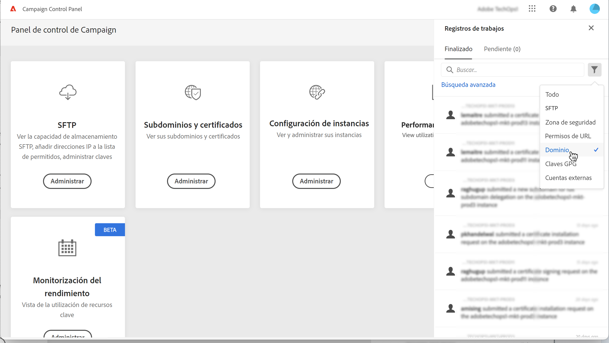
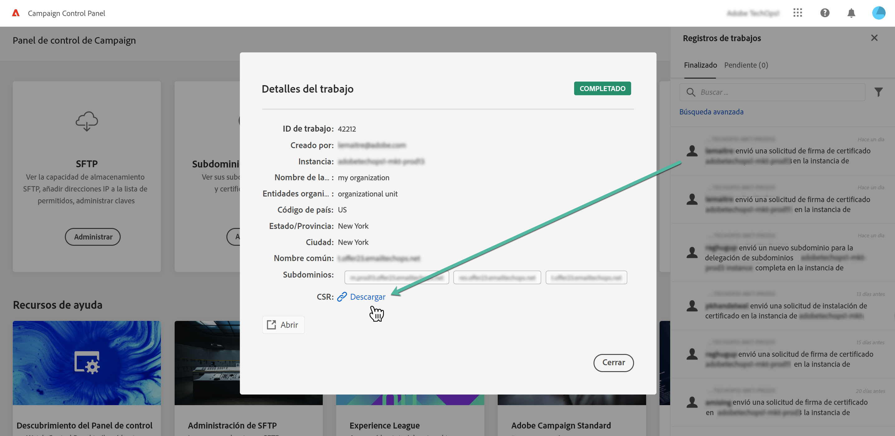

# Generar una CSR {#generating-csr}

>[!CONTEXTUALHELP]
>id="cp_generate_csr"
>title="Generación de CSR"
>abstract="La solicitud de firma de certificado debe generarse para la instancia y los subdominios que tiene previsto proteger antes de comprar un certificado."

>[!CONTEXTUALHELP]
>id="cp_select_subdomains"
>title="Selección de los subdominios para la CSR"
>abstract="Puede optar por incluir todos los subdominios o solo los específicos en la solicitud de firma de certificado. Solo los subdominios seleccionados se certificarán mediante el certificado SSL adquirido."
>additional-url="https://experienceleague.adobe.com/docs/control-panel/using/subdomains-and-certificates/subdomains-branding.html?lang=es" text="Acerca de la marca de subdominios"

## Generación de la CSR {#generate}

Para generar una solicitud de firma de certificado (CSR), siga estos pasos:

1. En la tarjeta **[!UICONTROL Subdomains & Certificates]**, seleccione la instancia que desee y haga clic en el botón **[!UICONTROL Manage Certificate]**.

   

1. Seleccione **[!UICONTROL 1 - Generate a CSR]**, luego haga clic en **[!UICONTROL Next]** para iniciar el asistente que lo guiará a través del proceso de generación de CSR.

   

1. Verá un formulario con todos los detalles necesarios para generar su CSR.

   Asegúrese de completar la información solicitada de forma completa y precisa; de lo contrario, es posible que el certificado no se renueve (póngase en contacto con el equipo interno, los equipos de seguridad y TI si es necesario) y haga clic en **[!UICONTROL Next]**.

   * **[!UICONTROL Organization]**: nombre oficial de la organización.
   * **[!UICONTROL Organization Unit]**: unidad vinculada al subdominio (ejemplo: Marketing, TI).
   * **[!UICONTROL Instance]** (precargada): dirección URL de la instancia de Campaign asociada al subdominio.
   * **[!UICONTROL Common name]**: Si el nombre común está seleccionado de forma predeterminada, puede seleccionar uno de los subdominios si es necesario.

   

1. Seleccione los subdominios que desea incluir en la CSR y, a continuación, haga clic en **[!UICONTROL OK]**.

   

1. Los subdominios seleccionados se muestran en la lista. Para cada uno de ellos, seleccione los subdominios que desee incluir y haga clic en **[!UICONTROL Next]**.

   

1. Se muestra un resumen de los subdominios que se incluirán en la CSR. Haga clic en **[!UICONTROL Submit]** para confirmar la solicitud.

   

   >[!NOTE]
   >
   >La variable **[!UICONTROL Copy CSR content]** permite copiar toda la información relacionada con la CSR (identificador de organización, instancia, nombre de organización, nombre común, subdominios incluidos, etc.)

1. El archivo .csr correspondiente a su selección se genera y descarga automáticamente. Ahora puede utilizarlo para adquirir el certificado SSL de la entidad emisora de certificados que apruebe su compañía. Si necesita volver a descargar la CSR, siga los pasos detallados en [esta sección](#download).

Una vez que su CSR se haya generado y descargado, puede utilizarlo para adquirir un certificado SSL de una entidad emisora de certificados aprobada por su organización.

Una vez adquirido el certificado SSL, podrá instalarlo en su instancia para proteger el subdominio. [Más información](install-ssl-certificate.md)

## Descargar la CSR {#download}

Para adquirir un certificado SSL, primero debe descargar la solicitud de firma de certificado. La CSR se descarga automáticamente una vez generada. También puede volver a descargarlo en cualquier momento desde los registros de trabajos:

1. En el **[!UICONTROL Job Logs]**, seleccione **[!UICONTROL Finished]** y, a continuación, filtre la lista para mostrar los trabajos relacionados con la administración de subdominios.

   

1. Abra el trabajo correspondiente a la generación de la CSR y, a continuación, haga clic en el botón **[!UICONTROL Downbload]** para obtener el archivo .csr.

   
