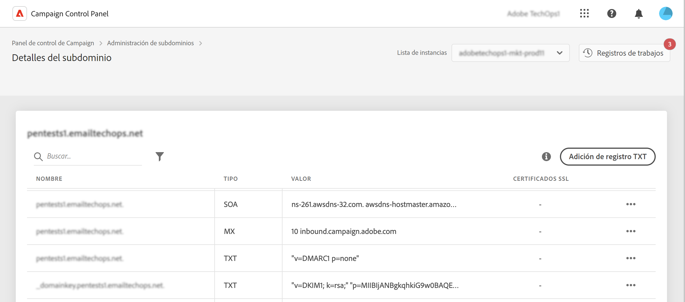

# Introducción a los registros TXT {#managing-txt-records}

>[!CONTEXTUALHELP]
>id="cp_siteverification_add"
>title="Administración de registros TXT"
>abstract="Los registros TXT son un tipo de registros DNS que se utilizan para proporcionar información de texto sobre un dominio y que pueden leer fuentes externas. El Panel de control permite añadir tres tipos de registros a sus subdominios: verificación del sitio de Google, registros DMARC y registros BIMI."

## Acerca de los registros TXT {#about}

Los registros TXT son un tipo de registros DNS que se utilizan para proporcionar información de texto sobre un dominio y que pueden leer fuentes externas. El Panel de control le permite añadir tres tipos de registros a los subdominios:

* Los **registros TXT de Google** le permiten certificar que es el propietario de su dominio, lo que garantiza altas tasas de mensajes en la bandeja de entrada y bajas tasas de correo electrónico no deseado para sus correos electrónicos. [Obtenga información sobre cómo añadir registros TXT de Google](managing-txt-records.md)
* Los **registros DMARC** proporcionan una forma de autenticar el dominio del remitente y evitar el uso no autorizado del dominio con fines malintencionados. [Obtenga información sobre cómo añadir registros DMARC](dmarc.md)
* Los **registros BIMI** le permiten mostrar un logotipo aprobado junto a los correos electrónicos en las bandejas de entrada de los proveedores de buzones de correo para mejorar el reconocimiento y la confianza de la marca. [Obtenga información sobre cómo añadir registros BIMI](bimi.md)

## Monitorización de los registros de los subdominios {#monitor}

Puede monitorizar todos los registros TXT que se han añadido para cada subdominio accediendo a los detalles de los subdominios.

En esta pantalla, se muestran todos los registros de tipo TXT del subdominio seleccionado, con información en la columna &quot;Valor&quot; de su configuración. Para eliminar un registro TXT, DMARC o BIMI de Google, haga clic en el botón de los tres puntos y seleccione Eliminar. También puede editar registros DMARC y BIMI si es necesario.

