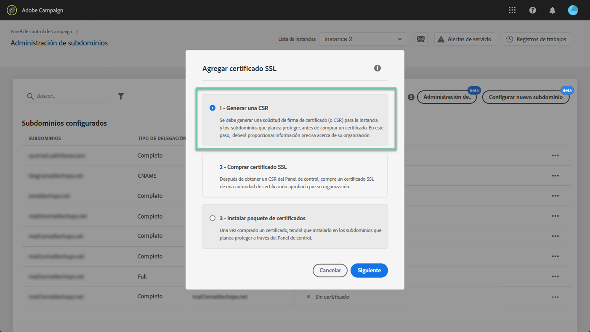

# Administración de los certificados SSL de los subdominios {#managing-subdomains-ssl-certificates}

La **[!UICONTROL Subdomains and Certificates]**tarjeta le permite ver cuáles de los subdominios y subdominios asociados albergan sus páginas de aterrizaje y recursos con certificados SSL instalados en ellos. También puede ver fácilmente qué subdominios tienen certificados que caducan para poder anticipar su caducidad.

Si un certificado está a punto de caducar, puede iniciar una solicitud del Servicio de atención al cliente con toda la información necesaria para renovar el certificado y garantizar el correcto funcionamiento de su instancia.

>[!NOTE]
>
>Adobe recomienda renovar un certificado SSL de los subdominios asociados **cuando esté cerca de la fecha de expiración**. La renovación de certificados puede llevar unos días en función de su organización, por ello, le recomendamos que asigne el tiempo adecuado para este proceso.

## Supervisión de certificados SSL {#monitoring-ssl-certificates}

La lista de subdominios de cada una de las instancias es accesible directamente al seleccionar la **[!UICONTROL Subdomains & Certificates]**tarjeta.

Los subdominios se organizan según la fecha de caducidad más próxima del certificado SSL, con información visual sobre la caducidad, en días:

* **Verde**: el subdominio no tiene un certificado que caduque en los próximos 60 días.
* **Naranja**: uno o varios subdominios tienen un certificado que caducará en los próximos 60 días.
* **Rojo**: uno o varios subdominios tienen un certificado que caducará en los próximos 30 días.

To get more details on a subdomain&#39;s certificates, click the **[!UICONTROL Certificate Details]**button.

La lista de todos los subdominios relacionados se mostrará en sus certificados. Generalmente incluye subdominios de páginas de aterrizaje, páginas de recursos, etc.

Si es necesario, puede iniciar una solicitud de renovación de certificado desde esta ventana. Para obtener más información sobre esto, consulte la sección a continuación.

## Iniciando la renovación de certificados SSL {#initiating-ssl-certificate-renewal}

>[!NOTE]
>
>El Panel de control no administra automáticamente la renovación de certificados. Solo le permite **iniciar el proceso** de renovación preparando la solicitud para enviarla al Servicio de atención al cliente de Adobe Campaign.

El proceso de renovación de certificados SSL incluye 3 pasos:

1. **Generación de la solicitud de firma certificada (CSR) El Servicio de atención al cliente de** Adobe genera un CSR para usted, a petición del portal de atención al cliente. Deberá proporcionar la información necesaria para generar el CSR (como Nombre común, Nombre de organización y dirección, etc.). En el Panel de control puede ver la lista de los elementos necesarios al iniciar el proceso de renovación. Para obtener más información sobre esto, consulte la sección a continuación.
1. **Compra del certificado** SSL Una vez que el Servicio de atención al cliente genera el CSR, puede descargarlo y comprar el certificado SSL con él a la Autoridad de certificados que la empresa apruebe.
1. **Instalación del certificado** SSL Una vez adquirido el certificado SSL, debe proporcionarlo al Servicio de atención al cliente de Adobe. Se instalará el certificado y verá las fechas de caducidad actualizadas de los certificados en el Panel de control.

Para iniciar la renovación de certificados SSL en el Panel de control, siga estos pasos:

1. Abra la **[!UICONTROL Subdomains & Certificates]**tarjeta y, a continuación, haga clic en el**[!UICONTROL Certificate details]** icono del subdominio con certificados caducados.

   

1. Se muestra la lista de subdominios relacionados. Generalmente incluye subdominios de páginas de aterrizaje, páginas de recursos, etc.
Click the **[!UICONTROL Ticket Details]**button to initiate the certificates renewal process.

   

1. Se muestra un formulario con todos los detalles necesarios para renovar el certificado SSL. Asegúrese de completar la información solicitada de manera completa y precisa (póngase en contacto con su equipo interno, con los equipos de seguridad y de TI si es necesario). De lo contrario, no se puede generar una solicitud de firma de certificado y no se podrá renovar el certificado.

   * **[!UICONTROL IMS Org]**:: ID de su organización.
   * **[!UICONTROL Instance]**:: Dirección URL de la instancia de Campaign asociada al subdominio.
   * **[!UICONTROL Common name]**:: Normalmente es una URL de subdominio de seguimiento, asociada al subdominio con el certificado que caduca.
   * **[!UICONTROL Subdomains]**:: Subdominios vinculados al subdominio con un certificado que caduca. Si desea aplicar un único certificado SSL a otros subdominios, puede agregarlos a esta lista. En ese caso, asegúrese de que esos subdominios están asociados con la misma organización y dirección URL de instancia de IMS.
   >[!CAUTION]
   >
   >The **[!UICONTROL IMS Org]**and**[!UICONTROL Instance]** fields are filled in automatically by the Control Panel and should not be modified.

   

1. Una vez completado el formulario, haga clic en el **[!UICONTROL Copy Details]**botón para guardar la información en el portapapeles.

   >[!NOTE]
   >
   >Si no borra el historial del explorador, se guardará la información especificada, lo que le permitirá utilizarlo para renovar el certificado más adelante.

1. Haga clic en el botón **[!UICONTROL Log new ticket]**. Se le redirige automáticamente a la página de inicio de sesión del Servicio de atención al cliente de Adobe Campaign.

   

1. Inicie sesión y, a continuación, cree un nuevo ticket de asistencia técnica con el asunto &quot;Solicitud CSR de certificado SSL&quot;.
Pegue toda la información copiada anteriormente en el cuerpo del ticket y, a continuación, haga clic en Enviar.

   >[!NOTE]
   >
   >Si no tiene privilegios para archivar casos de asistencia técnica para su organización, envíe toda la información que haya copiado al portapapeles a su contacto de asistencia técnica y pídale que abra un nuevo ticket de atención al cliente.

**Temas relacionados:**

* [Vídeo del tutorial de Campaign Standard](https://docs.adobe.com/content/help/en/campaign-learn/campaign-standard-tutorials/administrating/control-panel/managing-ssl-certificates.html)
* [Vídeo del tutorial de Campaign Classic](https://docs.adobe.com/content/help/en/campaign-learn/campaign-classic-tutorials/administrating/control-panel-acc/managing-ssl-certificates.html)
