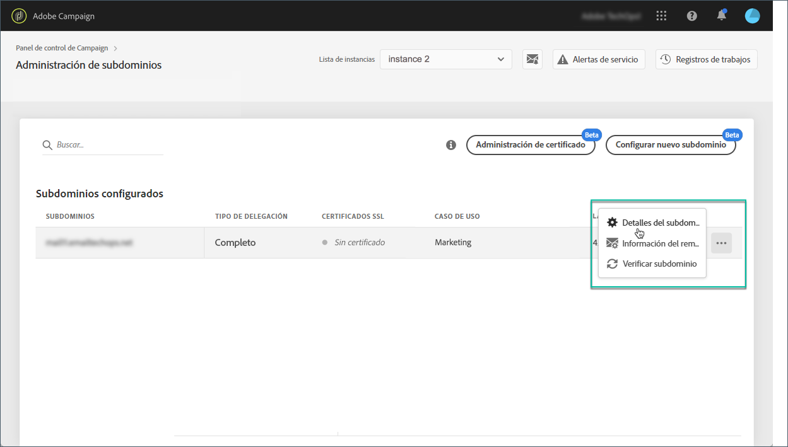

# Administración de registros TXT {#managing-txt-records}

>[!CONTEXTUALHELP]
>id="cp_siteverification_add"
>title="Administración de registros TXT"
>abstract="Algunos servicios como Google requieren que agregue un registro TXT a la configuración de su dominio para comprobar que es el propietario del mismo."

>[!IMPORTANT]
>
>La administración de registros TXT del Panel de control estará disponible a finales de abril.

## Acerca de los registros TXT {#about-txt-records}

Los registros TXT son un tipo de registros DNS que se utilizan para proporcionar información de texto sobre un dominio, que pueden ser leídos por fuentes externas.

Para garantizar altas tasas de entrada y bajas tasas de spam, algunos servicios como Google requieren que agregue un registro TXT a la configuración de su dominio para verificar que es el propietario del dominio.

Actualmente, Gmail es uno de los proveedores de direcciones de correo electrónico más populares. Para garantizar la buena entrega y el envío exitoso de los correos electrónicos a las direcciones de Gmail, Adobe Campaign le permite agregar registros TXT de verificación de sitios de Google especiales a sus subdominios para asegurarse de que se verifiquen.

Recursos adicionales:

* [Vídeo de tutorial de Campaign Standard](https://docs.adobe.com/content/help/en/campaign-standard-learn/tutorials/administrating/control-panel/google-txt-record-management.html)
* [Vídeo de tutorial de Campaign Classic](https://docs.adobe.com/content/help/en/campaign-classic-learn/tutorials/administrating/control-panel-acc/google-txt-record-management.html)

## Añadir un registro TXT de Google para un subdominio {#adding-a-google-txt-record}

Para agregar un registro TXT de Google al subdominio utilizado para enviar direcciones de Gmail por correo electrónico, siga estos pasos:

1. Vaya a la **[!UICONTROL Subdomain and Certificates]** tarjeta.

1. Seleccione la instancia y, a continuación, abra los detalles del subdominio al que desea agregar un registro DNS.

   

1. Haga clic en el **[!UICONTROL Add TXT record]** botón y, a continuación, introduzca el valor generado en las herramientas de administración de G Suite. Para obtener más información sobre esto, consulte la Ayuda [de administración de](https://support.google.com/a/answer/183895)G Suite.

   

1. Haga clic en el **[!UICONTROL Add]** botón para confirmar.

   

Una vez agregado el registro TXT, deberá comprobarlo Google. Para ello, vaya a las herramientas de administración de G Suite y, a continuación, inicie el paso de verificación (consulte la Ayuda [de administración de](https://support.google.com/a/answer/183895)G Suite).

Para eliminar un registro, selecciónelo en la lista de registros y haga clic en el botón Eliminar.

>[!NOTE]
>
>El único registro que puede eliminar de la lista de registros DNS es el que agregó anteriormente (en nuestro caso, el registro TXT de Google).

