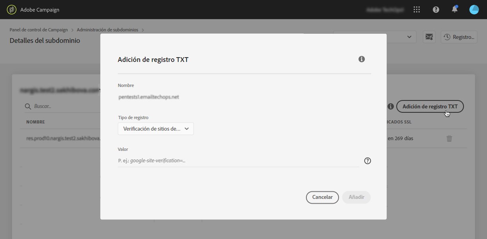
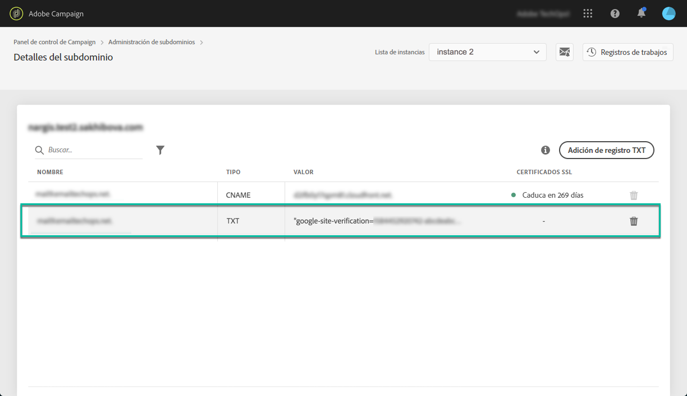

# Adición de registros de verificación del sitio Google {#adding-a-google-txt-record}

Para garantizar altas tasas de mensajes en bandeja de entrada y bajas tasas de spam, algunos servicios como Google requieren que agregue un registro TXT a la configuración de su dominio para verificar que es el propietario del dominio.

Actualmente, Gmail es uno de los proveedores de direcciones de correo electrónico más populares. Para garantizar la buena entrega y el envío correcto de correos electrónicos a las direcciones de Gmail, Adobe Campaign le permite agregar registros TXT de verificación de sitios de Google especiales a sus subdominios para asegurar que se verifican.

Para agregar un registro TXT de Google al subdominio utilizado para enviar direcciones de Gmail por correo electrónico, siga estos pasos:

1. En la lista de subdominios, haga clic en el botón de los tres puntos situado junto al subdominio deseado y seleccione **[!UICONTROL Detalles del subdominio]**.

1. Haga clic en el botón **[!UICONTROL Añadir registro TXT]**, y, a continuación, seleccione **[!UICONTROL Verificación de sitios de Google]** en la lista desplegable **[!UICONTROL Tipo de registro]**.

1. Introduzca el valor generado en las herramientas de administración de G Suite. Para obtener más información al respecto, consulte la [Ayuda de administración de G Suite](https://support.google.com/a/answer/183895).

   

1. Haga clic en el botón **[!UICONTROL Añadir]** para confirmar.

   

Una vez agregado el registro TXT, Google debe verificarlo. Para ello, vaya a las herramientas de administración de G Suite y, a continuación, inicie el paso de verificación (consulte la [Ayuda de administración de G Suite](https://support.google.com/a/answer/183895)).

Para eliminar un registro, selecciónelo en la lista de registros y haga clic en el botón Eliminar.

>[!NOTE]
>
>El único registro que puede eliminar de la lista de registros DNS es el que agregó anteriormente (en nuestro caso, el registro TXT de Google).

 Descubra esta funcionalidad en vídeo usando [Campaign v7/v8](https://experienceleague.adobe.com/docs/campaign-classic-learn/control-panel/subdomains-and-certificates/google-txt-record-management.html?lang=es#subdomains-and-certificates) o [Campaign Standard](https://experienceleague.adobe.com/docs/campaign-standard-learn/control-panel/subdomains-and-certificates/google-txt-record-management.html?lang=es#subdomains-and-certificates)
