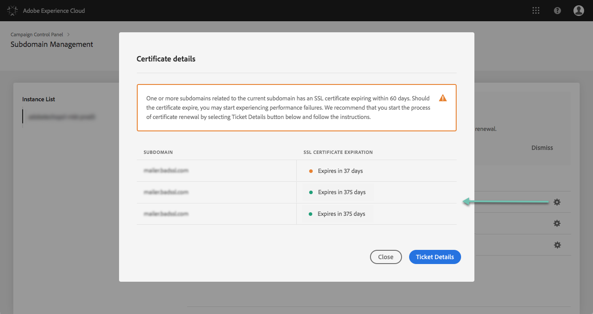

# Supervisión de los certificados SSL de los subdominios {#monitoring-ssl-certificates}

Adobe Campaign recomienda proteger los subdominios que alojan las páginas de aterrizaje, especialmente aquellos que recopilan información confidencial de sus clientes.

**El cifrado** SSL (Capa de zócalo seguro) garantiza que los subdominios delegados en Adobe sean seguros. Cuando el cliente rellena un formulario web o visita una página de aterrizaje alojada por Adobe Campaign, la información se envía de forma predeterminada a través de un protocolo no seguro (HTTP). Para garantizar una seguridad adicional, proteja la información enviada con un protocolo HTTPS. Por ejemplo, su dirección de subdominio &quot;http://info.mywebsite.com/&quot; será ahora &quot;https://info.mywebsite.com/&quot;.

**Los certificados SSL no están instalados en los propios** subdominios delegados. Se instalan en subdominios asociados, principalmente los que hospedan páginas de aterrizaje, páginas de recursos y otros.

**Los certificados SSL se proporcionan para un período de tiempo** específico (1 año, 60 días, etc.). Una vez que caduca un certificado, puede experimentar problemas al acceder a las páginas de aterrizaje o al usar recursos del subdominio. Para evitarlo, el Panel de control le permite supervisar los certificados SSL de los subdominios, así como iniciar el proceso de renovación.

Más detalles sobre la delegación de subdominios están disponibles [aquí](https://helpx.adobe.com/campaign/kb/domain-name-delegation.html).

La **[!UICONTROL Subdomains and Certificates]**tarjeta le permite ver cuáles de los subdominios y subdominios asociados albergan sus páginas de aterrizaje y recursos con certificados SSL instalados en ellos.

También puede ver fácilmente qué subdominios tienen certificados caducados y renovarlos si es necesario.

>[!NOTE]
>
>Adobe recomienda renovar un certificado SSL de los subdominios asociados **cuando esté cerca de la fecha de expiración**. La renovación de certificados puede llevar unos días en función de su organización, por ello, le recomendamos que asigne el tiempo adecuado para este proceso.
<!-- note to remove? immediate, no more delay? -->

La lista de subdominios de cada una de las instancias es accesible directamente al seleccionar la **[!UICONTROL Subdomains & Certificates]**tarjeta.

Los subdominios se organizan según la fecha de caducidad más próxima del certificado SSL, con información visual sobre la caducidad, en días:

* **Verde**: el subdominio no tiene un certificado que caduque en los próximos 60 días.
* **Naranja**: uno o varios subdominios tienen un certificado que caducará en los próximos 60 días.
* **Rojo**: uno o varios subdominios tienen un certificado que caducará en los próximos 30 días.

To get more details on a subdomain&#39;s certificates, click the **[!UICONTROL Certificate Details]**button.

La lista de todos los subdominios relacionados se mostrará en sus certificados. Generalmente incluye subdominios de páginas de aterrizaje, páginas de recursos, etc.

