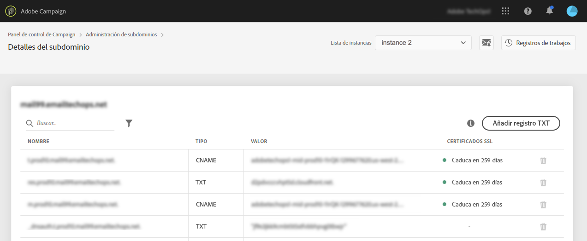

# Supervisión de los certificados SSL de los subdominios {#monitoring-ssl-certificates}

## Acerca de los certificados SSL {#about-ssl-certificates}

Adobe Campaign recomienda proteger los subdominios que albergan sus páginas de aterrizaje, especialmente aquellos que recopilan información confidencial de sus clientes.

**Cifrado SSL (Secure Socket Layer)** garantiza que los subdominios configurados para trabajar con Adobe sean seguros. Cuando el cliente rellena un formulario web o visita una página de aterrizaje alojada en Adobe Campaign, la información se envía de forma predeterminada a través de un protocolo no seguro (HTTP). Para garantizar una seguridad adicional, proteja la información enviada con un protocolo HTTPS. Por ejemplo, su dirección de subdominio &quot;http://info.mywebsite.com/&quot; será ahora &quot;https://info.mywebsite.com/&quot;.

**Los certificados SSL no están instalados en los propios subdominios configurados**. Se instalan en subdominios asociados, principalmente los que hospedan páginas de aterrizaje, páginas de recursos y otros.

**Los certificados SSL se proporcionan para un período de tiempo** específico (1 año, 60 días, etc.). Una vez que caduca un certificado, puede experimentar problemas al acceder a las páginas de aterrizaje o al usar recursos del subdominio. Para evitarlo, el Panel de control le permite supervisar los certificados SSL de los subdominios, así como iniciar el proceso de renovación.

## Administración de certificados SSL {#management}

La monitorización de certificados SSL es clave para garantizar que los subdominios sean seguros. Con el Panel de control de Campaign, puede instalar y renovar los certificados SSL de los subdominios directamente por su cuenta o delegarlos en el Adobe para que este proceso se realice automáticamente sin que sea necesario realizar ninguna acción por su parte.

Se recomienda delegar la administración de los certificados SSL de los subdominios al Adobe, ya que el Adobe creará automáticamente el certificado y lo renovará cada año antes de que caduque. Esto reduce el riesgo de errores que se pueden producir al administrar los certificados manualmente. [Obtenga información sobre cómo delegar los certificados SSL de los subdominios al Adobe](delegate-ssl.md)

A continuación, encontrará una lista completa de los impactos asociados con la administración manual de certificados, en lugar de delegar esta operación al Adobe:

|       | Certificado administrado por el cliente | certificado administrado por Adobe |
|  ---  |  ---  |  ---  |
| Proveedor de certificados | Autoridades de certificados de terceros | Adobe mediante los administradores de certificados de AWS |
| Pasos manuales | Generación de CSR, compra e instalación de certificados | Ninguno |
| Proceso de renovación | Responsabilidad del cliente | Administrado por Adobe automáticamente |
| Seguridad de subdominios | Los dominios pueden tener subdominios no protegidos (seguimiento, duplicación y res) a menos que instale o renueve certificados. | Todos los dominios nuevos (si se opta por la administración de Adobe) tendrán todos los subdominios protegidos de forma predeterminada. |
| Costo de certificado | El cliente asume el coste de los certificados | Libre |

## Monitorización de certificados SSL {#monitoring-certificates}

>[!CONTEXTUALHELP]
>id="cp_subdomain_details"
>title="Detalles del subdominio"
>abstract="Recupere información sobre los certificados SSL de los subdominios."

El estado de los certificados SSL de los subdominios está disponible directamente desde la lista de subdominios al seleccionar la tarjeta **[!UICONTROL Subdomains & Certificates]**.

Los subdominios se organizan según la fecha de caducidad más próxima del certificado SSL, con información visual sobre la caducidad, en días:

* **Verde**: el subdominio no tiene un certificado que caduque en los próximos 60 días.
* **Naranja**: uno o varios subdominios tienen un certificado que caducará en los próximos 60 días.
* **Rojo**: uno o varios subdominios tienen un certificado que caducará en los próximos 30 días.
* **Gris**: no se ha instalado ningún certificado para el subdominio.

Para obtener más información sobre un subdominio, haga clic en el botón **[!UICONTROL Subdomain Details]**.
Se muestra la lista de todos los subdominios relacionados. Por lo general, incluye subdominios de páginas de aterrizaje, páginas de recursos, etc.

La pestaña **[!UICONTROL Sender info]** proporciona información sobre las bandejas de entrada configuradas (Remitente, Responder a, Correo electrónico de error).

Si uno de los certificados SSL de su subdominio está a punto de caducar, puede renovarlo directamente desde el Panel de control. Para obtener más información sobre esto, consulte esta sección: [Renovación del certificado SSL de un subdominio](../../subdomains-certificates/using/renewing-subdomain-certificate.md).

**Temas relacionados:**

* [Renovación del certificado SSL de un subdominio](../../subdomains-certificates/using/renewing-subdomain-certificate.md)
* [Promoción de la marca de subdominios](../../subdomains-certificates/using/subdomains-branding.md)
