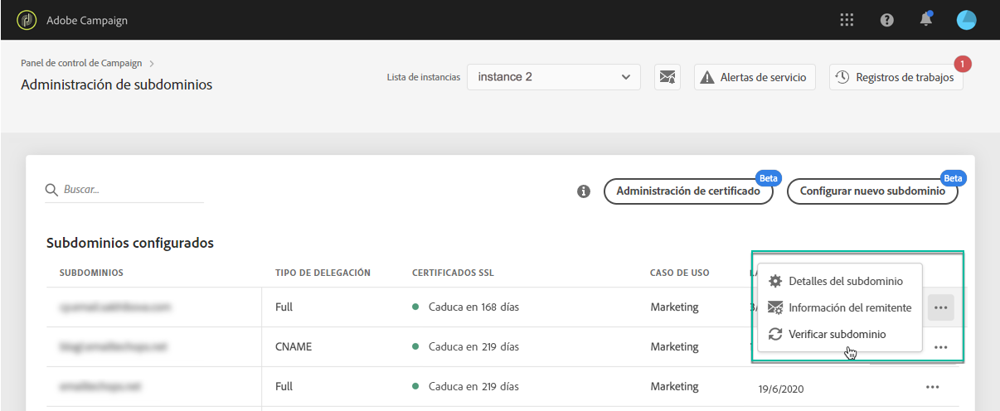

# Supervisión de los subdominios {#monitoring-subdomains}

Es esencial monitorizar los subdominios para asegurarse de que están configurados correctamente para trabajar con Adobe Campaign.

La lista de subdominios para cada una de las instancias de producción es accesible directamente al seleccionar la tarjeta **[!UICONTROL Subdominios y certificados]**.

La columna **[!UICONTROL Última verificación]** indica cuándo se verificó un subdominio por última vez. Puede iniciar una verificación en cualquier momento haciendo clic en el botón **...** / **[!UICONTROL Verificar subdominio]**.

>[!IMPORTANT]
>
>Adobe no recomienda el uso de subdominios sin fecha de certificado, ya que podría significar que estos subdominios pueden estar teniendo algunos problemas de entregabilidad.

Al iniciar una verificación, se realizan varias operaciones para comprobar que el subdominio está correctamente configurado (comprobación del inquilino de instancia, prueba de envío de correo electrónico, etc.) Si la verificación del subdominio falla, póngase en contacto con el servicio de atención al cliente de Adobe para una investigación más detallada.

**Temas relacionados:**

* [Renovación del certificado SSL de un subdominio](../../subdomains-certificates/using/renewing-subdomain-certificate.md)
* [Promoción de subdominios](../../subdomains-certificates/using/subdomains-branding.md)
