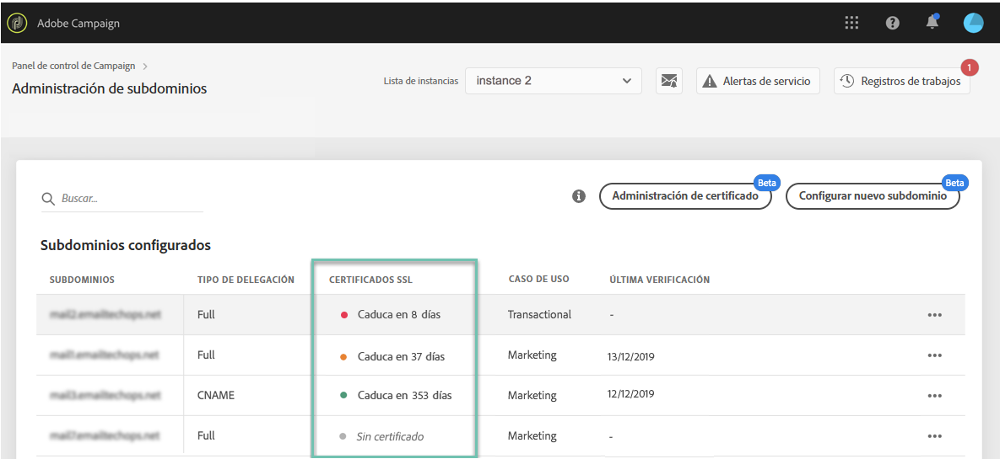

# Supervisión de subdominios {#monitoring-subdomains}

Es esencial supervisar los subdominios para asegurarse de que todos están configurados correctamente para funcionar con Adobe Campaign.

Se puede acceder directamente a la lista de subdominios de cada una de las instancias de producción al seleccionar la **[!UICONTROL Subdomains & Certificates]**tarjeta.

En la lista de subdominios, la columna indica cuándo se verificó un subdominio por última vez. **[!UICONTROL Last verification]**** Puede iniciar una verificación en cualquier momento haciendo clic en el botón **... /**[!UICONTROL Verify subdomain]** .

>[!CAUTION]
>
>Adobe no recomienda el uso de subdominios sin fecha de verificación, ya que esto podría significar que estos subdominios podrían tener algunos problemas de entrega.

Al iniciar una verificación, se realizan varias operaciones para comprobar que el subdominio está configurado correctamente (comprobación de inquilino de instancia, prueba de envío de correo electrónico, etc.)

Si falla la verificación del subdominio, póngase en contacto con el servicio de atención al cliente de Adobe para realizar más investigaciones.
