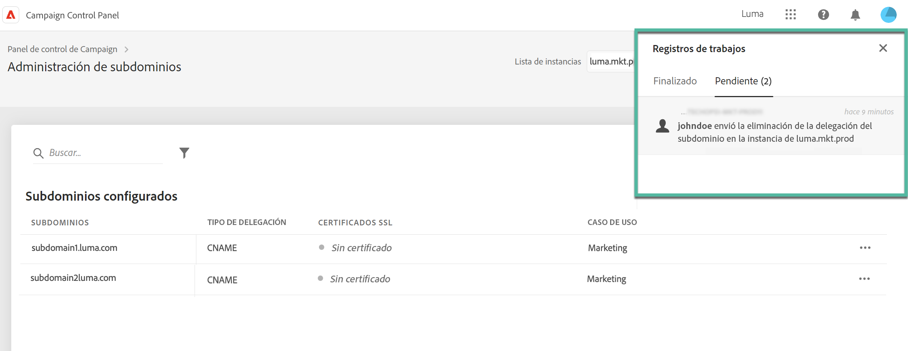

# Eliminar la delegación de subdominios al Adobe {#remove-delegated--subdomains}

>[!CONTEXTUALHELP]
>id="cp_subdomain_undelegate"
>title="Quitar delegación del subdominio"
>abstract="Esta pantalla le permite eliminar la delegación de un subdominio al Adobe. Tenga en cuenta que este proceso no se puede deshacer y es irreversible hasta que se complete su ejecución.  Si intenta eliminar la delegación de un dominio principal para la instancia seleccionada, se le pedirá que elija el dominio que lo reemplazará."

El Panel de control de Campaign le permite eliminar la delegación de un subdominio que se ha delegado al Adobe, incluida la configuración CNAME.

## Notas importantes {#important}

Antes de continuar, considere cuidadosamente los impactos que se producen una vez que se activa el proceso de eliminación:

* Una vez activado el proceso, la eliminación de la delegación de subdominios no se puede deshacer y es irreversible hasta que se completa la ejecución del proceso.
* No se puede eliminar ninguna otra delegación de subdominios cuando hay un proceso similar en curso en otro subdominio.
* Una delegación eliminada en un subdominio no se puede volver a delegar hasta tres días después de su eliminación.

## Eliminación de una delegación de subdominios {#steps}

Para eliminar la delegación de un subdominio al Adobe, siga estos pasos:

1. Haga clic en el botón de los tres puntos situado junto a la delegación de dominio que desee eliminar y seleccione **[!UICONTROL Remove delegated subdomain]**.

   

1. Revise la exención de responsabilidad y confirme que se ha eliminado la delegación de dominio al Adobe.

1. Revise la información relativa a la instancia a la que está asociado el subdominio, incluidas las afinidades de IP y configuraciones de marca relacionadas.

   Si va a eliminar la delegación del dominio principal para la instancia seleccionada, debe elegir el dominio que lo reemplazará con la variable **[!UICONTROL Replacement Domain]** lista.

   Clic **[!UICONTROL Next]** para continuar con la eliminación.

   

1. Revise el resumen que se muestra. Para confirmar la eliminación, escriba la dirección URL del dominio cuya delegación desea eliminar y haga clic en **[!UICONTROL Submit]**.

   

Una vez iniciada la eliminación de la delegación, el trabajo pendiente se muestra en los registros de trabajos hasta que se completa.

## Códigos de error {#FAQ}

En esta sección se enumeran los mensajes de error que pueden surgir al intentar eliminar la delegación de un subdominio:

| Código de error | Mensaje | Descripción |
|  ---  |  ---  |  ---  |
| 8002 | La eliminación del dominio delegado solicitada no se puede atender porque hay una solicitud similar en progreso que se solapa. Inténtelo pasados 3 días | Ya hay un trabajo de eliminación de delegación de subdominios en proceso para la instancia seleccionada. Espere hasta 3 días para iniciar un nuevo trabajo de eliminación. |
| 8003 | La eliminación del dominio delegado solicitada no se admite para esta instancia. | No se admite la eliminación de delegaciones para el subdominio seleccionado debido a un problema técnico. Póngase en contacto con el Servicio de atención al cliente. |
| 8004 | No se permite la eliminación del dominio delegado solicitada, ya que solo hay un dominio en esta instancia. | Solo se ha delegado un subdominio para la instancia seleccionada. No se permite eliminar la delegación. |
| 8005 | Esta configuración no admite la eliminación del dominio delegado solicitada. | No se admite la eliminación de delegaciones para el subdominio seleccionado debido a un problema técnico. Póngase en contacto con el Servicio de atención al cliente. |
| 8006 | No se permite la eliminación del dominio delegado solicitada por razones desconocidas. Póngase en contacto con el Servicio de atención al cliente. | No se admite la eliminación de delegaciones para la instancia seleccionada debido a problemas desconocidos. Póngase en contacto con el Servicio de atención al cliente. |
