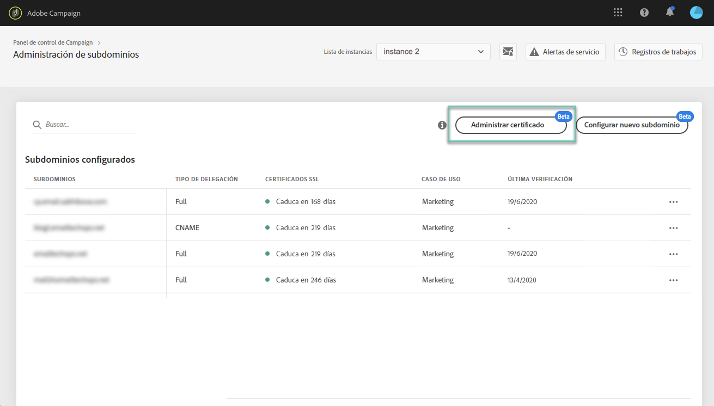
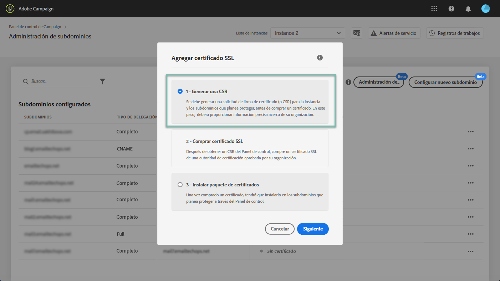
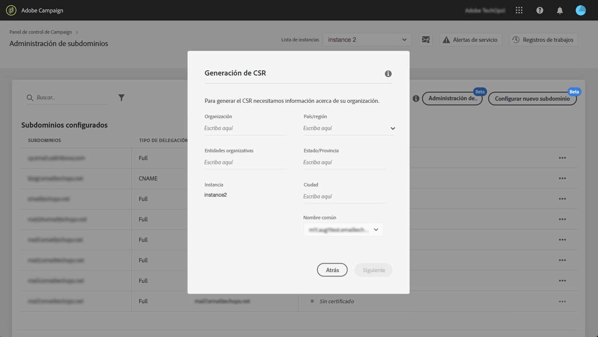
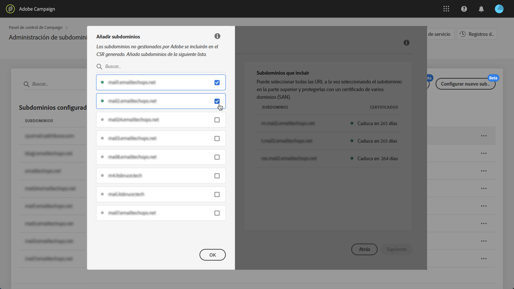
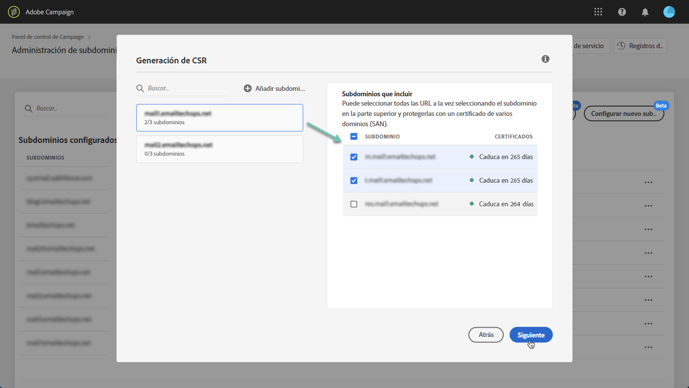
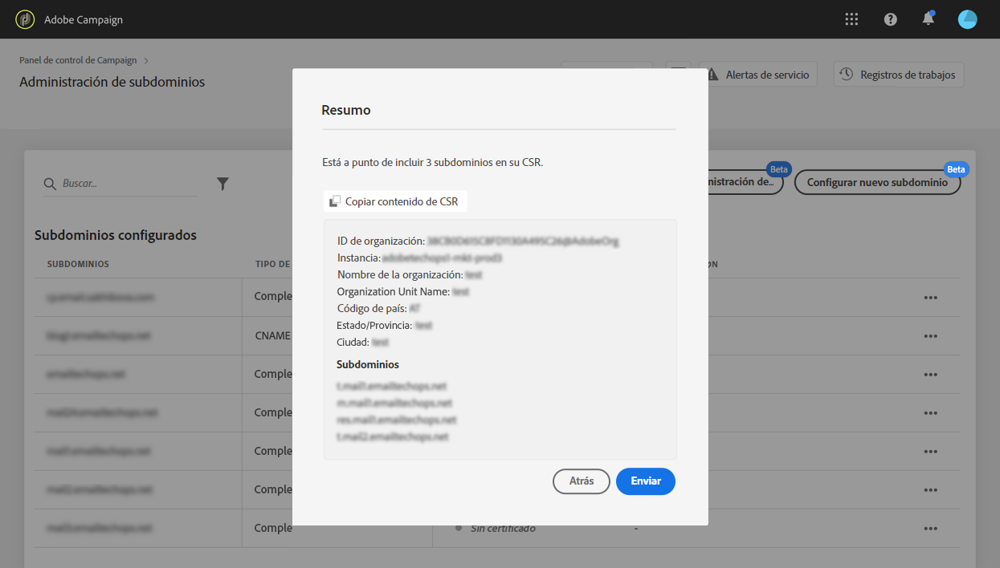
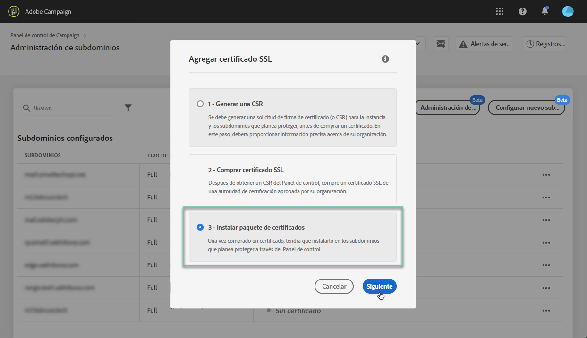
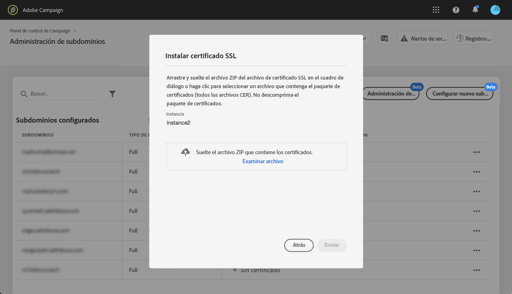

# Renovación del certificado SSL de un subdominio {#renewing-subdomains-ssl-certificates}

>[!IMPORTANT]
>
>La delegación de subdominios del Panel de control estará disponible en versión beta a finales de enero, y estará sujeta a frecuentes actualizaciones y modificaciones sin previo aviso.

## Acerca de la renovación de certificados {#about-certificate-renewal-process}

El proceso de renovación de certificados SSL incluye 3 pasos:

1. **Generación de la solicitud de firma certificada (CSR) El Servicio de atención al cliente de** Adobe genera un CSR para usted. Deberá proporcionar la información necesaria para generar el CSR (como Nombre común, Nombre de organización y dirección, etc.).
1. **Compra del certificado** SSL Una vez generado el CSR, puede descargarlo y utilizarlo para adquirir el certificado SSL de la entidad emisora de certificados que apruebe su empresa.
1. **Instalación del certificado** SSL Una vez adquirido el certificado SSL, puede instalarlo en el subdominio deseado.

>[!NOTE]
>
>La renovación de certificados SSL a través del Panel de control está disponible sólo para subdominios **delegados** completamente.

## Generación de una solicitud de firma de certificado (CSR) {#generating-csr}

Para generar una solicitud de firma de certificado (CSR), siga estos pasos:

1. En la **[!UICONTROL Subdomains & Certificates]**tarjeta, seleccione la instancia que desee y haga clic en el**[!UICONTROL Manage Certificate]** botón.

   

1. Seleccione **[!UICONTROL Generate a CSR]**, luego haga clic**[!UICONTROL Next]** para iniciar el asistente que lo guiará a través del proceso de generación de CSR.

   

1. Se muestra un formulario con todos los detalles necesarios para generar su CSR.

   Asegúrese de completar la información solicitada de forma completa y precisa; de lo contrario, es posible que el certificado no se renueve (póngase en contacto con el equipo interno, los equipos de seguridad y TI si es necesario) y haga clic en **[!UICONTROL Next]**.

   * **[!UICONTROL Organization]**:: nombre oficial de la organización.
   * **[!UICONTROL Organization Unit]**:: unidad vinculada al subdominio (ejemplo: Marketing, TI).
   * **[!UICONTROL Instance]**(precargada): Dirección URL de la instancia de Campaign asociada al subdominio.
   

1. Seleccione los subdominios que desea incluir en el CSR y, a continuación, haga clic en **[!UICONTROL OK]**.

   

1. Los subdominios seleccionados se muestran en la lista. Para cada uno de ellos, seleccione los subdominios que desee incluir y haga clic en **[!UICONTROL Next]**.

   

1. Se muestra un resumen de los subdominios que se incluirán en el CSR. Haga clic en **[!UICONTROL Submit]**para confirmar la solicitud.

   

1. El archivo .csr correspondiente a su selección se genera y descarga automáticamente. Ahora puede utilizarla para adquirir el certificado SSL de la entidad emisora de certificados que apruebe su empresa.

## Compra de un certificado con el CSR {#purchasing-certificate}

Después de obtener un CSR de solicitud de firma de certificado del Panel de control, compre un certificado SSL de una autoridad de certificación aprobada por su organización.

## Instalación del certificado SSL {#installing-ssl-certificate}

Una vez adquirido un certificado SSL, puede instalarlo en su instancia. Antes de continuar, asegúrese de conocer los requisitos previos siguientes:

* La solicitud de firma de certificado (CSR) debe haberse generado desde el Panel de control. De lo contrario, no podrá instalar el certificado desde el Panel de control.
* Asegúrese de que la solicitud de firma de certificado (CSR) coincide con el subdominio delegado a Adobe. Por ejemplo, no puede contener más subdominios que el que se ha delegado.
* El certificado debe tener una fecha actual. No es posible instalar certificados con fechas en el futuro.

Para instalar el certificado, siga estos pasos:

1. En la **[!UICONTROL Subdomains & Certificates]**tarjeta, seleccione la instancia que desee y haga clic en el**[!UICONTROL Manage Certificate]** botón.

   

1. Haga clic en **[!UICONTROL Install SSL Certificate]**, luego**[!UICONTROL Next]** para iniciar el asistente que lo guiará a través del proceso de instalación del certificado.

   

1. Seleccione el archivo .zip que contiene el certificado que desea instalar y haga clic en **[!UICONTROL Submit]**.

   

Una vez instalado el certificado SSL, la fecha de caducidad y el icono de estado del certificado se actualizan en consecuencia.

La dirección URL del subdominio cambiará de **http** a **https**.
