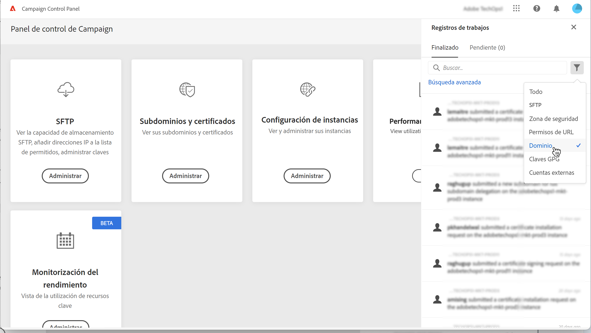

# Renovación de certificados SSL {#renewing-subdomains-ssl-certificates}

>[!CONTEXTUALHELP]
>id="cp_add_ssl_certificate"
>title="Renovación de certificado SSL"
>abstract="Para renovar un certificado SSL, debe generar una CSR, adquirir el certificado SSL de los subdominios e instalar el paquete de certificados. Esta operación solo es necesaria si decide administrar los certificados manualmente en lugar de delegarlos a Adobe. "

>[!NOTE]
>
>La renovación de los certificados SSL de los subdominios solo es necesaria si elige administrar los certificados usted mismo en lugar de delegar este proceso al Adobe. Se recomienda delegar la administración de los certificados SSL de los subdominios al Adobe, ya que el Adobe creará automáticamente el certificado y lo renovará cada año antes de que caduque. [Obtenga más información sobre la administración de certificados SSL](monitoring-ssl-certificates.md#management)

El proceso de renovación de certificados SSL incluye 3 pasos:

1. **Generación de la solicitud de firma de certificado (CSR)**

   La solicitud de firma de certificado debe generarse para la instancia y los subdominios que tiene previsto proteger antes de comprar un certificado.  Debe proporcionar la información necesaria para generar la CSR (como Nombre común, Nombre de organización y dirección, etc.). [Más información](#generate)

1. **Compra del certificado SSL**

   Una vez generada la CSR, puede utilizarla para adquirir el certificado SSL de la autoridad de certificación que apruebe su compañía.

1. **Instalación del certificado SSL**

   Instale el certificado SSL adquirido en el subdominio deseado para protegerlo. [Más información](#install)

 Descubra esta función en vídeo usando [Campaign v7/v8](https://experienceleague.adobe.com/docs/campaign-classic-learn/control-panel/subdomains-and-certificates/adding-ssl-certificates.html?lang=es#subdomains-and-certificates) o [Campaign Standard](https://experienceleague.adobe.com/docs/campaign-standard-learn/control-panel/subdomains-and-certificates/adding-ssl-certificates.html?lang=es#adding-ssl-certificates)

**Temas relacionados:**

* [Guía de prácticas recomendadas de capacidad de entrega: Proceso de solicitud de certificado SSL para Adobe Campaign](https://experienceleague.adobe.com/docs/deliverability-learn/deliverability-best-practice-guide/additional-resources/campaign/ac-ssl-certificate-request.html?lang=es)
* [Promoción de la marca de subdominios](../../subdomains-certificates/using/subdomains-branding.md)
* [Monitorización de subdominios](../../subdomains-certificates/using/monitoring-subdomains.md)

## Generación de la CSR {#generate}

>[!CONTEXTUALHELP]
>id="cp_generate_csr"
>title="Generación de CSR"
>abstract="La solicitud de firma de certificado debe generarse para la instancia y los subdominios que tiene previsto proteger antes de comprar un certificado."

>[!CONTEXTUALHELP]
>id="cp_select_subdomains"
>title="Selección de los subdominios para la CSR"
>abstract="Puede optar por incluir todos los subdominios o solo los específicos en la solicitud de firma de certificado. Solo los subdominios seleccionados se certificarán mediante el certificado SSL adquirido."

Para generar una solicitud de firma de certificado (CSR), siga estos pasos:

1. En la tarjeta **[!UICONTROL Subdomains & Certificates]**, seleccione la instancia que desee y haga clic en el botón **[!UICONTROL Manage Certificate]**.

   

1. Seleccione **[!UICONTROL 1 - Generate a CSR]**, luego haga clic en **[!UICONTROL Next]** para iniciar el asistente que lo guiará a través del proceso de generación de CSR.

   

1. Verá un formulario con todos los detalles necesarios para generar su CSR.

   Asegúrese de completar la información solicitada de forma completa y precisa; de lo contrario, es posible que el certificado no se renueve (póngase en contacto con el equipo interno, los equipos de seguridad y TI si es necesario) y haga clic en **[!UICONTROL Next]**.

   * **[!UICONTROL Organization]**: nombre oficial de la organización.
   * **[!UICONTROL Organization Unit]**: unidad vinculada al subdominio (ejemplo: Marketing, TI).
   * **[!UICONTROL Instance]** (precargada): dirección URL de la instancia de Campaign asociada al subdominio.
   * **[!UICONTROL Common name]**: el nombre común está seleccionado de forma predeterminada, puede seleccionar uno de los subdominios si es necesario.

   

1. Seleccione los subdominios que desea incluir en la CSR y, a continuación, haga clic en **[!UICONTROL OK]**.

   

1. Los subdominios seleccionados se muestran en la lista. Para cada uno de ellos, seleccione los subdominios que desee incluir y haga clic en **[!UICONTROL Next]**.

   

1. Se muestra un resumen de los subdominios que se incluirán en la CSR. Haga clic en **[!UICONTROL Submit]** para confirmar la solicitud.

   

   >[!NOTE]
   >
   >El **[!UICONTROL Copy CSR content]** permite copiar toda la información relacionada con la CSR (ID de organización, instancia, nombre de organización, nombre común, subdominios incluidos, etc.)

1. El archivo .csr correspondiente a su selección se genera y descarga automáticamente. Ahora puede utilizarlo para adquirir el certificado SSL de la entidad emisora de certificados que apruebe su compañía. Si necesita volver a descargar CSR, siga los pasos detallados en [esta sección](#download).

Una vez generada y descargada la CSR, puede utilizarla para adquirir un certificado SSL de una autoridad de certificación aprobada por su organización.

Una vez adquirido el certificado SSL, podrá instalarlo en su instancia para proteger su subdominio. [Más información](#install)

## Descargar la CSR {#download}

Para adquirir un certificado SSL, primero debe descargar la solicitud de firma de certificado. La CSR se descarga automáticamente después de generarse. También puede descargarlo de nuevo en cualquier momento desde los Registros de trabajos:

1. En el **[!UICONTROL Job Logs]**, seleccione la **[!UICONTROL Finished]** y, a continuación, filtre la lista para mostrar los trabajos relacionados con la administración de subdominios.

   

1. Abra el trabajo correspondiente a la generación de la CSR y haga clic en **[!UICONTROL Downbload]** para obtener el archivo .csr.

   

## Instalación del certificado SSL {#install}

>[!CONTEXTUALHELP]
>id="cp_install_ssl_certificate"
>title="Instalación del certificado SSL"
>abstract="Instale el certificado SSL adquirido de la entidad emisora de certificados aprobada por su organización."

Una vez adquirido un certificado SSL, puede instalarlo en su instancia. Antes de continuar, asegúrese de conocer los requisitos previos siguientes:

* La solicitud de firma de certificado (CSR) debe haberse generado desde el Panel de control. De lo contrario, no podrá instalar el certificado desde el Panel de control.
* La solicitud de firma de certificado (CSR) debe coincidir con el subdominio que se configuró para funcionar con el Adobe. Por ejemplo, no puede contener más subdominios que el que se ha configurado.
* El certificado debe tener una fecha actual. No es posible instalar certificados con fechas en el futuro y no deben caducar (es decir, fechas de inicio y finalización válidas).
* El certificado debe ser emitido por una autoridad de certificación (CA) de confianza como Comodo, DigiCert, GoDaddy, etc.
* El tamaño del certificado debe ser de 2048 bits y el algoritmo debe ser RSA.
* El certificado debe tener el formato X.509 PEM.
* Se admiten certificados SAN.
* No se admiten certificados comodín.
* El archivo ZIP o el certificado no deben estar protegidos con contraseña.
* El archivo ZIP solo debe contener lo siguiente en los archivos preferiblemente individuales:
   * Certificado de entidad final.
   * Cadena de certificados intermedia (organizada en orden correcto).
   * Certificado raíz (opcional).

Para instalar el certificado, siga estos pasos:

1. En la tarjeta **[!UICONTROL Subdomains & Certificates]**, seleccione la instancia que desee y haga clic en el botón **[!UICONTROL Manage Certificate]**.

   

1. Seleccione **[!UICONTROL 3 - Install Certificate Bundle]**, luego haga clic en **[!UICONTROL Next]** para iniciar el asistente que lo guiará a través del proceso de instalación del certificado.

   

1. Seleccione el archivo .zip que contiene el certificado que desea instalar y haga clic en **[!UICONTROL Submit]**.

   

>[!NOTE]
>
>El certificado se instalará en todos los dominios o subdominios incluidos en la CSR. No se tendrá en cuenta ningún dominio o subdominio adicional presente en el certificado.

Una vez instalado el certificado SSL, la fecha de caducidad y el icono de estado del certificado se actualizan en consecuencia.
