# Configuración de un nuevo subdominio {#setting-up-subdomain}

>[!CONTEXTUALHELP]
>id="cp_subdomain_management"
>title="Configuración de nuevos subdominios y administración de certificados"
>abstract="Debe configurar un nuevo subdominio y administrar los certificados SSL de los subdominios para que el inicio envíe correos electrónicos o publique páginas de aterrizaje con Adobe Campaign."
>additional-url="https://experienceleague.adobe.com/docs/control-panel/using/subdomains-and-certificates/monitoring-ssl-certificates.html?lang=es" text="Supervisión de certificados SSL"

## Lectura obligatoria {#must-read}

>[!IMPORTANT]
>
>La configuración de subdominios del Panel de control de Campaign está disponible en versión beta y sujeta a frecuentes actualizaciones y modificaciones sin previo aviso.

Esta página proporciona información sobre cómo configurar nuevos subdominios mediante delegación de subdominios completos o CNAME. Los conceptos globales sobre estos dos métodos se presentan en esta sección: [Promoción de subdominios](../../subdomains-certificates/using/subdomains-branding.md).

**Temas relacionados:**

* [Supervisión de subdominios](../../subdomains-certificates/using/monitoring-subdomains.md)

### Selección de instancias

La delegación de subdominios solo está disponible para instancias de **producción**.

Si la instancia que selecciona en el asistente no tiene subdominios configurados previamente, el primer subdominio configurado se convertirá en el **subdominio principal** para esa instancia y no podrá cambiarlo en el futuro.

Como resultado, se crearán **registros DNS inversos** para otros subdominios que usen este subdominio principal. **Las direcciones de respuesta y devolución** de otros subdominios se generarán desde el subdominio principal.

### Configuración de servidores de nombres

Al configurar servidores de nombres, asegúrese de **no delegar nunca su subdominio raíz a Adobe**. De lo contrario, el dominio solo podrá trabajar con Adobe. Cualquier otro uso será imposible, como, por ejemplo, enviar correos electrónicos internos a los empleados de la organización.

Además, **no cree ningún archivo de zona independiente** para este nuevo subdominio.

## Delegación completa de subdominios {#full-subdomain-delegation}

>[!CONTEXTUALHELP]
>id="cp_add_new_subdomain"
>title="Añadir nuevo subdominio"
>abstract="Adobe recomienda una delegación completa de subdominios. Sin embargo, puede utilizar CNAME o un método personalizado para configurar sus subdominios."
>additional-url="https://experienceleague.adobe.com/docs/control-panel/using/subdomains-and-certificates/setting-up-new-subdomain.html?lang=es" text="Configuración de un nuevo subdominio"
>additional-url="https://helpx.adobe.com/es/enterprise/using/support-for-experience-cloud.html" text="Contactar con el servicio de atención al cliente"

>[!CONTEXTUALHELP]
>id="cp_add_subdomain_create_delegate"
>title="Crear y delegar su subdominio"
>abstract="Cree el subdominio que desee usar con Adobe Campaign en su solución de alojamiento y delegarlo a Adobe."
>additional-url="https://experienceleague.adobe.com/docs/control-panel/using/subdomains-and-certificates/setting-up-new-subdomain.html" text="Configuración de un nuevo subdominio"

>[!CONTEXTUALHELP]
>id="cp_add_subdomain_submit"
>title="Enviar el subdominio"
>abstract="Confirme y envíe el subdominio configurado en los pasos anteriores."
>additional-url="https://experienceleague.adobe.com/docs/control-panel/using/subdomains-and-certificates/setting-up-new-subdomain.html" text="Configuración de un nuevo subdominio"

Para delegar completamente un subdominio a Adobe Campaign, siga los pasos a continuación.

 Descubra esta función en vídeo usando [Campaign Classic](https://experienceleague.adobe.com/docs/campaign-classic-learn/control-panel/subdomains-and-certificates/subdomain-delegation.html#subdomains-and-certificates) o [Campaign Standard](https://experienceleague.adobe.com/docs/campaign-standard-learn/control-panel/subdomains-and-certificates/subdomain-delegation.html#subdomains-and-certificates)

1. En la tarjeta **[!UICONTROL Subdomains & Certificates]**, seleccione la instancia de producción que desee y haga clic en **[!UICONTROL Setup new subdomain]**.

   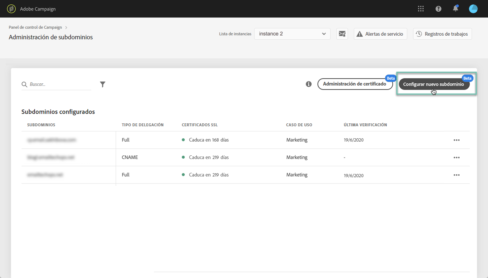

1. Haga clic en **[!UICONTROL Next]** para confirmar el método de delegación completo.

   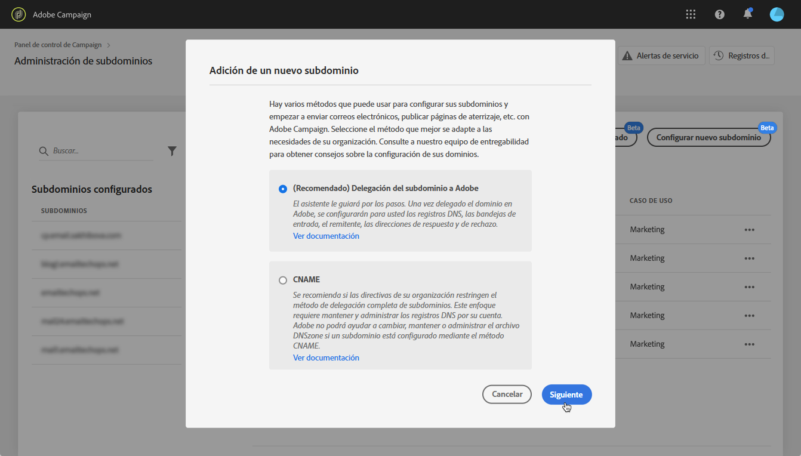

1. Cree los subdominios y servidores de nombres deseados en la solución de hospedaje que use su organización. Para ello, copie y pegue la información del servidor de nombres de Adobe que se muestra en el asistente. Para obtener más información sobre cómo crear un subdominio en una solución de alojamiento, consulte el [tutorial en vídeo](https://video.tv.adobe.com/v/30175).

   >[!NOTE]
   >
   > Para Adobe Campaign Standard, los subdominios delegados le permiten enviar comunicaciones de **marketing** y **transaccionales**.

   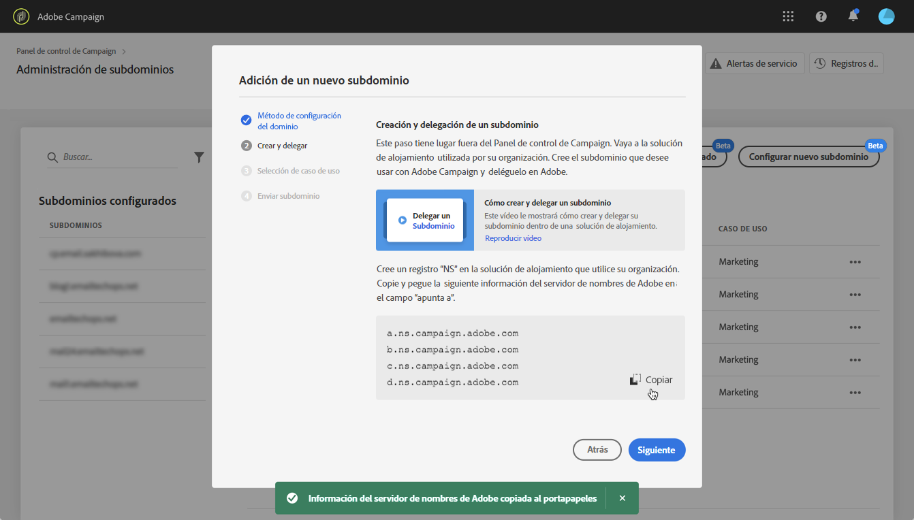

1. Una vez creado el subdominio con la información correspondiente del servidor de nombres de Adobe, haga clic en **[!UICONTROL Next]**.

1. Si ha seleccionado una instancia de Campaign Classic, seleccione el caso de uso que desee para el subdominio: **Comunicaciones de marketing** o **Comunicaciones transaccionales y operacionales**. Los conceptos globales sobre los casos de uso de los subdominios se presentan en [esta sección](../../subdomains-certificates/using/subdomains-branding.md#about-subdomains-use-cases).

   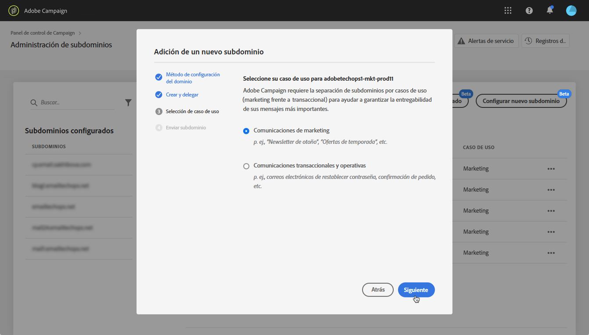

1. Escriba el subdominio que creó en la solución de alojamiento y haga clic en **[!UICONTROL Submit]**.

   Asegúrese de añadir el **nombre completo** del subdominio que desea delegar. Por ejemplo, para delegar el subdominio &quot;usoffer.email.weretail.com&quot;, escriba &quot;usoffer.email.weretail.com&quot;.

   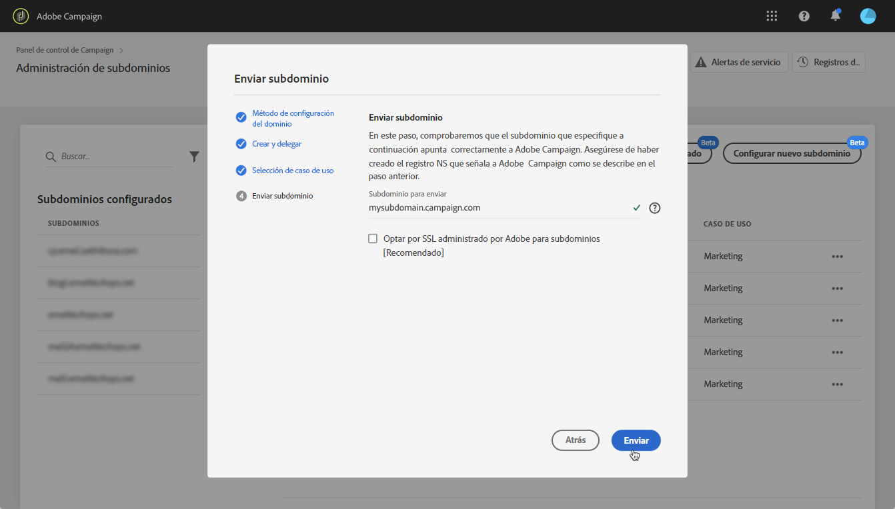

Una vez enviado el subdominio, el Panel de control de Campaign realizará varias comprobaciones y pasos de configuración. Para obtener más información, consulte [Comprobación y configuración de subdominios](#subdomain-checks-and-configuration).

## Configuración del subdominio mediante CNAME {#use-cnames}

>[!CONTEXTUALHELP]
>id="cp_add_cname_subdomain_create_delegate"
>title="Configurar el subdominio"
>abstract="En esta pantalla, especifique el subdominio que desea configurar con CNAME."
>additional-url="https://experienceleague.adobe.com/docs/control-panel/using/subdomains-and-certificates/setting-up-new-subdomain.html" text="Configuración de un nuevo subdominio"

>[!CONTEXTUALHELP]
>id="cp_add_cname_records"
>title="Generar registros"
>abstract="Vaya a la solución de alojamiento para generar la lista de registros DNS que se muestran en esta pantalla."
>additional-url="https://experienceleague.adobe.com/docs/control-panel/using/subdomains-and-certificates/setting-up-new-subdomain.html" text="Configuración de un nuevo subdominio"

>[!CONTEXTUALHELP]
>id="cp_add_cname_subdomain_submit"
>title="Enviar el subdominio"
>abstract="Confirme y envíe el subdominio configurado en los pasos anteriores."
>additional-url="https://experienceleague.adobe.com/docs/control-panel/using/subdomains-and-certificates/setting-up-new-subdomain.html" text="Configuración de un nuevo subdominio"

Para configurar un subdominio mediante CNAME, siga los pasos a continuación.

 Descubra esta función en vídeo usando [Campaign Classic](https://experienceleague.adobe.com/docs/campaign-classic-learn/control-panel/subdomains-and-certificates/delegating-subdomains-using-cname.html#subdomains-and-certificates) o [Campaign Standard](https://experienceleague.adobe.com/docs/campaign-standard-learn/control-panel/subdomains-and-certificates/delegating-subdomains-using-cname.html)

1. En la tarjeta **[!UICONTROL Subdomains & Certificates]**, seleccione la instancia de producción que desee y haga clic en **[!UICONTROL Setup new subdomain]**.

   

1. Seleccione el nodo **[!UICONTROL CNAME]** y haga clic en **[!UICONTROL Next]**.

   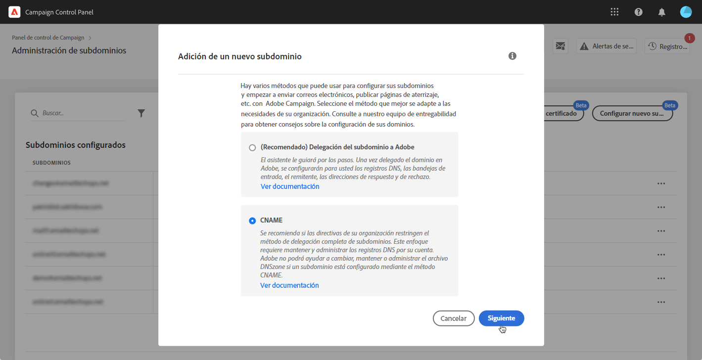

1. Si ha seleccionado una instancia de Campaign Classic, seleccione el caso de uso que desee para el subdominio: **Comunicaciones de marketing** o **Comunicaciones transaccionales y operacionales**. Los conceptos globales sobre los casos de uso de los subdominios se presentan en [esta sección](../../subdomains-certificates/using/subdomains-branding.md#about-subdomains-use-cases).

   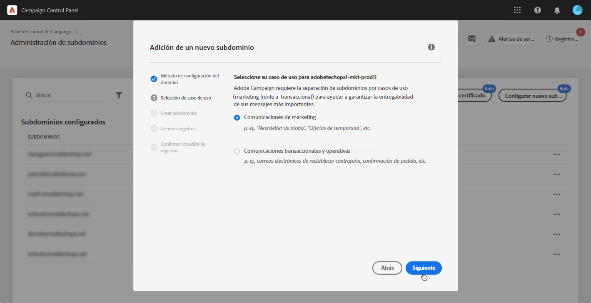

1. Escriba el subdominio que creó en la solución de alojamiento y haga clic en **[!UICONTROL Next]**.

   Asegúrese de añadir el **nombre completo** del subdominio que desea configurar. Por ejemplo, para configurar el subdominio “usoffers.email.weretail.com”, escriba “usoffers.email.weretail.com”.

   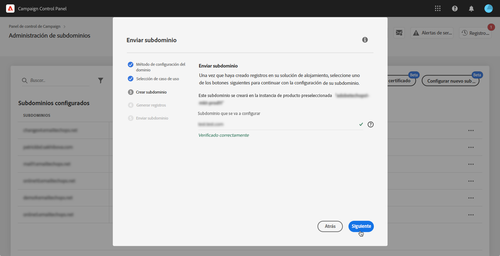

1. Se muestra la lista de registros que se van a colocar en los servidores DNS. Copie estos registros, uno por uno o descargando un archivo CSV, y luego vaya a la solución de alojamiento de dominios para generar los registros DNS coincidentes.

   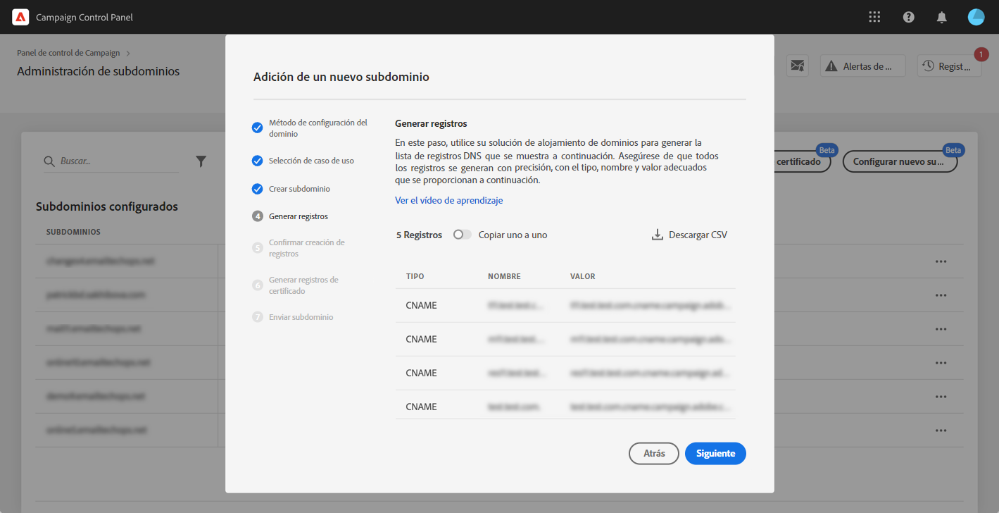

1. Asegúrese de que todos los registros DNS de pasos anteriores se hayan generado en la solución de alojamiento de dominios. Si todo está configurado correctamente, seleccione la primera instrucción y haga clic en **[!UICONTROL Submit]** para confirmar.

   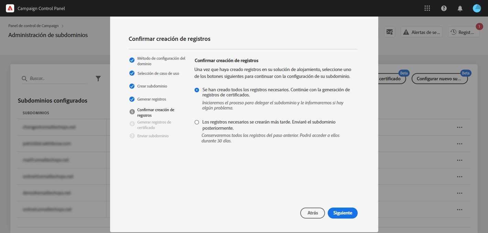

   >[!NOTE]
   >
   >Si desea crear los registros y enviar la configuración del subdominio más adelante, seleccione la segunda instrucción y haga clic en **[!UICONTROL Submit later]**. A continuación, podrá reanudar la configuración del subdominio directamente desde el área **[!UICONTROL Processing]** de la pantalla de administración del subdominio.
   >
   >Tenga en cuenta que el Panel de control de Campaign mantendrá los registros DNS que se van a colocar en el servidor durante 30 días. Más allá de ese periodo, tendrá que configurar el subdominio desde cero.

Una vez enviado el subdominio, el Panel de control de Campaign realizará varias comprobaciones y pasos de configuración. Para obtener más información, consulte [Comprobación y configuración de subdominios](#subdomain-checks-and-configuration).

## Comprobación y configuración de subdominios {#subdomain-checks-and-configuration}

1. Una vez enviado el subdominio, el Panel de control de Campaign comprobará que señala correctamente a los registros NS de Adobe y que el registro de Inicio de autoridad (SOA) no existe para este subdominio.

   >[!NOTE]
   >
   >Tenga en cuenta que mientras se ejecuta la configuración de subdominios, otras solicitudes que pasen a través del Panel de control de Campaign se pondrán en cola y se gestionarán solo después de que finalice la configuración de subdominios para evitar cualquier problema de rendimiento.

1. Si las comprobaciones son correctas, el Panel de control de Campaign establecerá el inicio del subdominio con registros DNS, direcciones URL adicionales, bandejas de entrada, etc.

   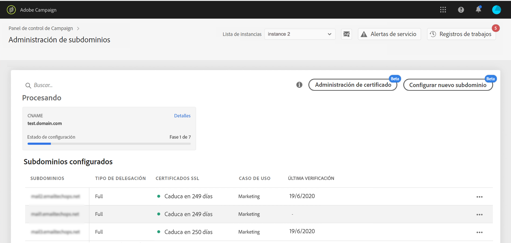

   Para obtener más detalles sobre el progreso de la configuración, haga clic en el botón **[!UICONTROL Details]**.

   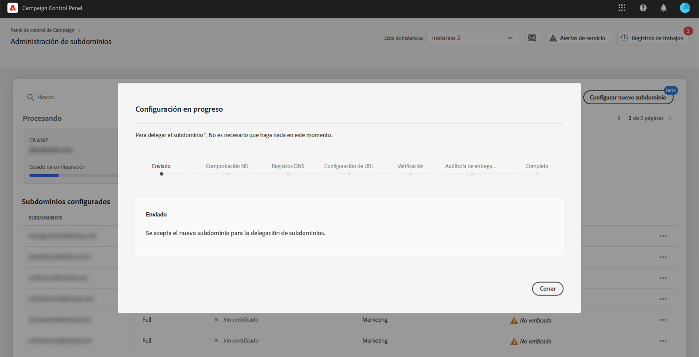

1. Al final, se notificará al **Equipo de entrega** acerca del nuevo subdominio para auditarlo. El proceso de auditoría puede demorarse hasta 10 días hábiles después de configurarse el subdominio.

   >[!IMPORTANT]
   >
   >Las comprobaciones de entrega que se realizan incluyen bucles de comentarios y pruebas de bucles por quejas de spam. Por lo tanto, no recomendamos el uso del subdominio antes de que se haya completado la auditoría, ya que podría causar una mala reputación de subdominio.

1. Al final del proceso, los subdominios se configurarán para que funcionen con la instancia de Adobe Campaign y se crearán los elementos siguientes:

   * **El subdominio con los siguientes registros DNS**: SOA, MX, CNAME, DKIM, SPF, TXT,
   * **Subdominios adicionales** para réplica de host, recurso, páginas de seguimiento y clave de dominio,
   * **Bandeja de entrada**: Remitente, Error, Responder.

   De forma predeterminada, la bandeja de entrada Responder del Panel de control de Campaign está configurada para borrar correos electrónicos y no se puede revisar. Si desea supervisar la bandeja de entrada Responder para sus campañas de marketing, no utilice esta dirección.

Puede obtener más información sobre el subdominio haciendo clic en los botones **[!UICONTROL Subdomain details]** y **[!UICONTROL Sender info]**.

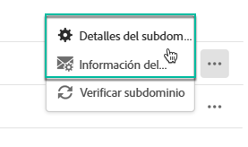

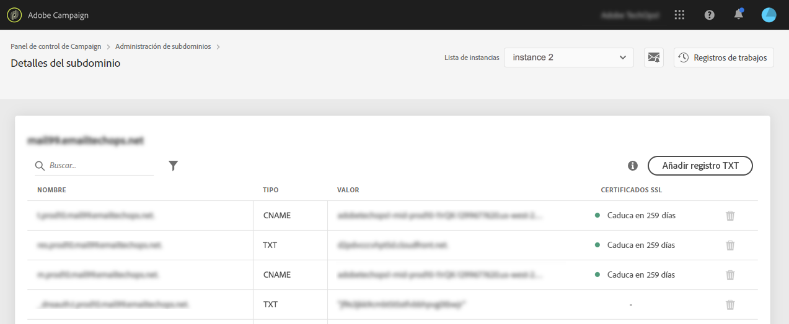

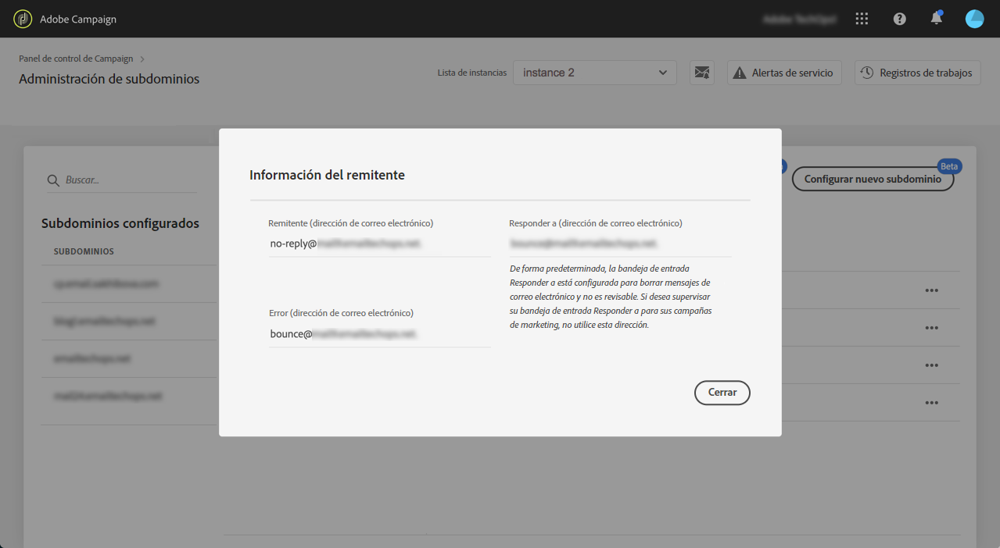

## Resolución de problemas {#troubleshooting}

* En algunos casos, la configuración se completa, pero es posible que el subdominio no se haya verificado correctamente. El subdominio permanecerá en la lista **[!UICONTROL Configured]** con un registro de trabajos que proporciona información sobre el error. Póngase en contacto con el Servicio de atención al cliente si tiene problemas.
* Si el subdominio se muestra como &quot;Unverified&quot; después de configurarse, inicie una nueva verificación de subdominio (**...**/**[!UICONTROL Verify subdomain]**). Si aún muestra el mismo estado, la razón podría ser que hay alguna personalización en el esquema de destinatarios, que no se puede comprobar mediante procesos estándar. Intente enviar una campaña con ese subdominio.
* Si la configuración del subdominio está tardando demasiado (más de 10 días hábiles) en el paso de auditoría de la entrega, póngase en contacto con Atención al cliente.
