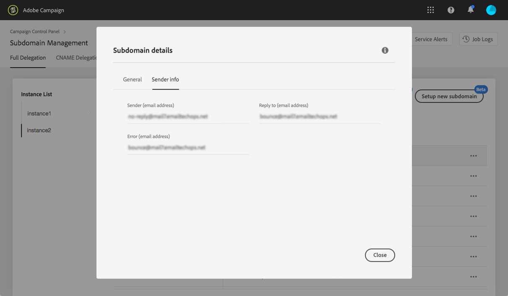

# Configuración de un nuevo subdominio {#setting-up-subdomain}

>[!NOTE]
>
>La delegación de subdominios del Panel de control se encuentra actualmente en fase beta y sujeta a frecuentes actualizaciones y modificaciones sin previo aviso.

## Delegación de subdominios completa {#full-subdomain-delegation}

El Panel de control permite delegar completamente un subdominio a Adobe Campaign. Para realizar esto, siga los pasos a continuación.

>[!NOTE]
>
>Si no tiene ningún subdominio configurado para Adobe, el primer subdominio que configurará se considerará un subdominio ****principal.
>Se creará un registro **DNS** inverso y se establecerá como subdominio de envío predeterminado para las bandejas de entrada (remitente, respuesta, direcciones de correo electrónico de error).

1. En la **[!UICONTROL Subdomains & Certificates]**tarjeta, seleccione la instancia de producción que desee y haga clic en**[!UICONTROL Setup new subdomain]**.

   

   >[!NOTE]
   >
   >La delegación de subdominios solo está disponible para instancias **de producción** .

1. Haga clic en **[!UICONTROL Next]**para confirmar el método de delegación completo.

   

   >[!NOTE]
   >
   >[El Panel de control no admite actualmente CNAME](#use-cnames) ni métodos personalizados.

1. Cree los subdominios y servidores de nombres deseados en la solución de hospedaje utilizada por su organización. Para ello, copie y pegue la información del servidor de nombres de Adobe que se muestra en el asistente. Para obtener más información sobre cómo crear un subdominio en una solución de alojamiento, consulte el vídeo [del](https://video.tv.adobe.com/v/30175?captions=spa)tutorial.

   >[!CAUTION]
   >
   >Al configurar servidores de nombres, asegúrese de que **nunca delega su subdominio raíz a Adobe**. De lo contrario, el dominio solo podrá trabajar con Adobe. Cualquier otro uso será imposible, como por ejemplo enviar correos electrónicos internos a los empleados de la organización.

   

   Una vez creado el subdominio con la información correspondiente del servidor de nombres de Adobe, haga clic en **[!UICONTROL Next]**.

1. Seleccione el caso de uso que desee para el subdominio:

   * **Comunicaciones** de marketing: comunicaciones destinadas a fines comerciales. Ejemplo: campaña de correo electrónico de ventas.
   * **Comunicaciones** transaccionales y operativas: las comunicaciones transaccionales contienen información destinada a completar un proceso que el destinatario ha iniciado con usted. Ejemplo: confirmación de compra, correo electrónico de restablecimiento de contraseña. Las comunicaciones de organización se refieren al intercambio de información, ideas y opiniones dentro y fuera de la organización, sin fines comerciales.
   >[!NOTE]
   >
   >Desglosar los subdominios según los casos de uso es una práctica recomendada para la entrega. Al hacerlo, la reputación de cada subdominio está aislada y protegida.
   >
   >Por ejemplo, si los proveedores de servicios de Internet acaban bloqueando el subdominio de comunicaciones de marketing, el subdominio de comunicaciones de transacción no se verá afectado y podrá seguir enviando comunicaciones.

   

1. Escriba el subdominio que creó en la solución de alojamiento y haga clic en **[!UICONTROL Submit]**.

   >[!NOTE]
   >
   > Asegúrese de completar el nombre **** completo del subdominio que desea delegar. Por ejemplo, para delegar el subdominio &quot;usoffer.email.weretail.com&quot;, escriba &quot;usoffer.email.weretail.com&quot;.

   

1. Una vez enviado el subdominio, el Panel de control comprobará que señala correctamente a los registros NS de Adobe y que el registro de inicio de autoridad (SOA) no existe para este subdominio.

1. Si las comprobaciones son correctas, el Panel de control empezará a configurar el subdominio con registros DNS, direcciones URL adicionales, bandejas de entrada, etc. Para obtener más detalles sobre el progreso de la configuración, haga clic en el **[!UICONTROL Process details]**botón .

   

   >[!NOTE]
   >
   >En algunos casos, la delegación pasa por ahí, pero es posible que el subdominio no se haya verificado correctamente. El subdominio irá directamente a la **[!UICONTROL Verified subdomains]**lista con el**[!UICONTROL Unverified]** estado y un registro de trabajo que proporciona información sobre el error. Póngase en contacto con el Servicio de atención al cliente si tiene problemas para resolver el problema.
   >
   >Tenga en cuenta que mientras se ejecuta la delegación de subdominios, otras solicitudes a través del Panel de control se pondrán en cola y se realizarán solamente después de que finalice la Delegación de subdominios, para evitar cualquier problema de rendimiento.

Al final del proceso, los subdominios se configurarán para que funcionen con la instancia de Adobe Campaign y se crearán los elementos siguientes:

* **El subdominio** con los siguientes registros **** DNS: SOA, MX, CNAME(s), DKIM, SPF, TXT,
* **Subdominios** adicionales a réplica de host, recurso, páginas de seguimiento y clave de dominio,
* **Bandeja de entrada**: Remitente, Error, Responder.

>[!NOTE]
>
>De forma predeterminada, la bandeja de entrada &quot;Responder&quot; del Panel de control está configurada para borrar correos electrónicos y no se puede revisar. Si desea supervisar la bandeja de entrada &quot;Responder a&quot; para sus campañas de marketing, no utilice esta dirección.

Para obtener más información sobre el subdominio, haga clic en el **[!UICONTROL Subdomain Details]**botón .

>[!NOTE]
>
>Además de la etapa de procesamiento, Adobe notificará al equipo de entregabilidad el nuevo subdominio para que audite el subdominio que se ha creado. El proceso de auditoría puede tardar hasta 3 días después de delegarse el subdominio.
>
>Las comprobaciones que se realizan incluyen bucles de comentarios y pruebas de bucles de quejas de spam. Por lo tanto, no recomendamos el uso del subdominio antes de que se haya completado la auditoría, ya que podría resultar en una mala reputación de subdominio.

## Uso de CNAME {#use-cnames}

Adobe no recomienda el uso de CNAME para la delegación de subdominios y no es compatible con el Panel de control. Para utilizar este método, póngase en contacto con el Servicio de atención al cliente de Adobe.
